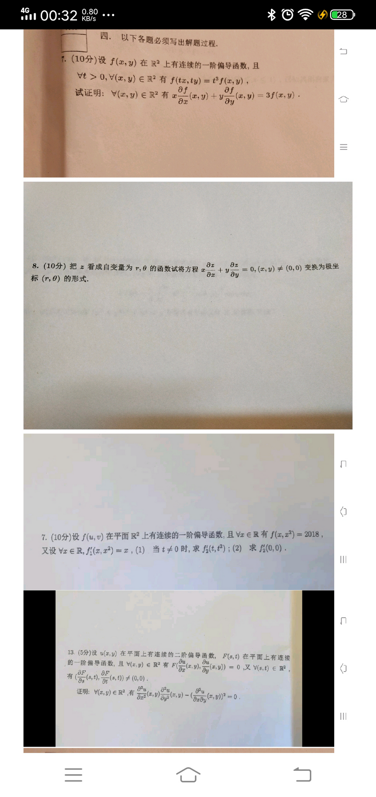
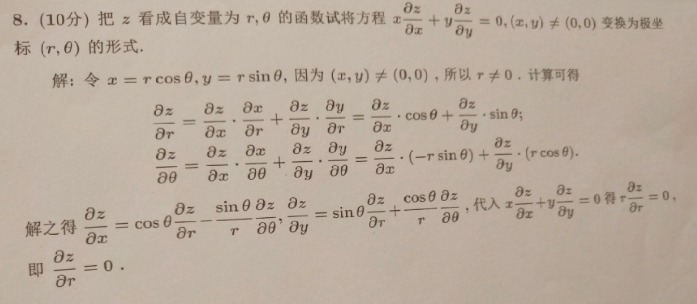
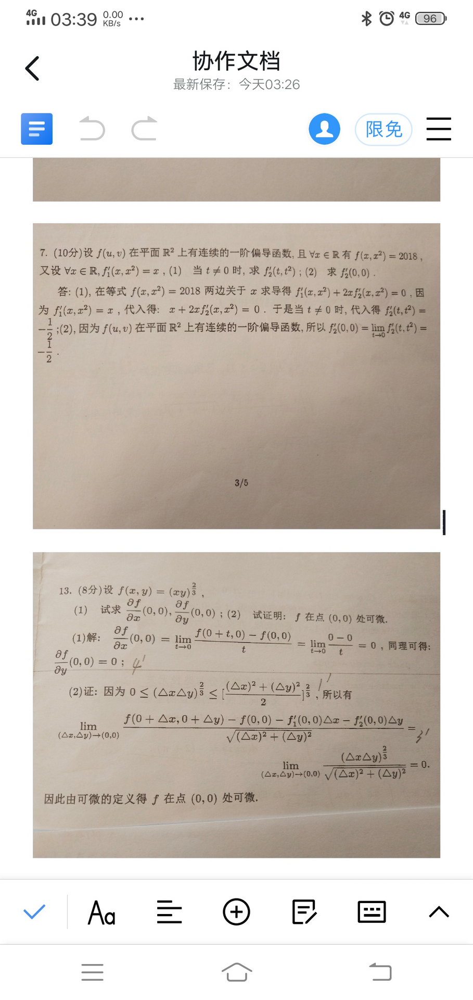
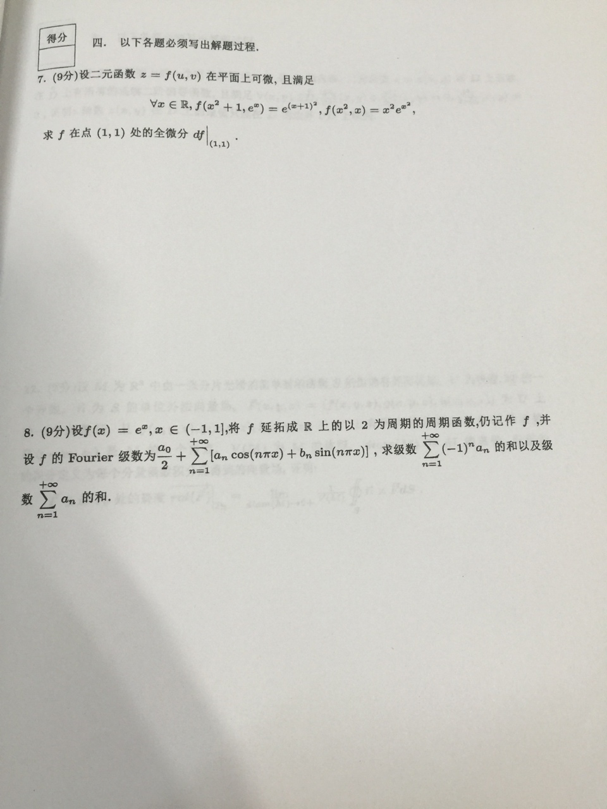
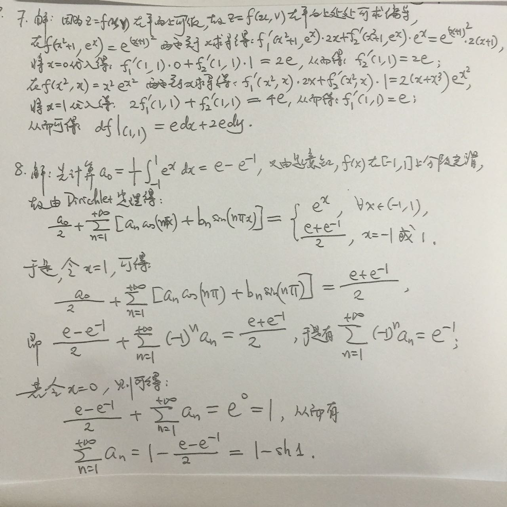

### 期中考真题

### 微分学证明题

方程或方程组两边求导，联立求解

1. 两边对t求导, 注意求导后是$xf_x'(tx,ty)$, 两边乘t

3. 隐函数问题。一阶偏导连续,所以$f_2'(0,0)=f'_2(t,t^2)=-1/2$

### 微分方程中的变量代换

#### 题型一: 自变量替换

把$z(x,y)$替换成$z(u,v)$. 实际上就是把$\frac{\partial z}{\partial x}$用$\frac{\partial z}{\partial u},\frac{\partial z}{\partial v}$ 代替

 注意偏微分没有链式法则。注意我们写的是一个因变量$z$，或者是写成$f_1',f_2'$这种形式，但实际上有两个变量。

#### 题型二: 变换函数和自变量

> 习题8-3 14

### 其他

> 1. $u=x^{y^z}$ 偏导

注意是$x^{(y^z)}$. 先算上面的

$\ln u=y^z\ln x \rightarrow \frac{1}{u}\frac{\partial u}{\partial y}=zy^{z-1}\ln x$

> 求$d^k(e^x\sin y)$

法一:

$z=f(x,y)$

$$
d^n z=\sum_{k=0}^n \binom{n}{k}\frac{\partial^k z}{\partial^k x \partial ^{n-k}y}dx^kdy^{n-k}
$$

先对$x$求导不变，然后对y$\frac{\partial^k x}{ \partial ^{n-k}}=e^x (\sin y)^{(k-i)}=e^x\sin(y+\frac{\pi}{2}(k-i))$

法二:

设$d^k(z)=e^x(a_k\cos y+b_k\sin y)$

---

---

答案
题号7:
这种题目一般要带着括号里的自变量写，不容易搞错。(1)式子要代入x=0才能得到$f_1'(1,1)$. (2)式子要代入$x=1$

题号8:

不需要计算an,bn的表达式，给傅里叶级数的式子里代入x求值。记得减去$\frac{a_0}{2}$