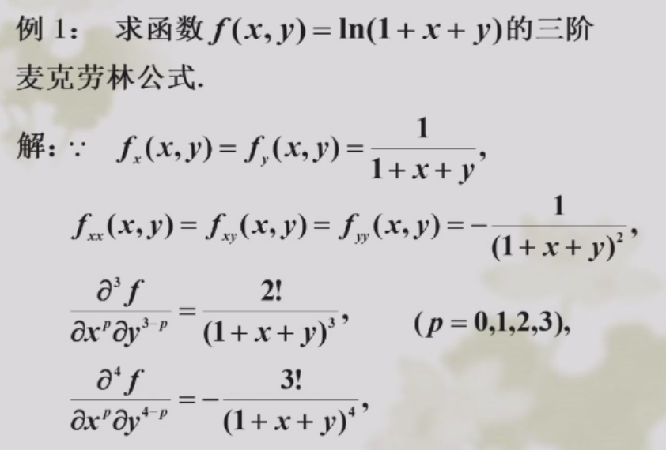
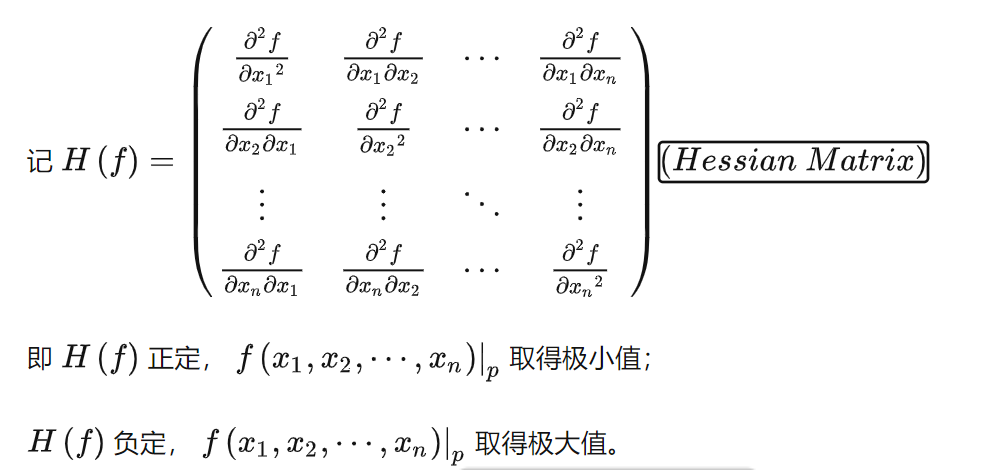
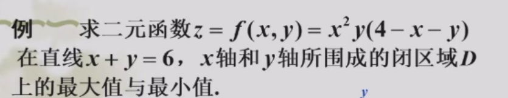
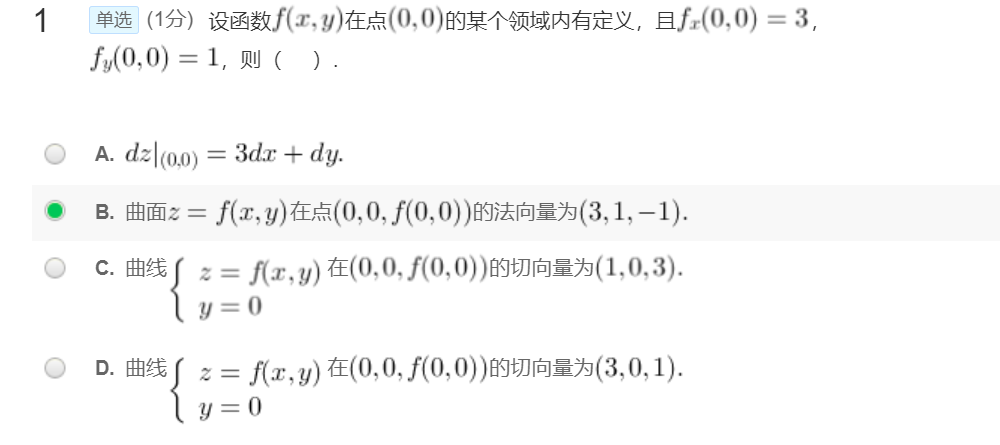

[TOC]

注意复习曲线的切线和法平面，极值的判定定理

## 多元函数的Taylor展开

目的:把$f(x_0+h,y_0+k)$表示为$h ,k$的多项式. 
$$
f(x_0+h,y_0+k)=f(x_0,y_0)+(h\frac{\partial}{\partial x}+k\frac{\partial}{\partial x})f(x_0,y_0)\\+\frac{1}{2!}(h\frac{\partial}{\partial x}+k\frac{\partial}{\partial x})^2f(x_0,y_0)+\dots +\frac{1}{n!}(h\frac{\partial}{\partial x}+k\frac{\partial}{\partial x})^nf(x_0,y_0)\\+\frac{1}{(n+1)!}(\frac{\partial}{\partial x}+\frac{\partial}{\partial y})^{n+1}f(x_0+\theta h,y_0+\theta k)
$$
注意这里偏导算符的意义:

$$(h\frac{\partial}{\partial x}+k\frac{\partial}{\partial x})f(x_0,y_0)=f'_x(x_0,y_0)h+f'_y(x_0,y_0)k
$$

$$(h\frac{\partial}{\partial x}+k\frac{\partial}{\partial x})^2f(x_0,y_0)=f''_{xx}(x_0,y_0)h^2+2f''_{xy}(x_0,y_0)hk+f''_{yy}f(x_0,y_0)k^2
$$

令$n=0$,得到拉格朗日中值定理
令$x=x_0+h,y=y_0+h$, 把h,k换成$(x-x_0),(y-y_0)$

$f(x_0+hx,y_0+hy)$

> 计算寄巧
> - 前n项是多项式,余项是n+1阶导函数
> - 系数是偏导×二项式系数。如果所有n阶偏导都相等,就可以写成$\frac{1}{n!}k(h+k)^n$
> - 记得除以$\frac{1}{n!}$

## 多元函数的极值

### 极值点的定义

定义: 在某邻域内$f(P)\geq f(P_0)(\leq)$

驻点(稳定点): $f'_x(x_0,y_0)=f'_y(x_0,y_0)=0$

极值点一定包含在稳定点或偏导数不存在的点中

极值的必要条件: 若在$(x_0,y_0)$偏导数存在，且在$(x_0,y_0)$有极值，那么$f'_x(x_0,y_0)=f'_y(x_0,y_0)=0$ （对应一元函数的费马定理)

- 驻点不一定是极值点. 如$z=xy$在$(0,0)$. (邻域内有>0和<0的)
- 极值点不一定可导. 如$z=\sqrt{x^2+y^2}$ 

### 极值的充分条件

 若在$(x_0,y_0)$有**连续的二阶偏导数**，且$f'_x(x_0,y_0)=f'_y(x_0,y_0)=0$ （驻点). 令$A=f''_{xx}(x_0,y_0),B=f''_{xy}(x_0,y_0),C=f''_{yy}(x_0,y_0)$

- $AC-B^2>0$ 是极值点，且$A>0$**极小值**点,$A<0$**极大值**点
- $AC-B^2<0$ 不是极值点
- $AC-B^2=0$ 无法确定

证明：

做二阶Taylor展开,有
$$
f(x_0+h,y_0+k)-f(x_0,y_0)=\frac{1}{2}(A^2h^2+2ABhk+C^2k^2)+o(\rho^2)
$$
判断括号内的正负，这是一个二次型，对应二次型矩阵为$\begin{pmatrix} A \ B \\ B \ C\end{pmatrix}$. 根据二次型正定性的判定，计算主子式:

- 当$\Delta_1=A>0,\Delta_2=AC-B^2>0$,二次型正定
- 当$(-1)\Delta_1=-A>0,\Delta_2=AC-B^2>0$,二次型负定

推广到n元函数，我们有

### 多元函数的最值

1. 先求一阶导，得到怀疑点(驻点or偏导数不存在的点) (这时候没必要区分极大极小，不需要求二阶导)

2. 再看边界上的点的函数值（换成条件极值）

3. 取最值

 （No.104）

最大值是4

### 条件极值

拉格朗日函数
$$L=f(x,y,z)-\lambda \varphi(x,y,z)
$$

难点在解方程如何消元

## 场的方向导数和梯度

数量场: 函数$u(x,y,z)$

矢量场: 矢量的分量是位置坐标$x,y,z$的函数

### 场的方向导数*

是一个标量$\frac{\partial u}{\partial \mathbf{l}}=\lim_{\rho \to 0} \frac{u(P)-u(P_0)}{\rho}$

定理: **若u在点P0处可微**,设l的方向向量为$(\cos \alpha,\cos\beta,\cos \gamma)$. 则方向导数
$$
\frac{\partial u}{\partial \mathbf{l}}=\frac{\partial u}{\partial x}\cos\alpha+\frac{\partial u}{\partial y}\cos\beta+\frac{\partial u}{\partial z}\cos\gamma
$$

可微->方向导数存在.反之不成立

> 例: 求$z=(x^3+y^3)^\frac{1}{3}$在(0,0)处沿任意方向的方向导数

设方向向量$\vec{l}=(\cos \alpha,\cos \beta),P=(\rho \cos \alpha,\rho \cos \beta)$

$\frac{\partial u}{\partial \vec{l}}=\lim_{\rho \to 0}\frac{\sqrt[3]{\rho^3\cos^3\alpha+\rho^3\cos^3}\beta}{\rho}=\sqrt[3]{\cos^3\alpha+\cos^3\beta}$

但是$\lim_{\rho \to 0}\frac{\Delta z-0\Delta x-0\Delta y}{\rho}$ 不存在(令$\Delta y=k\Delta x$),所以不可微

### 梯度

是一个矢量。方向沿着函数方向导数最大的方向
$$
\mathbf{grad}u=(\frac{\partial u}{\partial x},\frac{\partial u}{\partial y},\frac{\partial u}{\partial z})
$$
另外也可以利用Nabla算子$\nabla=(\frac{\partial }{\partial x},\frac{\partial }{\partial y},\frac{\partial }{\partial z})$. 写成

$\nabla u=\mathbf{grad} u$

### 曲线的切线和法平面*

切向量$\vec{v}$

曲线参数形式: $x=x(t),y=y(t),z=z(t)$,得
$$
\vec{v}=(x'(t),y'(t),z'(t))
$$
一般式$F(x,y,z)=0,G(x,y,z)=0$. 用隐函数组求偏导的方式得到$\frac{dy}{dx},\frac{dz}{dx}$
$$
\vec{v}=(1,\frac{dy}{dx},\frac{dz}{dx})
$$
有了切向量和曲线上一点坐标，就可以切线和法平面

### 曲面的切平面和法线

法向量$\vec{n}$

对于曲面方程$F(x,y,z)=0$. 对$x,y,z$分别求偏导
$$
\boxed{\vec{n}=(F'_x,F'_y,F'_z)}
$$
特殊情况：

- $z=f(x,y)$. 移项得$f(x,y)-z=0$.  $\boxed{\vec{n}=(f'_x,f'_y,\color{blue}{-1})}$

- $\frac{x^2}{a^2}+\frac{y^2}{b^2}+\frac{z^2}{c^2}=0$. $\boxed{\vec{n}=(\frac{2x}{a^2},\frac{2y}{b^2},\frac{2z}{c^2})}$  切平面方程$\frac{x_0x}{a^2}+\frac{y_0y}{b^2}+\frac{z_0z}{c^2}=0$

求平行于某平面的切平面

1. 求出$\vec{n}$
2. 代入原方程解出$(x_0,y_0,z_0)$. 一般有两个解

A错(不一定可微)
BC都对