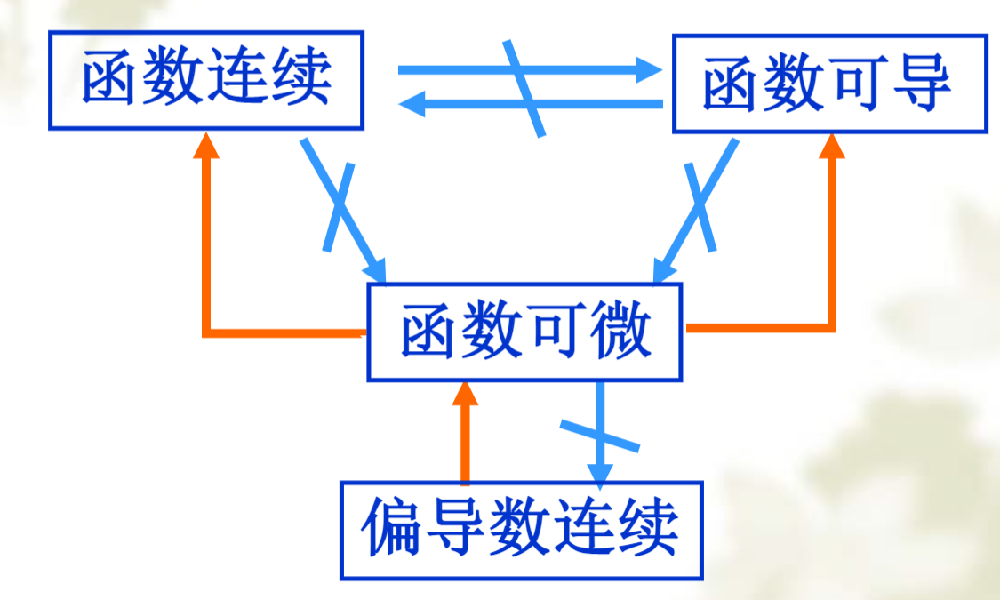
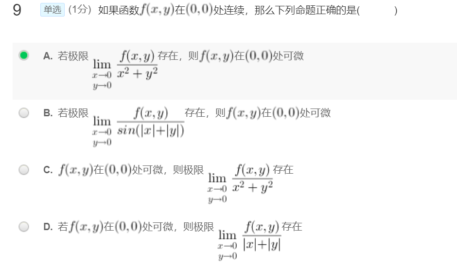
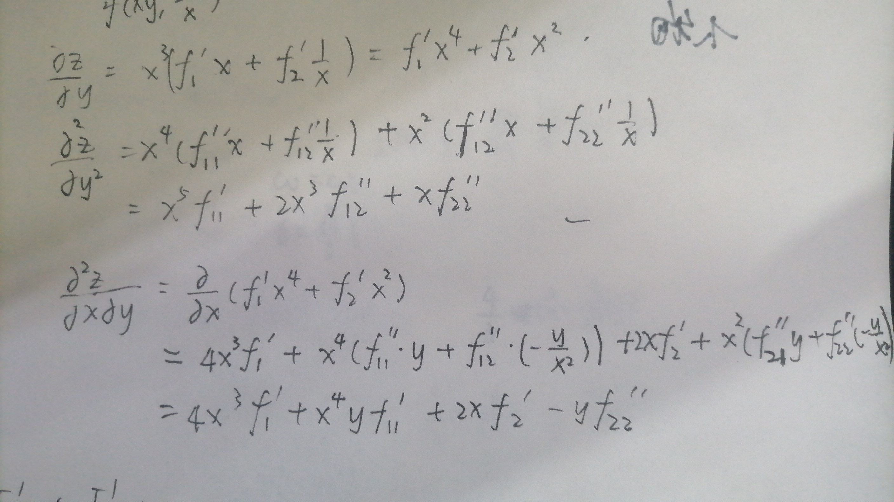
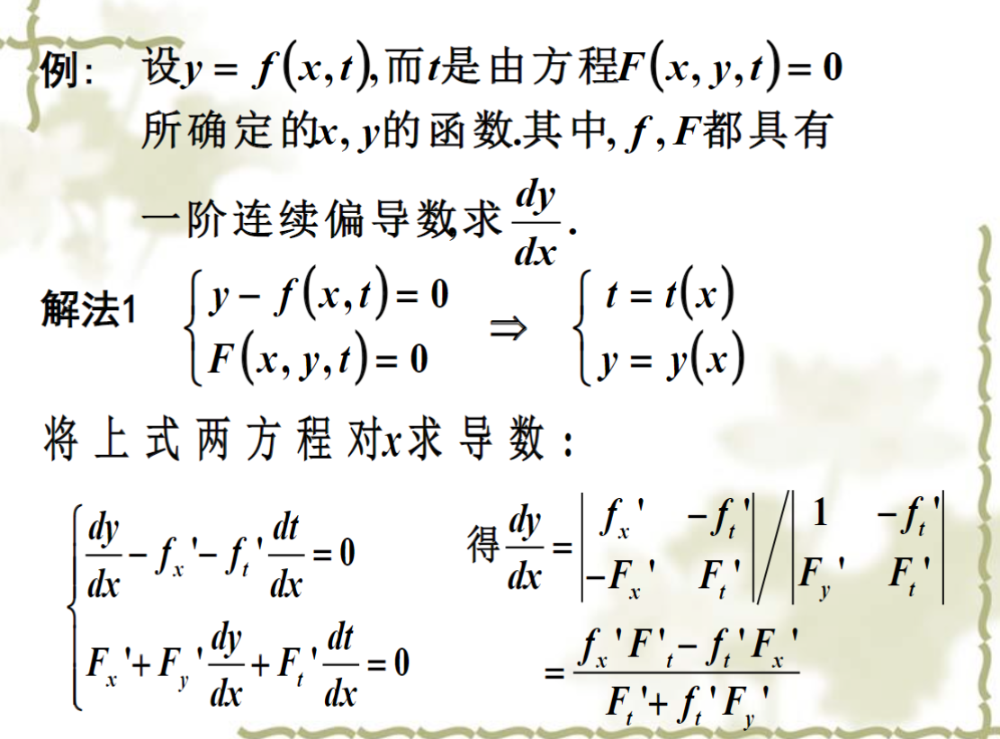

[TOC]
## 多元函数极限

### 多元函数的极限

> $\forall \epsilon,\exist \delta,\forall (x,y),\sqrt{(x-a)^2+(y-b)^2}<\delta$, $|f(x,y)-A|<\epsilon$,则
>
> 
$$\lim_{x\to a,y\to b}f(x,y)=A
$$

​		一元函数的各种性质可以推广到二元函数，如四则运算、夹逼定理等。

### 多元极限与累次极限

二次极限:把外面的看成参数，对里面的取极限。**累次极限存在不能说明二元极限存在**.因此求二元极限不能分开来求累次极限。常用方法是

- 夹逼定理，利用绝对值不等式、基本不等式
- 把关于xy的函数整体看成一个元
- 三角换元, $x=r\cos \theta,y=r\sin \theta, r\to 0$

>$\lim_{x\to 0}\lim_{y\to 0}(x+y)\sin\frac{1}{x}\sin \frac{1}{y}=\lim_{x\to 0}\sin\frac{1}{x}\lim_{y\to 0}(x+y)\sin \frac{1}{y}$ 不存在

而$\lim_{(x,y)\to(0,0)}(x+y)\sin\frac{1}{x}\sin \frac{1}{y}=0$. 因为夹逼定理, $0 \leq | (x+y)\sin\frac{1}{x}\sin \frac{1}{y}|\leq |x+y|\leq |x|+|y|$

$$\lim_{(x,y)\to(\infin,\infin)}\frac{x^2y^2}{x^4+y^4} \leq \frac{x^2+y^2}{2x^2y^2}=0
$$

$$\lim_{(x,y)\to(\infin,\infin)}\frac{x^2y^2}{e^{x+y}} \leq \frac{(x+y)^2}{e^{x+y}}-\frac{2x}{e^x}\frac{y}{e^{y}}=0
$$

右边就可以看成一元函数的极限

极限不存在
- 设k值法凑上下次数相等。如$\frac{xy}{x^2+y^2}$
- 两个重极限不相等,如$\frac{x-y+x^2+y^2}{x+y+x^2+y^2}$

### 多元函数连续性

> 定义: $\lim_{(x,y)\to (x_0,y_0)}=f(x_0,y_0)$

> 讨论$u=\frac{x+y}{x^3+y^3}$ 连续性
分母$x^3+y^3=(x+y)(x^2-xy+y^2)$. 所以不连续点在$x+y=0$上. 设$x=a,y=-a, \lim_{(x,y)\to(0,0)}u=\frac{1}{x^2-xy+y^2}=\frac{1}{3a^2}$

- (0,0)第二类间断点
- (a,-a)(a≠0)可去间断点

## 微分

### 偏导数

$$
f'_x(a,b)=\frac{\partial f}{\partial x}|_{x=a,y=b}=\lim_{x \to a} \frac{f(x,b)-f(a,b)}{x}
$$

跟一元函数一样，非端点处用求导法则，端点处用定义

二阶偏导数

用定义求之前，先要用求导法则得到一阶偏导的表达式
$$
\frac{\partial f^2}{\partial x\partial y}|_{x=a,y=b}=\lim_{y\to b}\frac{f'_x(a,y)-f'_x(a,b)}{y}
$$

### 全微分

类比一元函数的微分$dy=A\Delta x +o(\Delta x)(\Delta x \to 0)$

二元函数的全微分$dz=A\Delta x+B\Delta y+o(\rho)(\rho=\sqrt{\Delta x^2+\Delta y^2}\to 0)$. A,B与$\Delta x,\Delta y$无关

若 $f_x\left(x_0, y_0\right)$ 和 $f_y\left(x_0, y_0\right)$ 存在，且

$$
\lim _{(\Delta x, \Delta y) \rightarrow\left(x_0, y_0\right)} \frac{\Delta z-f_x\left(x_0, y_0\right) \Delta x-f_y\left(x_0, y_0\right) \Delta y}{\sqrt{\Delta x^2+\Delta y^2}} \tag{1}
$$

存在且等于 0 。
则称函数在点 $\left(x_0, y_0\right)$ 处可微分,记为。
$$
\left.\mathrm{d} z\right|_{\left(x_0, y_0\right)}=f_x\left(x_0, y_0\right) d x+f_y\left(x_0, y_0\right) d y
$$

全微分的四则运算法则和一元函数相同

#### 可微、可偏导、连续的关系

>  可微的充分条件: 偏导存在且在$(x_0,y_0)$连续

证明：
$$
\Delta z=f(x+\Delta x,y+\Delta y)-f(x,y)\\=[f(x+\Delta x,y+\Delta y)-f(x,y+\Delta y)]+[f(x,y+\Delta y)-f(x,y)]\\
=f'_x(x+\theta_1\Delta x,y+\Delta y)\color{blue}{\Delta x} \text{\ (中括号里的看成一元函数，运用中值定理)}\\+f'_y(x,y+\theta_2\Delta y)\Delta y
$$
因为$f'_x(x,y)$在$(x,y)$连续, 所以$\lim_{\Delta x \to 0,\Delta y \to 0}f'_x(x+\theta_1\Delta x,y+\Delta y)=f'_x(x,y)$. 记$f'_x(x+\theta_1\Delta x,y+\Delta y)=f'_x(x,y)\Delta x+\epsilon_1\Delta x$

所以$\Delta z=f'_x(x,y)\Delta x+\epsilon_1\Delta x+f'_x(x,y)\Delta y+\epsilon_2\Delta y$ (全增量公式)

$\lim_{}\frac{\epsilon_1\Delta x+\epsilon_2\Delta y}{\rho}=0$

> - 可偏导不一定连续。$z=\frac{xy}{x^2+y^2},(0,0)$
>
> - 可偏导不一定可微
>
> - 可微一定连续可偏导，不一定偏导数连续 $z=xy\sin \frac{1}{\sqrt{x^2+y^2}}$.该函数可微: $\lim_{\rho \to 0} \frac{xy}{\sqrt{x^2+y^2}}\sin \frac{1}{\sqrt{x^2+y^2}}<\frac{xy}{\sqrt{2xy}}=0$,但偏导数在 $(0,0)$ 不连续: 设 $y=x$
>

验证多元函数在某一点不可微

- 不连续
- 某个偏导数不存在

- 利用定义式$(1)$，极限不存在

$\color{red}\boxed{\text{求出偏导后偏导数，要验证是否可微，再写出微分}}$

由A条件和连续性,$f(0,0)=\lim\frac{f(x,y)}{x^2+y^2}{(x^2+y^2)}=0$.

$$f'_x(0,0)=\frac{f(x,0)-f(0,0)}{x}=\lim_{x \to 0} \frac{f(x,0)}{x^2}\cdot x=0
$$
 y同理

那么$\lim_{\rho \to 0}\frac{\Delta z}{\rho}=\\frac{f(x,y)}{x^2+y^2}\sqrt{x^2+y^2}=0$
### 复合函数的偏导数

$z=f(g(x,y))$. $\frac{\partial z}{\partial x}=f'(g_x(x,y))$

$z=\int_{u(x,y)}^{v(x,y)} h(t)dt.  \frac{\partial z}{\partial x}=h(u)\frac{\partial u}{\partial x}-h(v)\frac{\partial v}{\partial x}$

$z=f(u,v),u,v$  都是$x,y$的函数
$$
\boxed{\frac{\partial z}{\partial x}=\frac{\partial z}{\partial u}\frac{\partial u}{\partial x}+\frac{\partial z}{\partial v}\frac{\partial v}{\partial x}}\\
$$
画出函数关系图(无端联想pytorch)

对$y$同理。当$u,v$是具体函数的时候，可以不用引入中间变量$u,v$的记号,而用$f_1',f_2'$分别代表$\partial z/\partial u,\partial z/\partial v$.   同理 $f_{11}'' ,f_{12}''$代表

注意偏微分不是$\frac{\partial z}{\partial x}=\frac{\partial z}{\partial u}\frac{\partial u}{\partial x}$。我们写的是一个因变量$z$，或者是写成$f_1',f_2'$这种形式，但实际上有两个变量,要分开处理。

#### 复合函数的二阶偏导数:

(*首*.jpg)

$\frac{\partial}{\partial x}f_{1}'=f_{11}''\frac{\partial u}{\partial x}+f_{12}''\frac{\partial v}{\partial x}$.  注意$f_{12}''=f_{21}''$

> 例: $z=x^3f(xy,\frac{y}{x})$

#### 复合函数的全微分

$dz=\frac{\partial z}{\partial x}dx+\frac{\partial z}{\partial y}dy$. 不管中间有几层复合，都可以直接用对x,y的偏导表示。这是多元函数的一阶微分形式不变性。
求偏导的时候注意xyz是否有轮换对称性

### 隐函数的偏导数

存在性的证明一般不考。如果只是考求偏导数，本质的方法是列方程。

#### 一个隐函数的偏导数

对于一个三元方程$F(x,y,z)=0$，求$\partial z/\partial x$ 

设$z=z(x,y)$. 两边对$x$求偏导得
$$
F'_x\cdot 1+F'_y \cdot 0+F'_z \frac{\partial z}{\partial x}=0\\
\frac{\partial z}{\partial x}=-\frac{F'_x}{F'_z}
$$
- 对于高阶偏导，应在方程1的基础上再两边求导。

- 如果要同时求出$x,y$的偏导，可以两边取全微分

> 例: $e^{xy}-2z+e^z=0$. 求$\partial z/\partial x$

直接两边对x求偏导, $ye^{xy}-2\frac{\partial z}{\partial x}+e^z \frac{\partial z}{\partial x}=0$. 解得

#### 隐函数组的偏导数

方程组$\begin{cases}F(x,y,u,v)=0\\G(x,y,u,v)=0 \end{cases}$ 确定两个隐函数$u(x,y),v(x,y)$.

方程组两边对$x$求导得
$$
\begin{cases}
F'_x+F'_u \frac{\partial u}{\partial x}+F'_v \frac{\partial v}{\partial x}=0\\
G'_x+G'_u \frac{\partial u}{\partial x}+G'_v \frac{\partial v}{\partial x}=0
\end{cases}
$$
把两个偏导数看成变量，解这个方程组即可。二阶导同理。

如果要写出形式化的解析式（虽然做题中一般不用）。可以利用Cramer法则。系数矩阵的行列式称为Jacobi行列式。
$$
J=\frac{\partial(F,G)}{\partial(u,v)}=\left | \begin{matrix} F'_u \ F'_v \\ G'_u \ G'_v\end{matrix}\right|
$$

$$
\frac{\partial u}{\partial x}=-\frac{\left | \begin{matrix} F'_x \ F'_v \\ G'_x \ G'_v\end{matrix}\right|}{J} \  \frac{\partial v}{\partial x}=-\frac{\left | \begin{matrix} F'_u \ F'_x \\ G'_u \ G'_x\end{matrix}\right|}{J}
$$

关键是搞清楚谁是函数，谁是自变量，以及对谁求偏导

