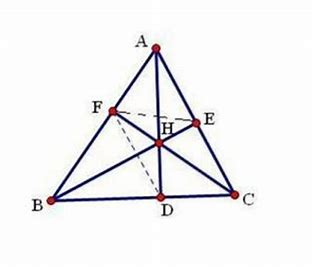
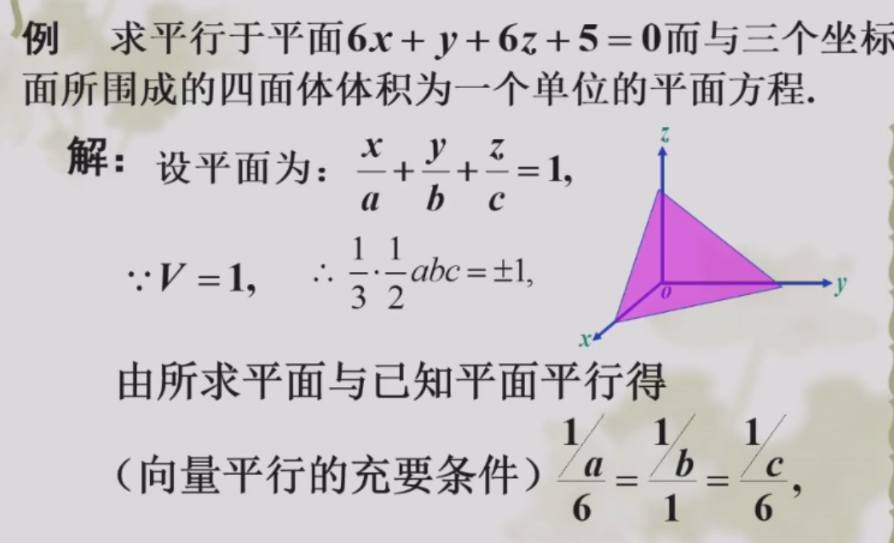
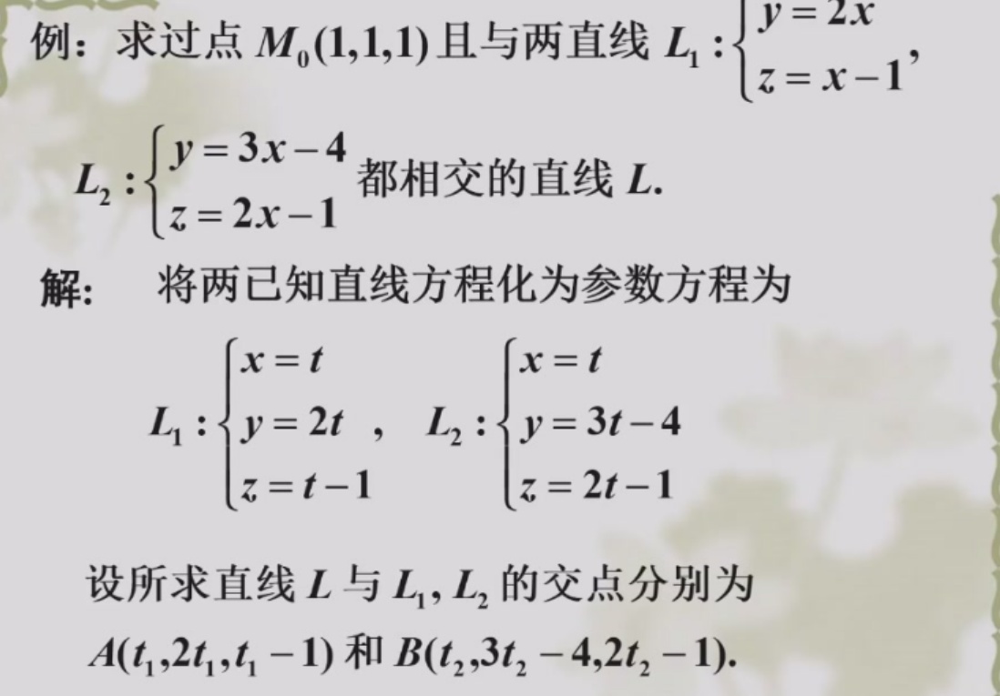
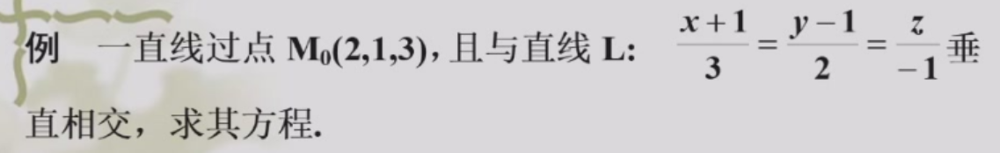
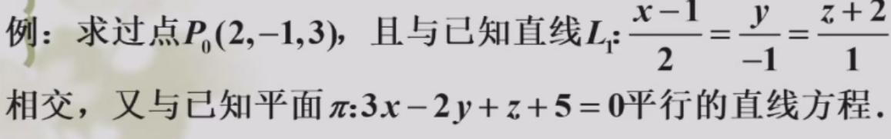
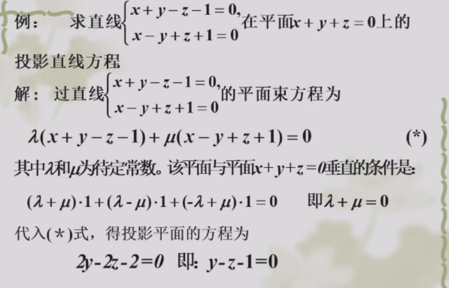
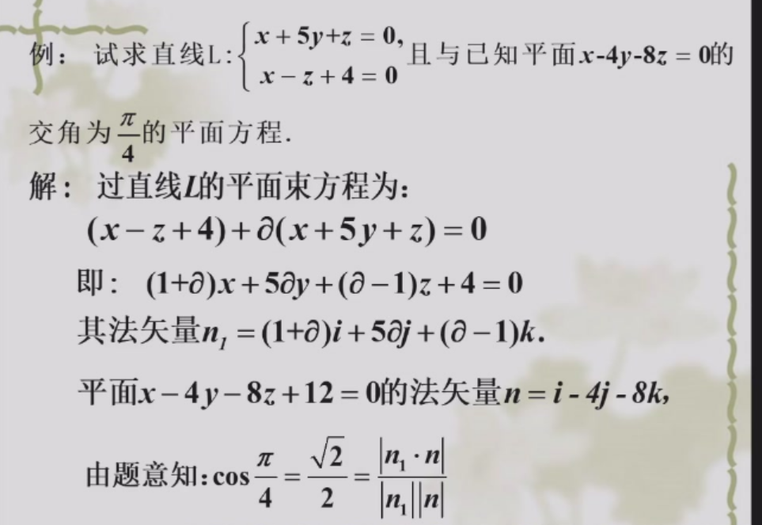
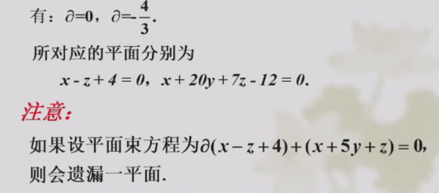
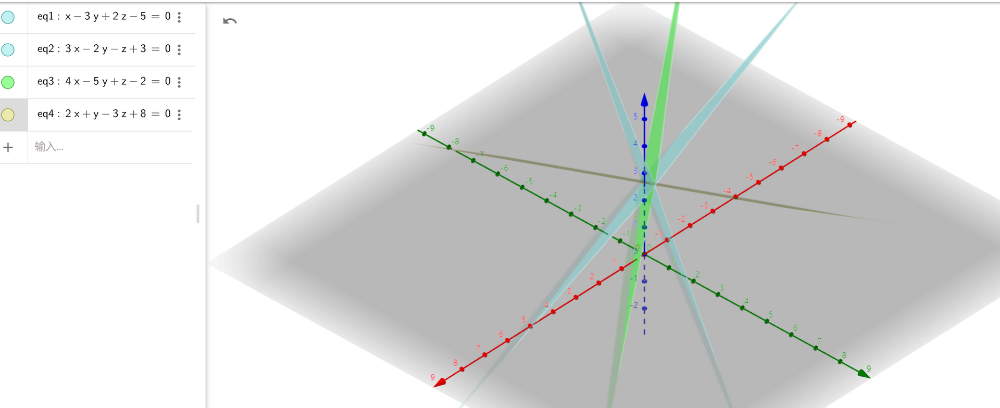

[TOC]

## 向量的运算

### 线性运算

本质是$\mathbb{R}^3$上的线性空间。这一部分基本线代课上都讲过

### 数量积

$a\cdot b=x_1x_2+y_1y_2+z_1z_2 \in \mathbb{R}$

几何意义

- $a\cdot b=|a||b|\cos <a,b>$
- $a\cdot b=0 \leftrightarrow a ⊥b$

> 用向量方法证明三角形三条高交于一点

已知$\vec{AH}\cdot \vec{BC}=\vec{BH}\cdot \vec{AC}=0$, 求证$\vec{CH}\cdot \vec{AB}=0$

$\vec{CH}\cdot \vec{AB}=(\vec{CA}+\vec{AH})\cdot(\vec{AH}+\vec{HB})=\vec{AH}\cdot (\vec{CA}+\vec{AH}+\vec{HB})\cdot\vec{CA}+\vec{HB}=0+0=0$
### 向量积

$$a\times b=\left |\begin{array}{cccc}
\bf{i} &\bf{j}   & \bf{k} \\
x_1 &y_1 & z_1  \\
x_2 & y_2 &z_2 \\
\end{array}\right| \in \mathbb{R}^3
$$ 

几何意义:

-  $|a\cdot b|=|a||b|\sin <a,b>$,即$a,b$围成的平行四边形面积
- $a\times b=\vec{0} \leftrightarrow a//b$
- $a\times b$与$a,b$都垂直

性质:

- $a\times b=-b\times a$

### 混合积

$$a\cdot (b\times c) =\left |\begin{array}{cccc}
x_1 &y_1  & z_1 \\
x_2 &y_2 & z_2  \\
x_3 & y_3 &z_3 \\
\end{array}\right|
$$

证明根据行列式的展开

几何意义
- $a,b,c$**共面的充要条件**是$a\cdot (b\times c)=0$. 证明: 共面,则三个向量线性相关,秩<3
- $|a\cdot (b\times c)|$是以$a,b,c$为棱的**平行六面体体积**

性质：

- 顺次调换混合积中的矢量，混合积结果不变(行列式做了2次行交换)
- 对调混合积中的矢量，混合积结果反号(做了1次行交换)

### 二重矢积

$a\times (b\times c)$称为二重矢积

性质:

- 与b,c共面的矢量（右手定则)
- 既然共面,那如何线性表示? $a\times(b\times c)=(a\cdot c)b-(a\cdot b)c$

## 平面和直线方程

### 平面方程

已知法向量$(A,B,C)$,平面上一点$(x_0,y_0,z_0)$

由内积为0推出点向式 $A(x-x_0)+B(y-y_0)+C(z-z_0)=0$ 

由此可推出一般式 $Ax+By+Cz+D=0$

**求平面方程:**
- 已知三点,用$\vec{AB}\times \vec{AC}$
- 已知一点和一条直线. 用$\vec{PM}\times \vec{v}$,M是直线上任取一点

### 直线方程

已知方向向量$(l,m,n)$,平面上一点$(x_0,y_0,z_0)$
参数式方程:

$$\begin{cases} x=x_0+lt \\ y=y_0+mt \\ z=z_0+nt\end{cases}
$$

点向式方程(又叫**对称式方程**):

$$\frac{x-x_0}{l}=\frac{y-y_0}{m}=\frac{z-z_0}{n} \\
$$

如果$l,m,n$中有一个为0,那就拆出一个$x=x_0$

一般式方程(两平面方程联立):

$$\begin{cases} A_1x+B_1y+C_1z+D_1=0 \\ A_2x+B_2y+C_2z+D_2=0\end{cases}
$$

这几种方程的联系: 因为两个平面不平行才能确定直线,故法向量线性无关, $r(a,b,c,d)=r(a,b,c)=2$.  那么联立后形成的非齐次线性方程组必有解，且只有一个自由变量。把自由变量用基础解系的方式写出,就变成了参数式方程。进而化成点向式方程

注意一般式方程中两平面的**法向量叉乘$v_1\times v_2$就是直线的方向向量**。

### 点线面的距离和夹角

梦回高中...

(1)点到直线的距离：**别忘了减法求出$P_0P$**:

$$h=\frac{|\vec{P_0P}\times \mathbf{v}|}{|\mathbf{v}|}
$$

(2)点在直线上的投影:

除了用距离做.也可以设出过点$P(x_0,y_0,z_0)$,法向量为直线方向向量的平面方程$l(x-x_0)+m(y-y_0)+n(z-z_0)=0$. 再与直线的一般式联立。

(3)点在平面上的投影: 设出方向向量为平面法向量的直线，联立求交点。
(3-1)**点关于平面对称点**: 设出垂直于平面的直线，求交点。遇到光的反射之类的问题同理

(4)线线角: $\cos \theta=|\cos<\mathbf{v_1},\mathbf{v_2}>|$
(5)线面角: $\sin \theta=|\cos<\mathbf{v},\mathbf{n}>|$
(6)二面角 :$\cos \theta=\cos(\mathbf{n_1},\mathbf{n_2})$
注意**线、面的夹角都取锐角**

(7)异面直线间的距离:

$$d=\frac{|\vec{M_1M_2}\cdot(\bf{v_1\times v_2)|}}{|\bf{v_1\times v_2}|}
$$

对应平行六面体的高。

(7-1)求两异面直线公垂线与直线交点

过$L_2$作平行于$L_1$的平面$\pi$ ，法向量满足$v_1\times v_2=n$。过$L_1$作垂直于$\pi$的平面$\pi_1$,法向量$n_1=v_1\times n$. 联立$\pi_1$和$L_2$就可以得到公垂线与$L_2$交点。另一点同理

(7-2)求两异面直线公垂线方程

(7-1)**求两异面直线公垂线方程**

同7-1求出过$L_1$的$\pi_1$,再求出过$L_2$的$\pi_2$，两平面交线就是公垂线。

(8)**直线在平面上的投影直线**:

法一：先求过直线L且垂直于平面π的平面$\pi_1$。 则**$\pi_1$的法向量与直线L的方向向量,平面π的法向量都垂直**。 $\bf{n_1}=v\times n$. 然后在L上任取一点写出$\pi_1$的方程，再加上平面π方程写出一般式方程即可

法二：平面束方程

### 求直线和平面方程
(直线的比较难，一般通过构造过直线的平面求交点或交线):

注意有两解$6x+y+6z=\pm6$

过M0作垂直于l的平面,解得交点

过P0作平行于$\pi$的平面

### 平面束方程

类比高中的直线束方程。
$\lambda f(x,y,z)+\mu g(x,y,z)=0$表示通过一条直线的所有平面($\lambda,\mu$不同时为零，且两方程系数不成比例)。其中直线方程$\begin{cases} f(x,y,z)=0\\g(x,y,z)=0\end{cases}$

**如果写成$\lambda f+g$的形式，注意单独检验$\lambda f$**

例: 求两平面的角平分面。先设出平面束方程,然后$\frac{|n_1\cdot n|}{|n_1|}=\frac{|n_2\cdot n|}{|n_2|}$

注意有两解

## 曲面方程

### 一般的曲面方程

**球面方程**: $(x-x_0)^2+(y-y_0)^2+(z-z_0)^2=R^2$

**柱面方程**: 平行于定直线且沿定曲线$C$(称为**准线**)移动的直线(称为**母线**)形成的曲面

 设$\begin{cases} F(x,y)=0\\z=0\end{cases}$. 母线的方向向量为$(a,b,c)$. 曲面上一点坐标为$(x,y,z)$.母线交$xOy$平面 $\frac{x-x_0}{a}=\frac{y-y_0}{b}=\frac{z}{c}$. 代入方程

$$\boxed{F(x-\frac{a}{c}z,y-\frac{b}{c}z)=0}
$$

特别的, $F(x,y)=0$表示母线平行z轴的柱面. $F(x,z)=0$同理。平面也是一个特殊的柱面，如$z=1$准线是$xOz$平面上$z=1$,母线平行于y轴

**锥面方程**: 过空间定点O,沿不过O的曲线为准线移动的直线形成的曲面

设**顶点为原点**,准线为$\begin{cases}F(x,y)=0\\z=h \end{cases}$,母线的方向向量为$(a,b,c)$

$x/x_0=z/h,y/y_0=z/h$. 

$$\boxed{F(\frac{h}{z}x,\frac{h}{z}y)=0}
$$

例: $z=c,\frac{x^2}{a^2}+\frac{y^2}{b^2}=0$, 得椭圆锥面方程$\frac{x^2}{a^2}+\frac{y^2}{b^2}-\frac{z^2}{c^2}=0$

**旋转曲面**:

以$z$轴为旋转轴, $yOz$平面上的曲线$F(y,z)=0$为母线 $(x,y,z)$和$(0,y_0,z_0)$

有$z=z_0,\sqrt{x^2+y^2}=|y_0|$. 所以有

$$\boxed{F(\pm\sqrt{x^2+y^2},z)=0}
$$

>  例母线是$z=y\cot \alpha$,绕Oz轴

$z^2=(x^2+y^2)\cot^2\alpha$就是圆锥面。圆锥的半顶角为$\alpha$

> 【重要!】例：母线是$\frac{x-1}{0}=\frac{y}{1}=\frac{z-1}{2}$,绕Oz轴旋转得到的曲面

还是用定义,先化成**参数方程**$\begin{cases}x=1\\y=t\\z=2t+1 \end{cases}$

点M绕z轴旋转得到 $\begin{cases}x^2+y^2=1+t^2\\z=2t+1 \end{cases}$

消去$t$即可。这是一个单叶双曲面

### 二次曲面及其分类

| 对应二次型的秩和正惯性系数 | 方程                                                 | 名称               | 图片 |
| -------------------------- | ---------------------------------------------------- | ------------------ | ---- |
| r=3,p=3                    | $\frac{x^2}{a^2}+\frac{y^2}{b^2}+\frac{z^2}{c^2}=1$  | 椭球面             |      |
| r=3,p=2                    | $\frac{x^2}{a^2}+\frac{y^2}{b^2}-\frac{z^2}{c^2}=-1$ | 单叶双曲面         |      |
| r=3,p=2                    | $\frac{x^2}{a^2}+\frac{y^2}{b^2}-\frac{z^2}{c^2}=0$  | 二次锥面           |      |
| r=3,p=2                    | $\frac{x^2}{a^2}+\frac{y^2}{b^2}-\frac{z^2}{c^2}=-1$ | 双叶双曲面         |      |
| r=2,p=2                    | $\frac{x^2}{a^2}+\frac{y^2}{b^2}=z$                  | 椭圆抛物面         |      |
| r=2,p=2                    | $\frac{x^2}{a^2}+\frac{y^2}{b^2}=1$                  | 椭圆柱面           |      |
| r=2,p=1                    | $z=\frac{x^2}{a^2}-\frac{y^2}{b^2}$                  | 双曲抛物面(马鞍面) |      |
| r=2,p=1                    | $\frac{x^2}{a^2}-\frac{y^2}{b^2}=1$                  | 双曲柱面           |      |
| r=1                        | $x^2=2py$                                            | 抛物柱面           |      |

 退化成平面、直线、点甚至空集的不考虑        [参考资料](https://zhuanlan.zhihu.com/p/128039622)                                  

### 空间曲线

- 表示为两曲面方程联立

- 参数方程

### 空间曲线在平面上的投影

对于空间曲线$\begin{cases}f(x,y,z)=0\\g(x,y,z)=0 \end{cases}$,消去$z$得$F(x,y)=0$. 这是一个母线垂直z轴的柱面方程,且曲线上的任意一点都在这个柱面上。那么曲线$\begin{cases} F(x,y)=0\\z=0\end{cases}$就是空间曲线在xOy平面上的投影

> 例: 曲线$\begin{cases}x^2+y^2+z^2=1\\z=\frac{1}{2} \end{cases}$在各个平面上投影

注意曲线在$z=1/2$上，故在xOz和yOz上的投影都是线段。$\begin{cases}y=0\\z=\frac{1}{2}\\|x|\leq \frac{\sqrt{3}}{4} \end{cases}$

