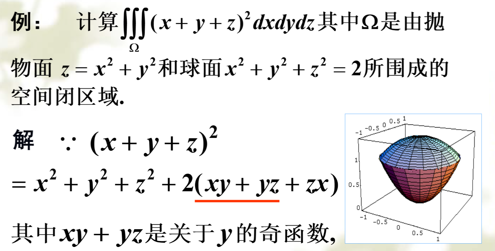

[TOC]
## 基本方法
### 投影法

外面是二重积分，里面是定积分
$$

$$

### 平面截割法

外面是定积分，里面是二重积分

如

- 积分函数只是与一个变量有关，或利用对称性拆
- 截面积好计算，如$S=\pi ab$. 椭球. 这样就可以转换成密度(常量)乘截面积

> 例：$\iiint_{V}(x^2+y^2+z^2)dV,V:\frac{x^2}{a^2}+\frac{y^2}{b^2}+\frac{z^2}{c^2} \leq 1$

$$
\iiint_{V}z^2dV=\int_{-c}^cdz\iint_{S} z^2 dS, S:x^2/a^2+y^2/b^2 \leq (1-\frac{z^2}{c^2})
$$

椭圆面积$\pi ab(1-\frac{z^2}{c^2})$,所以原式=

$\pi ab\int_{-c}^c z^2(1-\frac{z^2}{c^2})dz=\frac{4}{15}\pi abcc^2$

同理对$x^2,y^2$积分,最终答案是$\frac{4}{15}\pi abc(a^2+b^2+c^2)$

## 换元

三阶Jacobi行列式

### 柱坐标

$J=r$

注意

- $x^2+y^2=r^2$代换

### 球面坐标

$J=r^2\sin \varphi$

$x=r\sin \varphi\cos \theta,y=r\sin \varphi\sin \theta,z=r\cos \varphi$

适用情况(对应球面坐标系中的坐标曲面:

- 球面 $r$好确定
- 锥面 $\varphi$好确定   

> 例：计算曲面围成体积 $x^2+y^2+z^2=a^2,x^2+y^2+z^2=b^2,x^2+y^2=z^2(z \geq 0,0<a<b)$

$0 \leq \varphi \leq \frac{\pi}{4},a \leq r \leq b$
$$
V=\int_0^{2\pi}d\theta\int_0^{\frac{\pi}{4}}d\varphi \int_a^b\rho^2\sin \varphi d \rho\\=\frac{\pi}{3}(2-\sqrt{2})(b^2-a^2)
$$
对于$z=a,z=b,x^2+y^2=z^2$围成区域，也可这样处理。但范围变成$\frac{a}{\cos \varphi}\leq r \leq \frac{b}{\cos \varphi}$

> 例: 习题9-5 11

> 例：第九章补充题 7(2)
>
> $x^2+y^2+(z-1)^2 \leq 1$被$y=0,z=1$截的部分
>
> $0 \leq \theta\leq 2\pi, 0 \leq \varphi \leq \frac{\pi}{4}, \frac{1}{\cos \varphi} \leq \rho \leq 2\cos\varphi$

## 对称性的应用

- 关于x,y,z平面的对称性
- 轮换对称性

同理zx是关于x的奇函数，所以后面的都为零
又根据$x^2,y^2$轮换对称性,最后积分化为
$\iiint(2x^2+z^2)dxdydz$

## 物理应用

注意看清是对曲面还是立体

引力
$$
\boxed{F_x=Gm\int \frac{\mu(P)(x-x_0)}{r^3}d\omega}
$$
 转动惯量(Oz轴)
$$
I=\int \mu(P)(x^2+y^2)d\omega
$$
