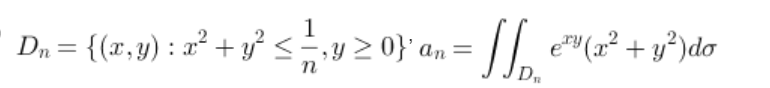

[TOC]

## 二重积分
$$
\iint\limits_{\sigma} f(x,y) d\sigma
$$
x型区域: 
$$
\int_{x_1}^{x_2}dx\int_{y_1(x)}^{y_2(x)}f(x,y)dy
$$
处理里面的积分时,把$x$看做常数,y是积分变量,最后的结果用x表示。

y型区域: 
$$
\int_{y_1}^{y_2}dy\int_{x_1(y)}^{x_2(y)}f(x,y)dx
$$
几何意义: 立体体积。积分区域$\sigma$是底面。

### 交换积分顺序及其应用

常见于处理$e^{x^2}$等原函数不初等的

$\int_0^1te^{-t}dt=1-\frac{2}{e}$

### 极坐标变换

$$
\int_{\alpha}^{\beta}d\theta\int_{r_1(\theta)}^{r_2(\theta)}f(r\cos \theta,r\sin \theta)\color{blue}{rdr}
$$
如果点在区域内,$\theta$取0到$2\pi$. $r$的下界取0

常见的区域边界: 

- 圆心在坐标轴上$x^2+y^2=2ax$.化成$r=a\cos \theta$，范围$0\leq r \leq a\cos \theta$
- 如果圆心在$(a,b)$, 令$x=r\cos\theta+a,y=r\sin \theta+b$. $d\sigma仍然=rd\theta dr$

### 一般坐标变换

用到微分学中的Jacobi行列式($\color{red} 把x,y用u,v$)

$$\frac{\partial(x,y)}{\partial(u,v)}=\begin{vmatrix}\frac{\partial x}{\partial u}\ \frac{\partial x}{\partial v}\\ \frac{\partial y}{\partial u}\ \frac{\partial y}{\partial v}\end{vmatrix}
$$
$$
\iint\limits_{\sigma} f(x,y) d\sigma=\iint\limits_{\sigma'} f(x(u,v),y(u,v))|\frac{\partial(x,y)}{\partial(u,v)}|dudv
$$
对于极坐标变换$x=r\cos\theta,y=r\sin\theta$. Jacobi行列式值为$r$

对于广义极坐标变换$x=ar\cos\theta,y=br\sin\theta$. Jacobi行列式值为$abr$

其他的变换可通过求导或隐函数求导得到

>例:

$x=\frac{u}{\sqrt{n}},y=\frac{v}{\sqrt{n}},J=\frac{1}{n}$
$$
a_n=\iint \frac{1}{n^2}e^{\frac{uv}{n}}dudv(u^2+v^2)
$$
所以$a_n \sim \frac{1}{n^2}(n \to \infin)$,因为$e^{uv/n}$趋近于$e^0$,剩下部分的积分是$\iint(u^2+v^2)dudv=\frac{\pi}{4}$

> 例: