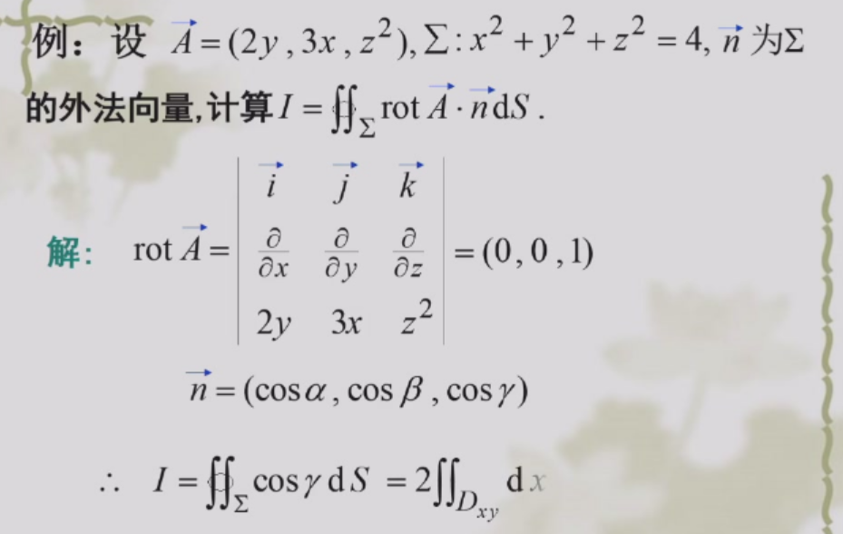

哈密顿算子$\nabla=(\frac{\partial}{\partial x},\frac{\partial}{\partial y},\frac{\partial}{\partial z})$
算子和变量不能交换顺序

梯度: 数量->矢量
散度: 矢量->数量
旋度: 矢量->矢量
### 梯度

对于数量场$u$, $\textbf{grad}\ u=\nabla u=(\frac{\partial u}{\partial x},\frac{\partial u}{\partial y},\frac{\partial u}{\partial z})$

- 矢量,指向变化最快的方向,模=方向导数最大值

### 散度、通量

对于矢量场$\vec{A}$,$\textrm{div}\ \vec{A}=\nabla \cdot \vec{A}$是一个标量

通量$\iint \vec{A}\cdot d\vec{S}$

高斯定理 
$$
\oiint \vec{A}\cdot d\vec{S}=\iiint \nabla \cdot \vec{A} dV
$$

### 旋度、环量

旋度 $\mathbf{rot}\ \vec{A}=\nabla \times \vec{A}$

环量$\oint \vec{A}d \vec{l}$

斯托克斯公式
$$
\oint \vec{A}\cdot d\vec{l}=\iint (\nabla \times \vec{A})\cdot d\vec{S}
$$

$\vec{n}dS$其实就是$d\vec{S}$. 注意因为有上下两个球面,所以是$2dxdy$

### 运算性质

$\nabla \cdot(\nabla \times \vec{A})=0$
证明: 发现是二阶混合偏导
$\nabla \times(\nabla u)=\vec{0}$.

   $\vec{A}$是一个势量场(势函数是$u$)等价于$\nabla \times \vec{A}=0$