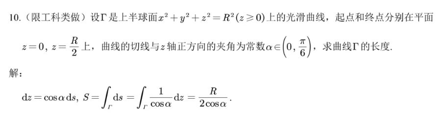

### 第一类曲线积分

$\int_L f(x,y,z)ds$. 关键是表示ds

#### 已知曲线参数方程

$x=x(t),y=y(t),z=z(t)$
$$
\boxed{ds=\sqrt{x'(t)^2+y'(t)^2+z'(t)^2}dt} \\
\int_L f(x,y,z)ds=\int_{t_1}^{t_2}f(x(t),y(t),z(t)) \sqrt{x'(t)^2+y'(t)^2+z'(t)^2}dt
$$
注意参数上下限

> 习题9-4 1(3)   $(x^2+y^2)^2=a^2(x^2-y^2)$  $\int_C |y|ds$

极坐标$r^2=a^2\cos2\theta$. $ds=\sqrt{r^2+r'^2}d\theta$

#### 已知曲线是平面曲线

$$
\boxed{ds=\sqrt{1+{y'_x}^2}}\\
\boxed{ds=\sqrt{r(\theta)^2+r'(\theta)^2}}
$$

#### 隐函数型(如两曲线联立)

用隐函数求导法

### 第一类曲面积分

1. 投影(投影到平面，找曲面的微元$dS$和$dxdy,dydz,dxdz$等的面积关系(夹角$\cos \gamma$，转化为平面上的积分)
2. 代换（因为有曲面的限制条件，x,y,z中可以去掉一个,最终只剩两个变量变成二重积分)

#### 已知曲面方程z=z(x,y)

$$
\boxed{dS=\sqrt{1+{z'_x}^2+{z'_y}^2}dxdy}
$$

投影到哪个平面可以根据计算方便来,如dxdz,dydz都行.

> 习题9-4 3 (1)(2)   作业本4.20

#### 已知曲面方程(隐函数)

隐函数求导

> eg.$x^2+y^2+z^2=a^2$

$z'_x=-\frac{x}{z},z'_y=-\frac{y}{z}$

 计算投影$dS=\frac{\sqrt{x^2+y^2+z^2}}{z}dxdy$.

代换消掉z,$dS=\frac{a}{\sqrt{a^2-x^2-y^2}}dxdy$

>eg $x^2+y^2=z^2, z'_x=x/z$  

$dS=\sqrt{2}dxdy$

#### 配套的积分技巧 

> [上学期的笔记](joplin://x-callback-url/openNote?id=76b8f03b1d31479f953ef8d9827af578)

（1)第一类曲线积分中常常见到$\sqrt{a+bt}$. 令$u=\sqrt{a+bt},t=\frac{u^2-a}{b},dt=\frac{2udu}{b}$. $\color{red}{换完之后注意上下界会变},如t\in[0,1],u\in[\sqrt{a},\sqrt{a+b}]$

  (2) 平方项的处理

- 凑平方的微分    $\frac{xdx}{\sqrt{x^2\pm a^2}}=d(\sqrt{x^2\pm a^2})$
- 有时也可以尝试三角换元如$\sqrt{a^2-x^2} \sqrt{a^2+x^2}$

计算：注意方程里的根号
注意多项式积分1/n+1

> 习题9-4 4.p;
