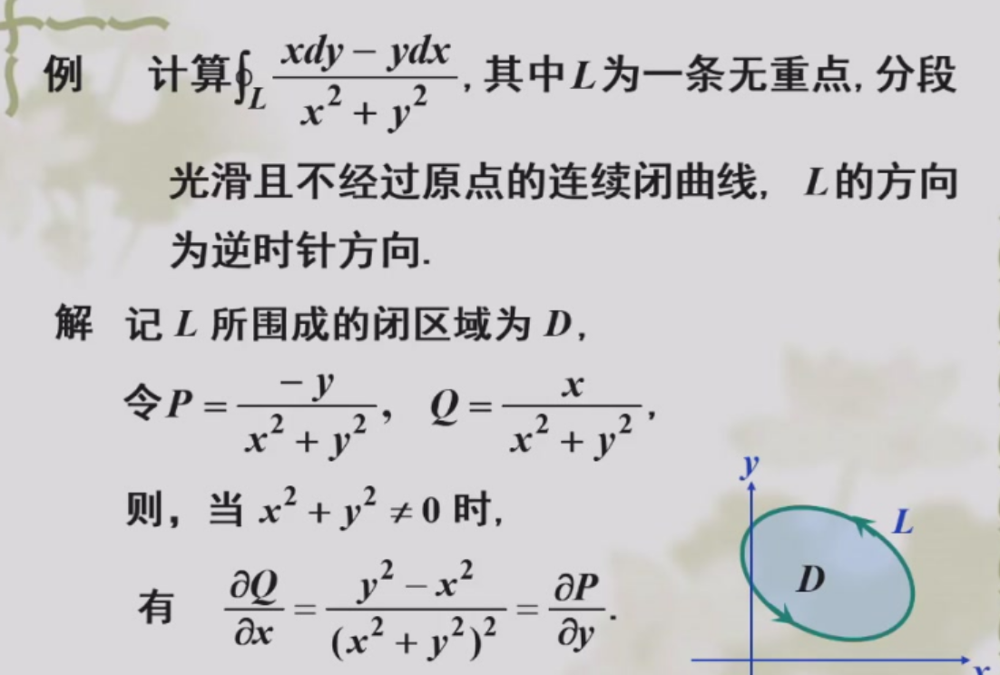
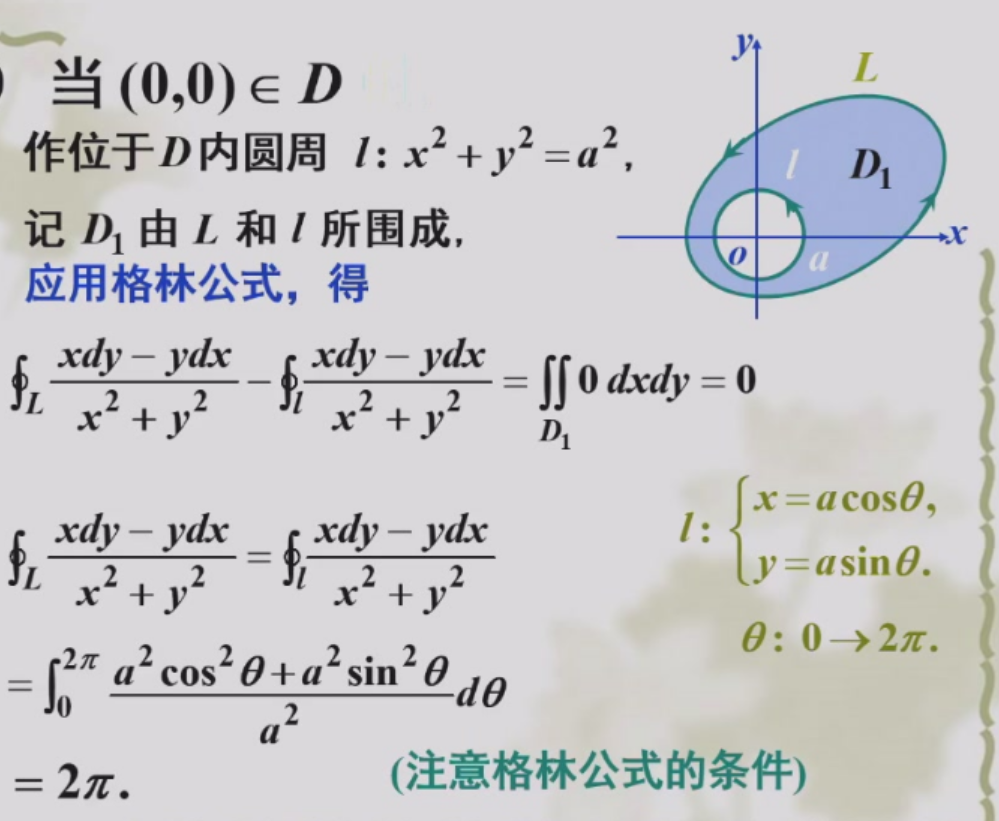
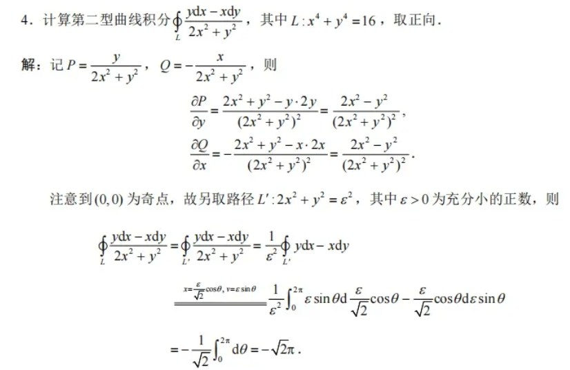
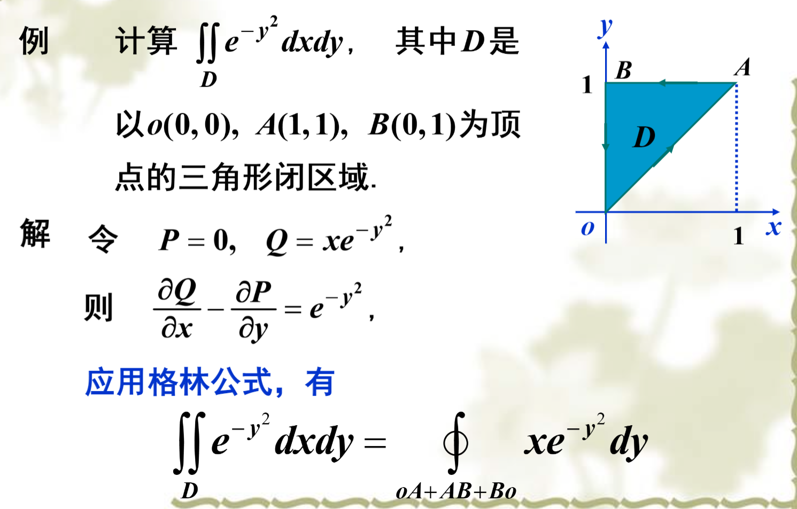

# 第二类曲线积分

## 按定义计算

## 格林公式

$$
\iint (\frac{})dxdy=\oint
$$

### 简单应用

#### 曲线积分变成二重积分

注意格林公式的使用条件: 有界闭区域、P,Q有一阶连续偏导数

注意只有$(0,0) \notin D$时才能直接用格林公式，得到$\oint_L=0$
当$(0,0) \in D$

#### 简化二重积分

引入辅助曲线(直线),把曲线变成封闭的

- 形如xdy的,在平行x轴/y轴的直线都好积分。但是要注意方向

沿AB的有$dy=0$.沿BO的有x=0

用格林公式求面积

$Q=x,P=-y$.

$\boxed{\iint_D dxdy=\frac{1}{2}\oint xdy-ydx}$

### 路径无关性

四个等价条件

> $D$是单连通开区域
>
> $\int_L Pdx+Qdy$与路径无关
>
> $\oint_C Pdx+Qdy=0$
>
> 在D内$\frac{\partial P}{\partial y}=\frac{\partial Q}{\partial x}$
>
> 在D内,存在$u(x,y)$使得$du=Pdx+Qdy$

路径无关的积分求解

