[TOC]

## 第二类曲面积分的定义

两个形式: $\vec{A}=(P,Q,R),\vec{n}=(\cos \alpha,\cos \beta,\cos \gamma),dydz=dS\cos \alpha,dxdz=dS\cos\beta,dxdy=dS\cos \gamma$
$$
\begin{aligned}&\iint \vec{A}\cdot d\vec{S}=\iint \vec{A}\cdot \vec{n} dS\\&= \iint(P\cos \alpha+Q\cos \beta+R\cos \gamma)dS\\&=\iint Pdydz+Qdxdz+Rdxdy\end{aligned}
$$

### 按定义计算(分片投影法)

1. 分别投影到3个平面上
2. 根据曲面方程代换掉$x,y,z$中的一个
3. 确定符号: 如$xOy$平面,考虑$z$轴**正向**与法向量夹角,锐角+,钝角-。法向量的方向根据外侧/内侧决定

- 曲面平行于x轴,dydz=0. 平行于y轴,dxdz=0
- 垂直于z轴,dxdz=dydz=0.

> 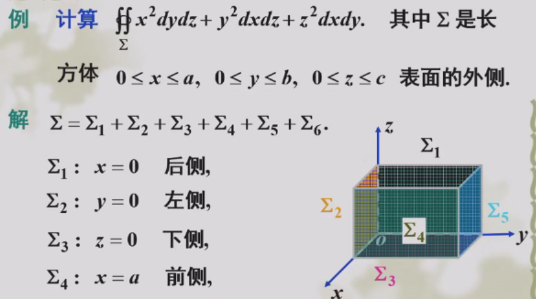

$x^2dydz$只需要考虑与x轴垂直的2个面, $\iint 0dydz+a^2dydz=a^2bc$

第二类曲面积分不具有奇偶对称性(有上下侧)

配套积分技巧 二重积分极坐标

- $p(r)\sqrt{1-r^2}$ 三角换元
- $\sin \theta \cos \theta$ 凑微分

### 与第一类曲面积分的联系(合一投影法)

关键$\boxed{dydz=dS\cos \alpha,dxdz=dS\cos\beta,dxdy=dS\cos \gamma}$. 其中$(\cos \alpha,\cos \beta,\cos \gamma)$是$dS$的法向量

如果投影到平面上的区域不是圆或矩形，而是抛物线、椭圆等,那二重积分就不好计算.我们可以回到第二类曲线积分的一种定义,进一步变形

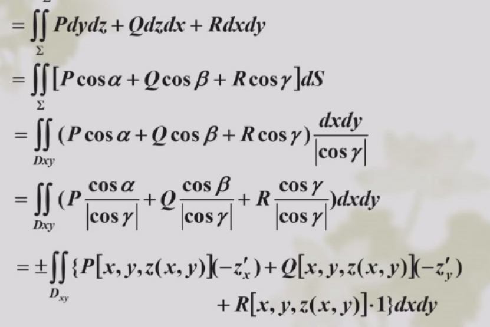
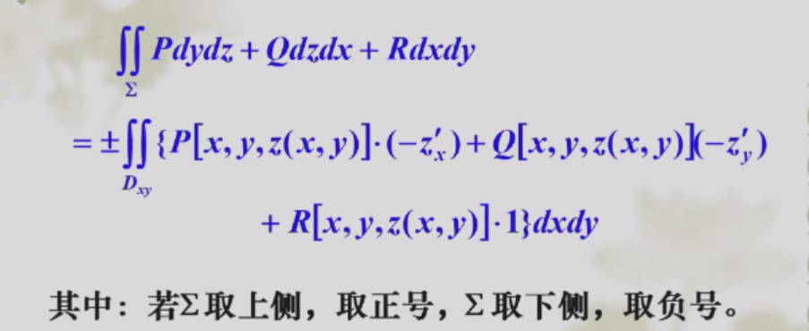

> 例
> 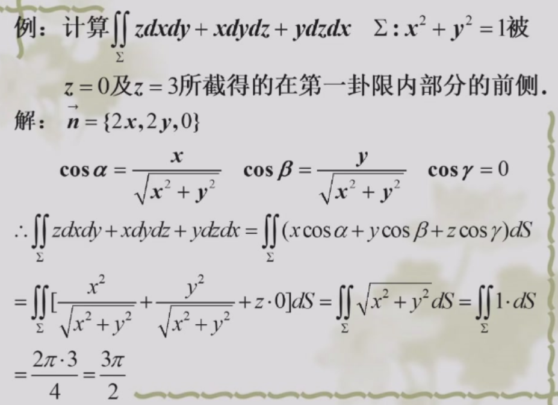

dS指的是对曲面的微元。其实直接对三个积分分别投影也能做,$\iint zdxdy=0,xdydz=ydzdx$

> 例: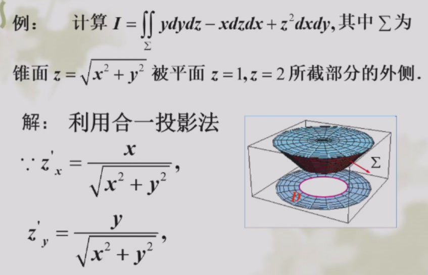
> 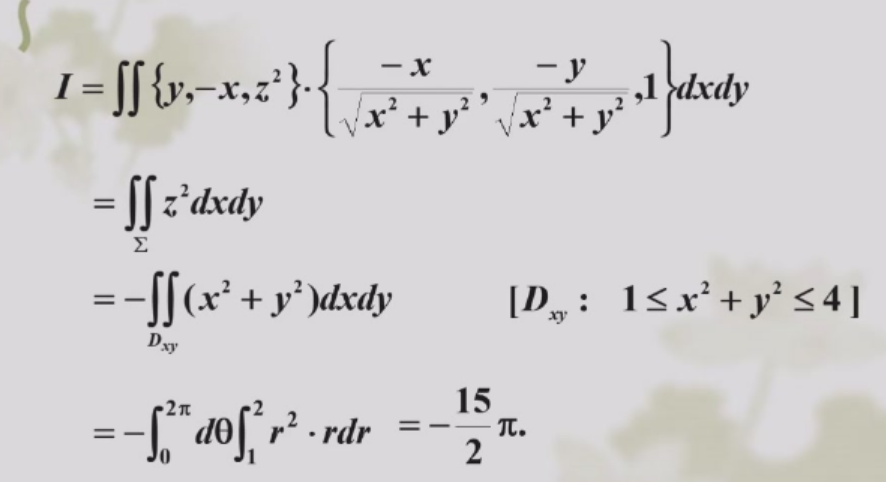

>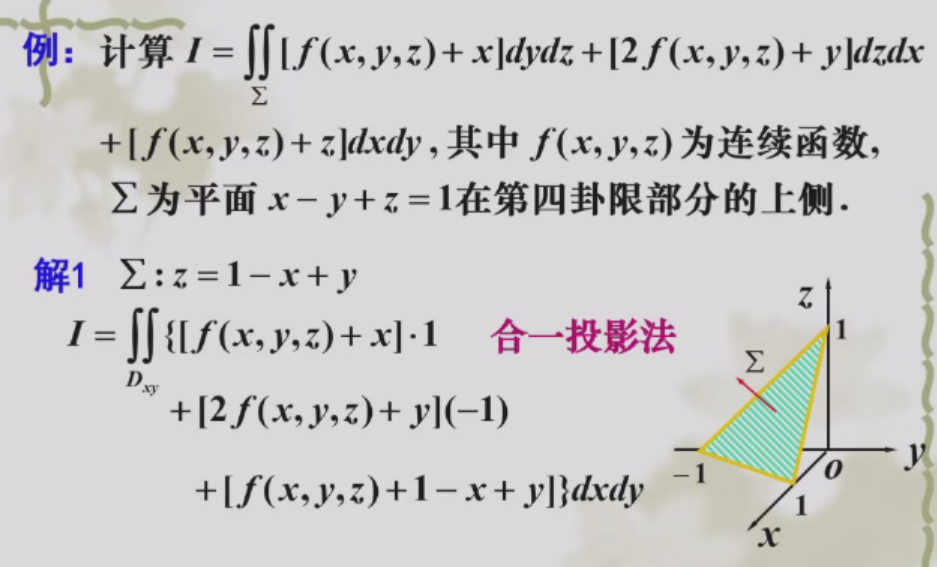
## 高斯公式

封闭曲面$\Sigma$围成的立体$\Omega$
$$
\iiint(\frac{\partial P}{\partial x}+\frac{\partial Q}{\partial y}+\frac{\partial R}{\partial z})dxdydz=\oiint(Pdydz+Qdzdx+Rdxdy)
$$
曲面取外侧

注意$Pdydz$,对$x$求导(微分里面没有谁,就对谁求导)

### 曲面补成封闭曲面
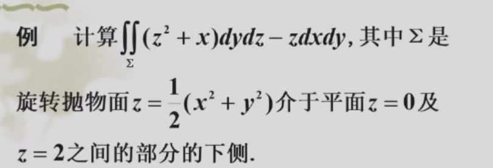

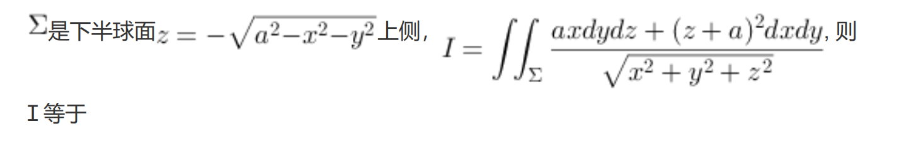
先代换消掉分子的根号

## 斯托克斯公式

$$
\oint Pdx+Qdy+Rdz=\oiint \left|\begin{matrix}&dydz &dxdz &dxdy \\ &\frac{\partial}{\partial x}&\frac{\partial}{\partial y}&\frac{\partial}{\partial z}\\ &P &Q &R\end{matrix} \right|
$$

### 曲线化成曲面积分

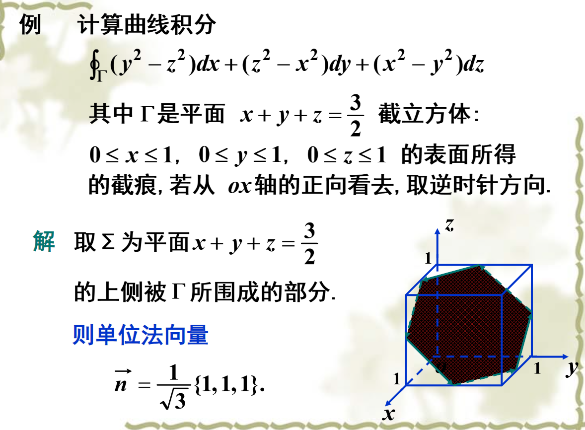
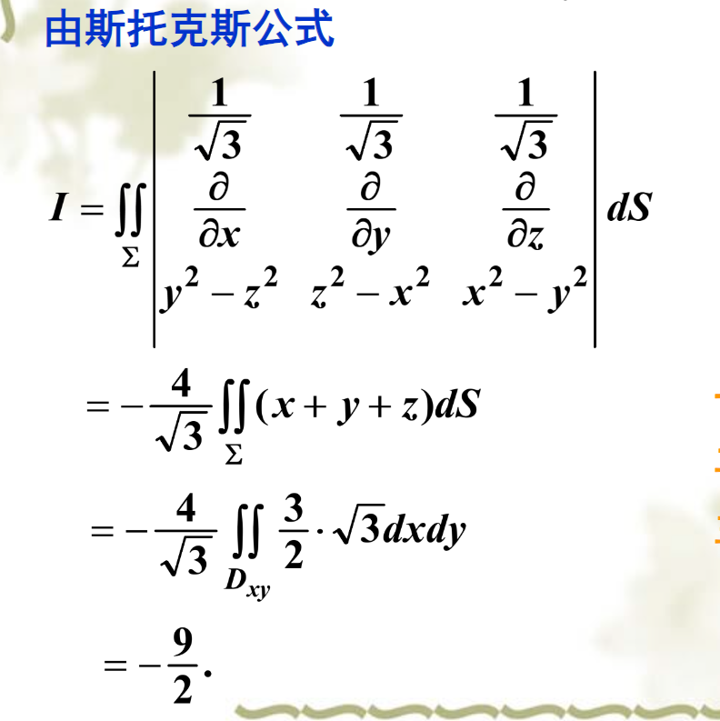

### 空间曲线积分与路径无关

