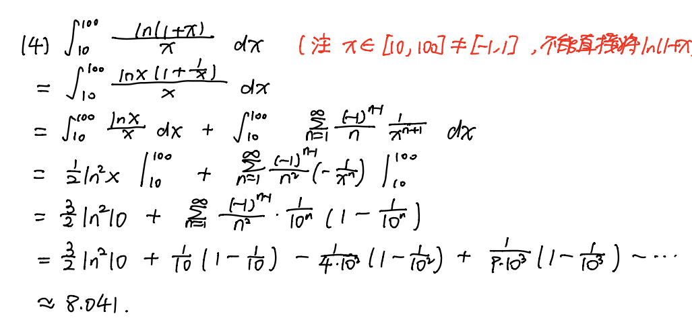
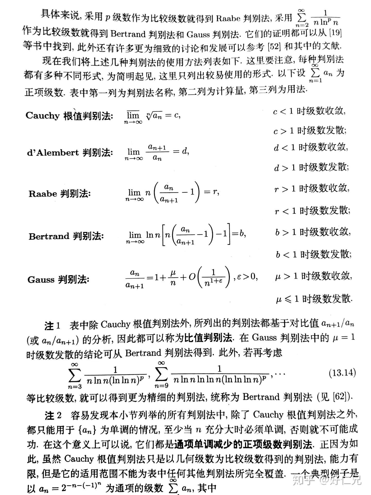
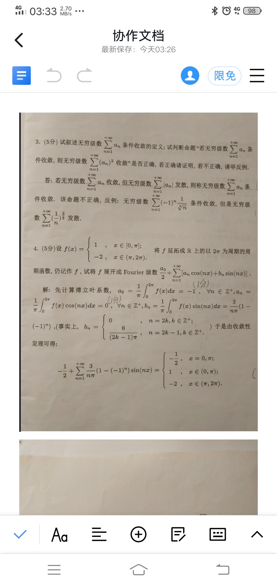
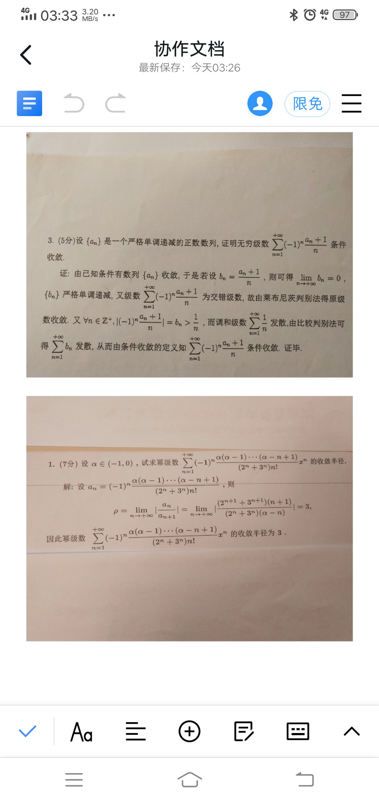
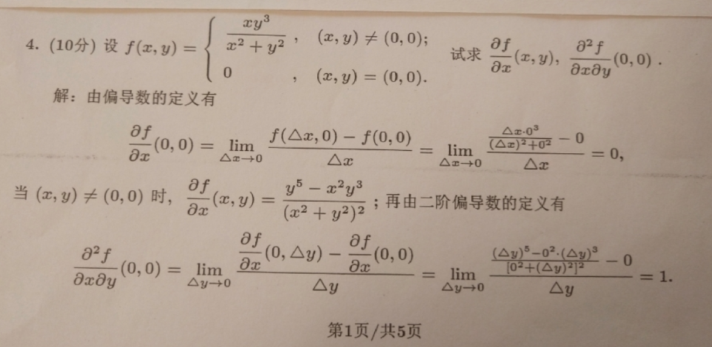
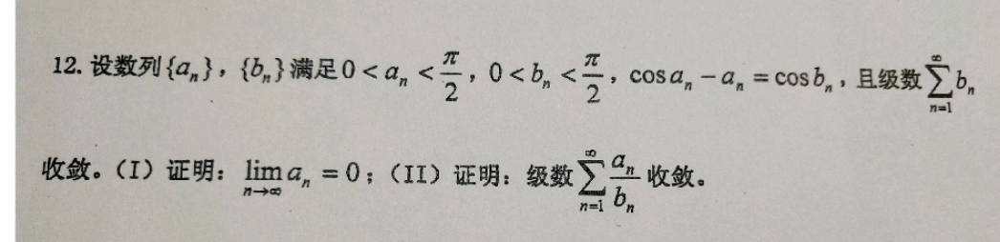

[TOC]

## 级数的敛散性
正项级数收敛性
- 比较判别法
- 比值判别法、根值判别法
- 积分判别法
- 部分和有上界
- 线性运算法则
- 如果通项极限不为0，则发散

一般级数
- 绝对值的。。。
- 莱布尼兹定理
- 如果通项极限不为0，则发散
### 比较判别法与泰勒展开

> 判断敛散性$\sum_{n=1}^{\infin}(\sqrt[n]{a}-\sqrt{1+\frac{1}{n}})$

看到有指数的,应该考虑换成e为底. 注意$\sqrt{1+x}=1+\frac{1}{2}x-\frac{1}{8}x^2+o(x^2)$

展开后变成$\frac{\ln a-1/2}{n}+\frac{\ln^2a-1/8}{n^2}+o(1/n^2)$

展开到二阶是因为一阶的时候系数=0的情况无法判断。

>  判断$\sum_{n=1}^{\infin}(e-(1+\frac{1}{n})^n)^p$的敛散性

$$a_n=e-\exp(n\ln(1+\frac{1}{n}))=e-\exp\left( n(\frac{1}{n}-\frac{1}{2n^2}+\frac{1}{3n^3}+\dots )\right)=e-\exp(1-\frac{1}{2n}+\frac{1}{3n^2}+\dots)\\=e(1-\exp(-\frac{1}{2n}+\frac{1}{3n^2}+\dots))
$$

因为$e^x-1\sim x(x \to 0)$ 

所以$a_n\sim \frac{e}{2n}(n \to \infin)$

因此只需判断$\sum \frac{1}{n^p}$敛散性(略)

> 判断敛散性
>
> 
$$\sum_{n=2}^{\infin}\ln(1+\frac{(-1)^n}{n^p})\\
$$

$$a_n=\frac{(-1)^n}{n^p}-\frac{1}{n^{2p}}+\frac{(-1)^{3n}}{n^{3p}}-\dots=\frac{(-1)^n}{n^p}-\frac{1}{n^{2p}}+o(\frac{1}{n^{2p}})
$$

对于$\sum \frac{(-1)^n}{n^p}$

- p>1绝对收敛
- 0<p<=1 条件收敛

对于$\frac{1}{n^{2p}}$

- p>1/2收敛
- 0<p<=1/2发散

综上所述: $p>1$绝对收敛 $\frac{1}{2}<p\leq 1$条件收敛,$p\leq\frac{1}{2}$发散

用同样的方法，可以判断交错级数和正项级数混合的级数。如$\sum \ln(1+\frac{(-1)^n}{\sqrt{n}})$发散

> 判断$\sum_{n=1}^{\infin}(-1)^n\frac{(2n-1)!!}{2n!!}$

注意要先判断是绝对收敛还是条件收敛。取绝对值后变成$\frac{1}{\sqrt{1-x}}$泰勒展开式令$x=1$时，发散。原级数$\frac{1}{\sqrt{1+x}}$ $x=1$时收敛。因此级数条件收敛

### Raabe判别法

> $u_n \geq 0,\lim_{n \to \infin}n(\frac{u_n}{u_{n+1}}-1)=r$

- $r>1$ $\{u_n\}$收敛
- $r<1$ 发散
- $r=1$失效

证明:- 若 $p>1$, 则可求得 $r \in(1, p)$ 满足
$$
\lim _{n \rightarrow \infty} n\left(\frac{a_n}{a_{n+1}}-1\right)=p>r=\lim _{n \rightarrow \infty} n\left[\left(1+\frac{1}{n}\right)^r-1\right],
$$
当 $n$ 充分大，有
$$
n\left(\frac{a_n}{a_{n+1}}-1\right)>n\left[\left(1+\frac{1}{n}\right)^r-1\right]
$$
也即
$$
\frac{a_n}{a_{n+1}}>\frac{(n+1)^{r}}{n^{r}}
$$
因此$a_{n}n^r$从某项开始递减，其必有上界。设$a_nn^r \leq M$,则$a_n \leq \frac{M}{n^r}$. 根据p级数的敛散性和比较判别法知$a_n$收敛。

在达朗贝尔和柯西失效的时候可以用

如$\sum{\frac{(2n-1)!!}{(2n)!!}}$ $r=\lim_{n \to \infin} \frac{n}{2n+1}=\frac{1}{2}$发散

 ,$\sum{\frac{(2n-1)!!}{(2n)!!(2n+1)}}$

## 幂级数展开

### 函数展成幂级数

>  $f(x)=\frac{1}{1-x-x^2}$

$1=(1-x-x^2)f(x)=(1-x-x^2)\sum a_nx^n=a_0+(a_1-a_0)x+(a_2-a_1-a_0)x^2+\dots (a_{n+2}-a_{n+1}-a_{n})x^n$

对比系数得$a_0=a_1=1,a_n=a_{n-1}+a_{n-2}$. 这就是斐波那契数列的生成函数

$\frac{a_{n+1}}{a_na_n+2}=\frac{1}{a_n}-\frac{1}{a_{n+2}}$

> $f(x)=\frac{1}{x^2-x+1}$. 求$a_{2n+2}$

类似上一题，乘积相当于系数平移。$a_{n-2}-a_{n-1}+a_n=0,a_0=a_1=1$

$[1,1,0,-1,-1,0]$循环

### 微分方程求解幂级数的和函数

> $s(x)=\sum_{n=0}^{\infin}\frac{x^{2n-1}}{(2n-1)!!}$

$s(x)+s'(x)=e^x$

> $s(x)=\sum _{n=0}^{\infin} \frac{(2n)!!}{(2n+1)!!}x^{2n+1}$

### 近似计算 

注意ln(1+x)收敛域$(-1,1]$,不能直接代入

### 综合题
> 求$\lim_{n \to \infin}\sum_{k=0}^n \frac{1}{n+k^a}(a>0)$

$\frac{n}{n+n^a}\leq \sum_{k=0}^n \frac{1}{n+k^a}\leq \frac{1}{n+1}$

如果$0<a<1$,左边和右边的极限都是1，夹逼.

如果$a=1$, $\lim_{n \to \infin}\frac{1}{n}\sum_{k=0}^n \frac{1}{1+k/n}=\int_0^1\frac{1}{1+x}=\ln 2$

如果$a>1$,根据p级数的结论$\sum \frac{1}{k^a}$收敛, 所以$\exist N,\sum_{k=N}^{}$

## 考前模拟题

注意单调有界定理的应用

(I) $a_n<b_n$

(II) $\lim_{n \to \infin}\frac{a_n}{b_n^2}=\frac{\cos a_n-\cos b_n}{b_n^2}\leq \frac{1-\cos b_n}{b_n^2}=\frac{1}{2}$

所以$b_n \sim \frac{a_n}{b_n}$