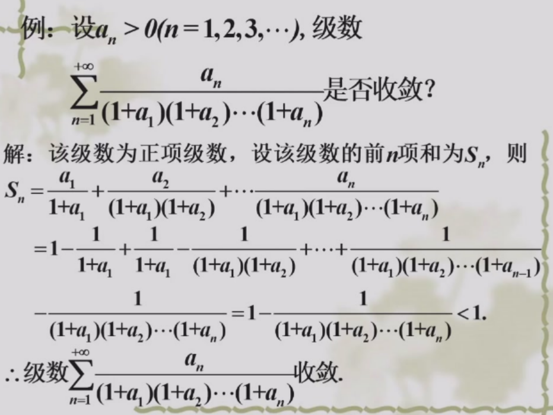
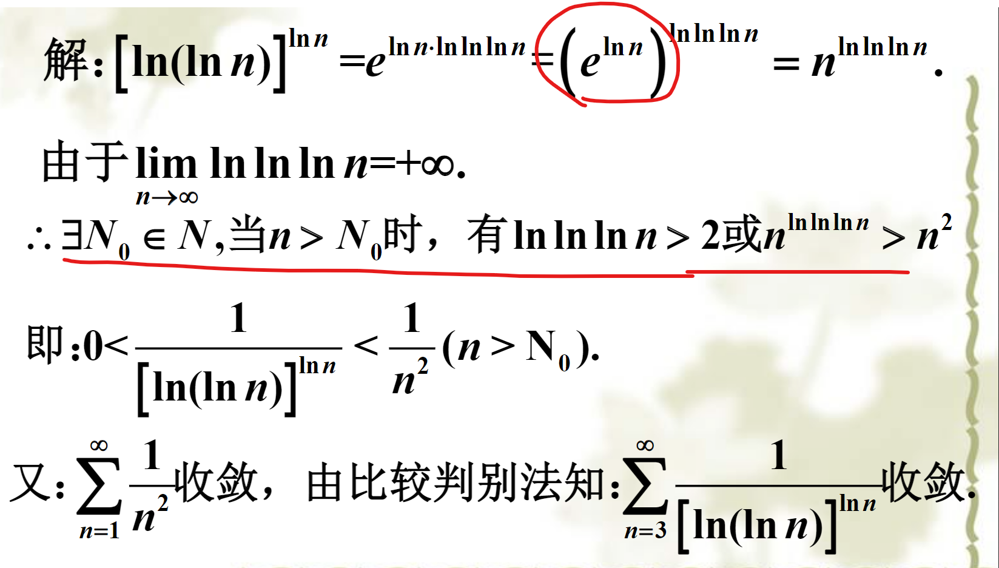
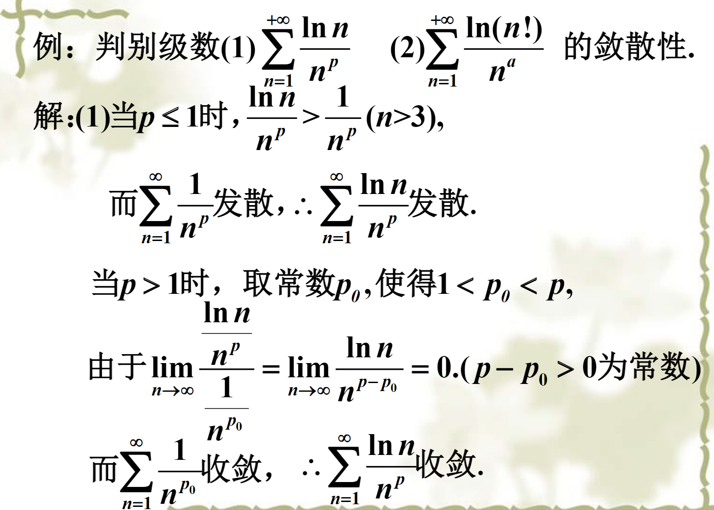
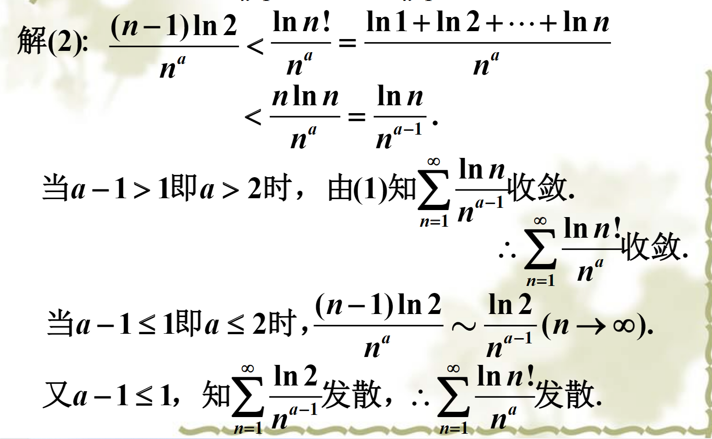
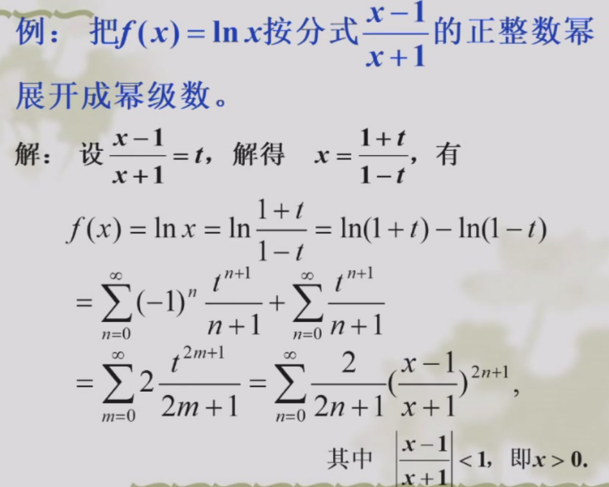
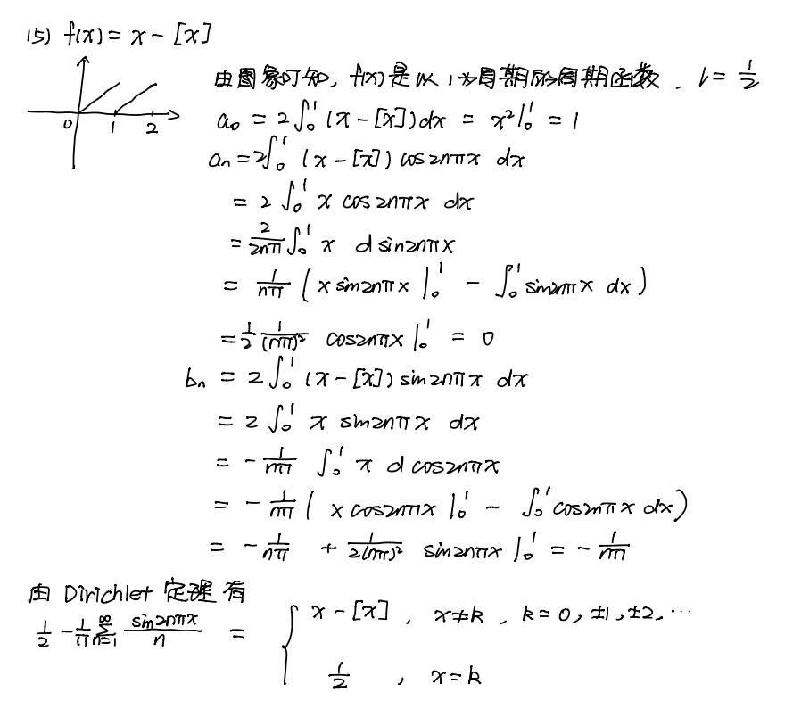
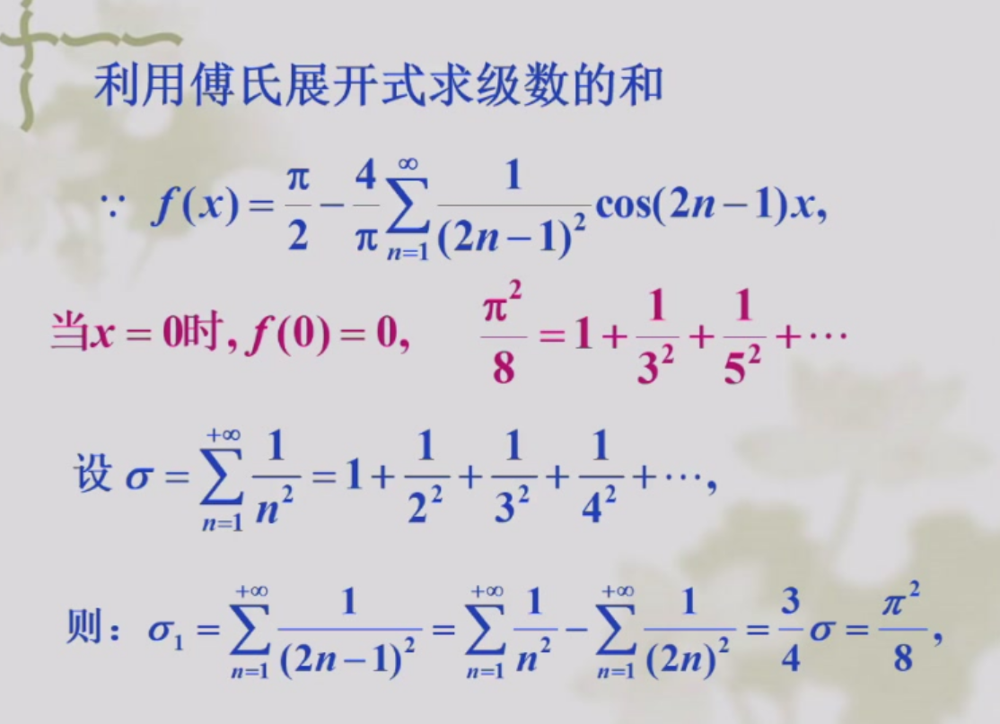

[TOC]

## 级数的定义

$$\sum_{n=0}^{\infin}a_n=\lim_{n \to \infin}S_n
$$

### 定义法判断收敛性

利用部分和$S_n$的极限

推论: $\sum_{n=0}^{\infin}a_n$收敛，则$\lim_{n \to \infin}a_n=0$

​          $\lim_{n \to \infin}a_n\neq0$或不存在,则**原级数发散**

> 例: $\sum \frac{n}{\ln^3n}$发散。  注意重要极限$\lim_{n \to \infin} \frac{\ln n}{n^p}=0(p>)$

### 柯西收敛准则

设$\lim_{n \to \infin} S_n=s,r_n=s-S_n=a_{n+1}+a_{n+2}+\dots$,则

$\lim_{n \to \infin}r_n=0$. 用极限的语言写

柯西收敛准则: $\forall \varepsilon>0,\exist N,\text{当}n>N$时对一切自然数$p$, 有$|u_{n+1}+u_{n+2}+\dots u_{n+p}|<\varepsilon$

### 利用特殊的级数

几何级数: 

$$ \sum_{n=0}^{\infin} aq^n \text{收敛到}\frac{a}{1-q}\text{当且仅当}|q|<1 \\
$$

p级数

$$\sum_{n=1}^\infin \frac{1}{n^p} \text{收敛当且仅当}p>1 \\
$$

### 利用级数之间的运算

数乘收敛性不变

收敛±收敛=收敛

收敛+发散=发散

增加、减少、修改有限项收敛性不变（因为有限项的和是常数)

收敛级数的结合性: 

- **收敛级数加括号形成的级数仍然收敛**（但发散不一定,如1 -1 1 -1)
- **加括号形成的级数发散，则原级数发散** (如调和级数$1+1/2+(1/3+1/4)+(1/5+1/6+1/7+1/8)+...(1/(2^m+1)+1/2^(m+1))>1+1/2+2/4+4/8+....$发散)

## 正项级数的收敛性

定义 $\sum_{n=0}^{\infin}a_n(a_n>0)$

### 充要条件(部分和有界)

正项级数$\sum_{n=0}^{\infin}a_n$收敛当且仅当$a_n$有界

### 比较判别法

既可以直接放缩

$\sum 1/{\ln n}$发散
也可以根据去掉有限项的性质，写成极限的形式:

$\lim _{n \to \infin} \frac{u_n}{v_n}=l$

$0<l<+\infin$(这里不需要和1比） 则$u_n$和$v_n$敛散性相同（相当于等价$u_n \sim lv_n$）

$l=0$,  $v_n$ 收敛则 $u_n$ 收敛

$l=+\infin$, $v_n$发散则$u_n$发散

用极限形式就不需要严格的大小关系，
多项式看最高次项, $n! \sim n^n$
$\sin 1/n \sim 1/n (n\to \infin)$

> 例:
>
> $\sum(1-\cos \frac{a}{n}) \sim \sum \frac{a^2}{2n^2}$ 收敛
>
> $\sum \frac{n\cos^2(n\pi/3)}{2^n}<\sum \frac{n}{2^n}$ 收敛
>
> $\sum \frac{1}{n}\sin \frac{1}{n}<\frac{1}{n^2}$
>
> $\sum n^{\frac{1}{n^2+1}}-1 \overset{取对数}{\sim} \sum \frac{\ln n}{n^2+}$

> 比较判别法推出的二级结论
> $\sum u_n^2, \ \sum v_n^2$收敛,则$\sum |u_nv_n| ,\sum(u_n+v_n)^2 ,\sum \frac{u_n}{n}$收敛
>
> $\sum u_n$收敛,则$\sum u_n^2$收敛,逆命题不成立。
第一个是因为$|u_nv_n|\leq \frac{1}{2}(u_n^2+v_n^2)$

第二个是因为$\exist N,\forall n>N,u_n \leq M<1,u_n^2 \leq Mu_n$

### 达朗贝尔比值法

$$\lim_{n \to \infin} \frac{u_{n+1}}{u_{n}}=\gamma
$$

$\gamma<1$ 收敛

$\gamma>1$发散

$\gamma=1$无法确定（比如p级数)

适用于有阶乘、n次方的。

>  例子:$\sum \frac{n}{3^n}$, $\sum \frac{n!}{n^n}$

$\lim_{n \to \infin}\frac{(n+1)!}{(n+1)^{n+1}}\cdot \frac{n^n}{n!}=\lim_{n \to \infin}(\frac{n}{n+1})^n=\lim_{n \to \infin} \frac{1}{(1+1/n)^n}=\frac{1}{e}$,收敛

### 柯西根值法

$$\lim_{n \to \infin} \sqrt[n]{u_{n}}=\gamma
$$

$\gamma<1$ 收敛

$\gamma>1$发散

$\gamma=1$无法确定

适用于能整体开根号的

### 积分判别法

> 如果$f(n)$ 在$(b,+\infin)$递减，连续，非负,则$\sum_{n=b}^{\infin} f(n)\text{和}\int_{b}^{+\infin}f(x)dx$收敛性相同。

适用于和式。
常见结论:$\sum_{n=2}^{\infin}\frac{1}{x(\ln x)^p}$在$p>1$收敛,$p \leq 1$发散

还有题目是利用积分判别法化曲为直的思想来放缩
> 例: $\sum \frac{1}{1+\sqrt{2}+\dots \sqrt{n}}$

$$\frac{1}{1+\sqrt{2}+\dots \sqrt{n}}=\frac{\frac{1}{n\sqrt{n}}}{\frac{1}{n}(\sqrt{\frac{1}{n}}+\sqrt{\frac{2}{n}}+\dots \sqrt{\frac{n}{n}})}<\frac{1}{n\sqrt{n}\int_0^1 \sqrt{x}}=\frac{3}{2} \frac{1}{n\sqrt{n}}
$$
由比较判别法，级数收敛

## 交错级数

$\sum_{n=b}^{\infin} (-1)^{n-1} u_n(u_n>0)$.或者$(-1)^n$也可以

### 莱布尼兹定理*

> 三个条件
> - $u_n \geq 0$
> - $u_n$递减
> - $\color{red}{\lim_{n \to \infin}u_n=0}$,则$u_n$收敛

比如$\sum (-1)^n \frac{1}{n}$收敛

注意不是所有交错级数都能用莱布尼兹判别法。

## 一般级数的收敛性

### 绝对收敛和条件收敛

 $\sum |a_n|$收敛，则$\sum a_n$收敛，称为绝对收敛

 $\sum |a_n|$发散且$\sum a_n$收敛，称为条件收敛

 $\sum a_n$发散

如果$\lim_{n \to \infin}|a_n|>0$,则$\lim_{n \to \infin}a_n$肯定不等于0，级数发散。etc. $\lim_{n \to \infin} n^{1/n}=e^{\ln n/n}=1$. 所以$\sum \frac{1}{n^{1/n}}$发散

### 绝对值的比值和根判别

### 绝对收敛级数的性质

> 绝对收敛级数任意重排后的级数也绝对收敛
>
> 条件收敛级数重排之后可以收敛到任意实数 

## 函数项级数

增加了一个参数x, 定义$\sum_{n=1}^{\infin}u_n(x)$为函数项级数。代入不同的$x$,得到不同的数项级数。所有让级数收敛的$x$(收敛点）的集合称为收敛域。发散的称为发散域。

求收敛域: 把$x$看成常数，然后按数项级数的判断方法分类讨论。

> 例: 求$\sum (\ln x)^n$的收敛域

利用绝对值比值判别法,得到$|\ln x|<1$. 收敛域$(\frac{1}{e},e)$

## 幂级数

标准形式:$\sum a_nx^n$

但很多时候题目给出的可能是$\sum a_n (ax+b)^n$,要换元。

### Abel定理和Cauchy-Hadamard定理

> Abel定理: 如果幂级数$\sum a_nx^n$当$x=x_0$时收敛，那么$|x|<|x_0|$时绝对收敛， $|x|>|x_0|$发散

>Cauchy-Hadamard公式: $\sum a_nx^n$，设 $\lim_{n \to \infin} \frac{|a_n|}{|a_{n+1}|}=R$
>
>$0<R<+\infin$ 则$(-R,R)$内绝对收敛
>
>$R=0$,则 $x=0$收敛
>
>$R=+\infin$, 在$\mathbb{R}$上收敛

本质是比值判别法，注意端点处需要检验

### 求幂级数的收敛域

1. 先求收敛区间
   - 如果是标准形式，根据Cauchy-Hadamard公式求解
   - 如果是$\sum a_n(kx+b)^n$，换元$y=kx+b$化成标准形式求出$R_y$ ,最后要换回x,收敛半径$R_x=\frac{R_y}{k},$
   - 把$x$看成常数,用数项级数的方法求解(适用于缺项的，如$\sum_{n=0}^{\infin} \frac{x^{2n+1}}{n}$)
2. 代入端点进行讨论

**注意换元时收敛区间、半径会变!!!**
### 幂级数的性质

> 分析性质: 
>
> - $S(x)$在收敛域上连续
> - 在$(-R,R)$上任意阶逐项可积、可微，且收敛半径不变
> - 推论:$a_0=S(0),a_n=\frac{S^{(n)}(0)}{n!}$ (保证幂级数唯一性)
>
> 代数性质:
>
> - 两个幂级数相加减，收敛半径为$R=\min\{R_a,R_b\}$

### 求幂级数和函数

1. 确定收敛域

2. 确定和函数

    - 线性运算、换元法:

    - 若逐项求导后的结果可以看出和函数，用$S(x)=S(0)+\int_0^x S'(x)dx$. 注意这里要用到$S(0)$是为了确定$S'(x)$不定积分之后的$C$.  比如有$\frac{x^n}{n}$
    - 若逐项积分后的结果可以看出和函数,用$S(x)=(\int_0^x S(x)dx)'$ 比如有$nx^{n-1}$

3. 端点处要讨论: 端点处的值$\sum_{n=0}^\infin a_n R^n=\lim_{x \to R^-} S(x)$. 如果$S(x)$在$x=R$连续,才可以直接用$S(R)$

注意求和符号的下界

> 例:  求$\sum_{n=1}^\infin \frac{x^{n-1}}{n}$

收敛半径$R=1$,收敛域$[-1,1)$

$\sum_{n=1}^\infin \frac{x^{n-1}}{n}=\frac{1}{x} \sum_{n=1}^\infin \frac{x^n}{n}(x \neq 0)$

设$S(x)=\sum_{n=1}^\infin \frac{x^n}{n},S(0)=0$

$S'(x)=\sum_{n=1}^\infin x^{n-1}=\frac{1}{1-x}$

$S(x)=S(0)-\ln(1-x)|^x_0=-\ln(1-x)$

当$x=0$时$\sum_{n=1}^\infin 0^{n-1}/n=1$.**注意0次幂**

因此$\sum_{n=1}^\infin \frac{x^{n-1}}{n}=\begin{cases}  \frac{-\ln(1-x)}{x},[-1,0)\cup(0,1) \\ 1,x=0\end{cases}$

> 例: 求$\sum_{n=1}^\infin \frac{x^n}{n+1}$

$$\sum_{n=1}^\infin \frac{x^n}{n+1}=\frac{1}{x}\sum_{n=1}^\infin \frac{x^{n+1}}{n+1}=\frac{1}{x}\sum_{n=\mathbf{2}}^\infin \frac{x^n}{n}=\frac{1}{x}(-\ln(1-x)-x)
$$

x=0时显然等于0

> 例: 求$\sum_{n=1}^\infin(-1)^{n-1} \frac{2nx^{2n-1}}{(2n-1)!}$

易得收敛域为$\mathbb{R}$

注意到$2n$和$2n-1$差1,考虑积分。
$$\int_0^x s(x)dx=\sum_{n=1}^\infin (-1)^{n-1}\frac{x^{2n}}{(2n-1)!}=x\sum_{n=1}^{\infin} (-1)^{n-1}\frac{x^{2n-1}}{(2n-1)!}=x\sin x
$$

求导得到$s(x)=x\cos x+\sin x(x \in R)$

> 例: 求$\sum_{n=0}^\infin \frac{a(a-1)\dots(a-n+1)}{n!}x^n$

由Cauchy-Hadamard公式,收敛半径$R=\lim_{n \to \infin}|\frac{n+1}{a-n}|=1$

求导有$s'(x)=\sum_{n=1}^{\infin} \frac{a(a-1)\dots(a-n+1)}{(n-1)!}x^{n-1}=a+\sum_{n=1}^{\infin}\frac{a(a-1)\dots(a-n)}{n!}x^n$

注意到$xs'(x)=\sum_{n=1}^{\infin} \frac{a(a-1)\dots(a-n+1)}{(n-1)!}x^{n}$

那么通分之后$xs'(x)+s'(x)=\sum_{n=1}^{\infin} \frac{a^2(a-1)\dots(a-n+1)}{n!}x^{n}=as(x)$

解这个微分方程得$s(x)=(1+x)^a (-1<x<1)$

> 例: 求$\sum_{n=2}^\infin \frac{x^n}{n(n+1)}$
利用和函数可以求一些数项级数的和。比如$\sum \frac{n(n+1)}{2^n}$就可以看成$s(\frac{1}{2}),s(x)=\sum n(n+1)x^n$

适当的拆分:
$n^2-n+1$拆成$n(n-1)$(构造二阶导数)+1
## Taylor级数

之前我们只知道展开到第n阶的情况。现在我们想知道$x$满足什么条件时可以无限展开下去。

### 函数展开成幂级数

#### 定义法

1. 先求$f^{(n)}(x_0)$,并写出级数表达式
2. 确定收敛区间$|x-x_0|<R$
3. 证明$|x-x_0|<R$内$\lim_{n \to \infin}R_n(x)=0$

> 例：$f(x)=e^x$展开为$x$的幂级数

$R=\lim_{n \to \infin}\frac{n!}{(n+1)!}=+\infin$

拉格朗日余项$R_n(x)=\frac{e^{\xi}x^{n+1}}{n!}(|\xi|<|x|)$

$\forall x\in(-\infin,+\infin)$, 则$\lim_{n \to \infin}|R_n(x)| \leq \lim_{n \to \infin}|\frac{e^{|x|}|x|^{n+1}}{(n+1)!}|=e^{|x|}\cdot \lim_{n \to \infin}|\frac{|x|^{n+1}}{(n+1)!}|$. 又因为级数绝对收敛,根据收敛的必要条件，右边的极限一定为0.

由此可见，通过定义证是很难的。因为要证明余项极限为0

### 利用幂级数的运算

跟求和函数一样

- 线性运算
- 换元,注意是展开成$x-x_0$的幂级数还是其他式子
- 求导、积分.比如求$\ln(1-x),\ln(1+x),\arctan x,\arcsin x$.

> 例: $f(x)=\frac{x}{x^2-x-3}$ 展开为$x$的幂级数

$f(x)=\frac{1}{3} (\frac{1}{x+1}+\frac{2}{x-2})$

$\frac{2}{x-2}=-\frac{1}{1-\frac{x}{2}}=-\sum_{n=0}^{\infin}(\frac{x}{2})^n(-2<x<2)$

所以$f(x)=\frac{1}{3}\sum ((-1)^n-\frac{1}{2^n})x^n$

> 例$f(x)=x \arctan x-\ln \sqrt{1+x^2}=x\arctan x-\frac{1}{2}\ln(1+x^2)$.

法一:利用初等函数的泰勒展开

法二:注意到这是$\arctan x$的积分

### 要记住的Taylor级数

$$\boxed{\frac{1}{\sqrt{1-x}}=1+\sum_{n=1}^{\infin} \frac{(2n-1)!!}{(2n)!!}x^n} [-1,1)
$$
$$\boxed{\frac{1}{\sqrt{1+x}}=1+\sum_{n=1}^{\infin} \frac{(-1)^n(2n-1)!!}{(2n)!!}x^n,\color{red}{-1<x\leq 1}}
$$
$$\arctan x=\sum_{n=0}^{\infin}\frac{(-1)^n}{2n+1}x^{2n+1},\color{red}{-1\leq x \leq 1}
$$

$$\ln(1+x)=\sum_{n=1}^\infin \frac{(-1)^{n-1}}{n}x^n ,\color{red}{x \in (-1,1]}
$$

$$(1+x)^a=\sum_{n=0}^\infin \frac{a(a-1)\dots(a-n+1)}{n!}x^n, x  \in \begin{cases} (-1,1),a \leq -1\\ (-1,1],-1<a<0 \\ [-1,1],a>0 \end{cases}
$$

## Fourier级数

感觉本质利用了线代里正交基的一些性质。假设我们要把$\alpha$分解成$k_1\alpha_1+k_2\alpha_2+\dots k_n\alpha_n$.其中$\alpha_1\dots \alpha_n$是一组基,那么求$k_1\dots k_n$需要解一个线性方程组，很复杂。
但如果是一组正交基，两边内积$\alpha_i$则$(\alpha,\alpha_i)=k_i(\alpha_i,\alpha_i)$. 求系数就很快了

那么对于内积$(f(x),g(x))=\int_{-l}^l f(x)g(x)dx$. $1,\cos \frac{\pi x}{l},\cos \frac{2\pi x}{l}\dots \cos \frac{n\pi x}{l},\sin \frac{\pi x}{l}\,\dots \sin\frac{n\pi x}{l}$.是一组正交基。代入上式结合内积定义就得到傅里叶级数的表达式
### 傅里叶级数的定义
三角函数的函数项级数

$f(x)$是周期函数,$T=2l$

$$S(x)=\frac{a_0}{2}+\sum_{n=0}^{\infin}(a_n\cos \frac{n\pi x}{l}+b_n\sin \frac{n\pi x}{l})
$$

称为$f(x)$的傅里叶级数

其中
$$a_0=\frac{1}{l}\int_{-l}^l f(x)dx
$$
$$\boxed{a_n=\frac{1}{l}\int_{-l}^l f(x)\cos \frac{n\pi x}{l}dx, \ \ \ b_n=\frac{1}{l}\int_{-l}^l f(x)\sin \frac{n\pi x}{l}dx}
$$

> 推论1: 当$f(x)$为奇函数的时候,$a_n=0$. $f(x)$为偶函数的时候,$b_n=0$

> Dirichlet定理: 若$f(x)$在$[-l,l]$连续或只有有限个第一类间断点，并且至多只有有限个极值点，则$f(x)$的傅里叶级数收敛
> 
$$S(x)=\frac{f(x-0)+f(x+0)}{2}
$$
> 其中$f(x-0),f(x+0)$表示在$x$点处的左右极限
> 当$x=\pm l$时,$S(x)=\frac{f(-l+0)+f(l-0)}{2}$ (由周期$2l$显然)

因此，写出级数后，还要讨论$f(x)$的连续性,**计算间断点处的极限，不能直接写等于**$f(x)$
$$\frac{a_0}{2}+\sum_{n=0}^{\infin}(a_n\cos \frac{n\pi x}{l}+b_n\sin \frac{n\pi x}{l})=\begin{cases} f(x), x \text{属于连续区间}\\ \frac{f(x-0)+f(x+0)}{2},x是间断点点\end{cases}
$$

**易错的计算细节和技巧**

- 记得除以$l$
- sin\cos的端点值。 $\cos n\pi=(-1)^n$
- sin\cos的分部积分注意正负号，$-1$的
- 常见积分结果
    - $\boxed{\int_0^{\pi}x\cos nx dx=\frac{(-1)^n-1}{n^2}}$
    - $\boxed{\int_0^{\pi}x^2\cos nx dx=\frac{2\pi(-1)^n}{n^2}}$
    - $\boxed{\int_0^{\pi}x\sin nx dx=\frac{(-1)^{n+1}\pi}{n}}$
    - $\boxed{\int_0^{\pi}x^2\sin nx dx=\frac{(-1)^{n+1}}{n}+\frac{2(1-(-1)^n)}{n^3}}$
    - 跟$e^x$有关的直接待定系数

**一般周期函数在[a,b]的傅里叶展开**

令$l=\frac{b-a}{2}$,积分区间换成$[a,b]$

> 例: $f(x)=x-[x]$

**非周期函数在[0,l]的傅里叶展开**

我们可以先把定义域延拓到$[-l,0]$, 令函数周期为$2l$, 然后在 $[-l,l]$ 上展开。根据推论1：

- 令$f(-x)=-f(x)(0<x<l)$ 奇延拓(得到**正弦级数**) $a_n=0$, 
- 
$$\boxed{b_n=\frac{2}{l}\int_{0}^lf(x)\sin \frac{n\pi x}{l}}
$$
-  (乘2是因为积分符号内是偶函数)
- 令$f(-x)=f(x)(0<x<l)$偶延拓(得到**余弦级数**) 
$$\boxed{a_n=\frac{2}{l}\int_{0}^lf(x)\cos \frac{n\pi x}{l},b_n=0}
$$

### 傅里叶级数的应用

> 帕塞瓦尔等式: 若$f(x)$在 $[-l,l]$上连续
> 
$$\frac{1}{l}\int_{-l}^l f^2(x)dx=\frac{a_0^2}{2}+\sum_{n=1}^\infin(a_n^2+b_n^2)
$$

求一些级数的和（幂级数无法做到)

### 傅里叶级数的复数形式