*Discrete Mathematics and Its Applications*, Kenneth H. Rosen

有点鬼畜的Latex代码: $\neg$是`\neg`, $\vee$是`\vee`,$\wedge$是`\wedge`
## 1.1Propositional Logic

> Propositions is a **statement** that is either true or false,but not both

### Logic Operators
1. Negation: $\neg p$
2. Conjunction(and) $p \wedge q$
3. Disjunction(or) $p \vee q$
4. Exclusive or(xor)  
5. Implication(If p then q / p implies q / p only if q) $p \to q$

 注意p only if q 也是 $p \to q$，相当于必要条件 

| p    | q    | p ->q |
| ---- | ---- | ----- |
| 1    | 1    | 1     |
| 1    | 0    | 0     |
| 0    | 1    | 1     |
| 0    | 0    | 1     |

Everything implies true. False implies everything

5. Biconditional : $p \leftrightarrow q$

## 1.2 Applications of Logic

### Translating English Sentences

感觉在考英语

$p \to q:$

if p, then q.

**p only if q**

**q unless $\neg p$**

p is sufficient for q  /  q is necessary for p

q whenever p / **q follows from p**

To p,you must q

$p \leftrightarrow q:$

p is necessary and sufficient for q / ....and conversely/ p iff q

$p \to q$

- converse: $q \to p$
- inverse $\neg p \to \neg q$
- contrapositive $\neg q \to \neg p$

Converse and Inverse are logically equivalant. Constrapositive and original proposition are logically equivalant

### System Specifications

先翻译，然后转化成了**给出一系列逻辑表达式，判断是否存在赋值的方法使得这些表达式全为True**。先从单目入手，然后再考虑$p\to q=F$的时候可以确定赋值。如果$p \to q=T$，就枚举

### Logic Puzzles

可以转化成逻辑表达式的方式，也可以直接枚举真值

## 1.3 Propositional Equivalences

> **Tautology**: Compound propositions that are always true( e.g. $p \vee\neg p$)
>
> **Contradiction**:  Compound propositions that are always false
>
> Compound propositions that have the same truth values in all cases are called logically equivalent. $p \equiv q$

### Logical Equivalences

Using truth tables, we can prove these equivalences:

$p \vee 0=p \wedge 1=p$

$p \vee 1=1,p \wedge 0=0$

De Morgan's Laws: 
$\neg(p \wedge q)=\neg p \vee \neg q,\neg(p \vee q)=\neg p \wedge \neg q$

Distribution: 
$p \wedge(q \vee r)=(p \wedge q) \vee(p \wedge r)$

​                       $p \vee(q\wedge r)=(p \vee q)\wedge (p \vee r)$

注意有时也反向用分配律合并同类项

**Absorption Laws**: $\boxed{p \vee(p \wedge q)=p, p \wedge(p \vee q)=p}$

implication law: 

$p \to q \equiv \neg p \vee q$

 (Because p implies q is false only if p=1 and q=0)

Then using these laws we can prove:

Conditional statements:

$p \to q \equiv \neg q \to \neg p$

$\neg(p \to q)=p\wedge \neg q$

Biconditional statements:

$p \leftrightarrow q \equiv (p \to q)\wedge(q\to p)$

$p \leftrightarrow q \equiv \neg p \leftrightarrow \neg q$

$p \leftrightarrow q \equiv (p \wedge q)\vee(\neg p \wedge \neg q)$

第三条从真值表来看是显然的。但是也可以用上面的定律证,多次用分配律拆括号,然后用$p \wedge \neg p=0$的性质

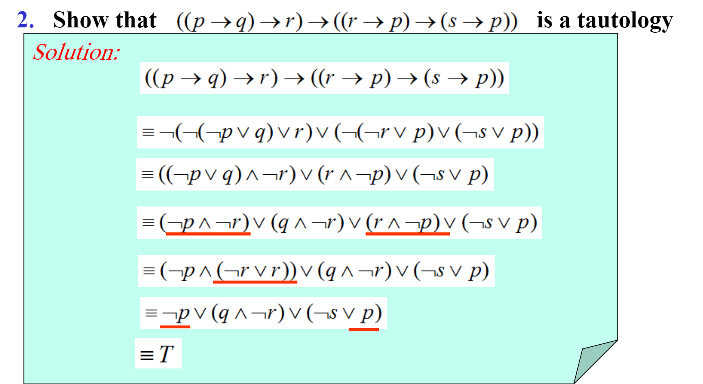

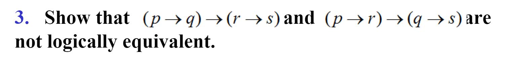

Assume that the second proposition is false. Then $q \to s=F,p \to r=T$. so $q=T,s=F$. Enumerate all 3 cases of $p,r$, then we can get $p=F,q=T,r=F,s=F$ as a counterexample.

### Satisfiability

> A compound proposition is satisfiable if there is an assignment of truth values to its variables that makes it true

### Normal Form

Literal: $p$ or $\neg p$

Distributive Normal Form (DNF) : A formula is said to be in disjunctive normal form if it is written as a disjunction, in which all the terms are conjunctions of literals(a variable or its negation). etc. $(p \wedge \neg q)\vee r$.  We can also define Conjunctive Normal Form(CNF)
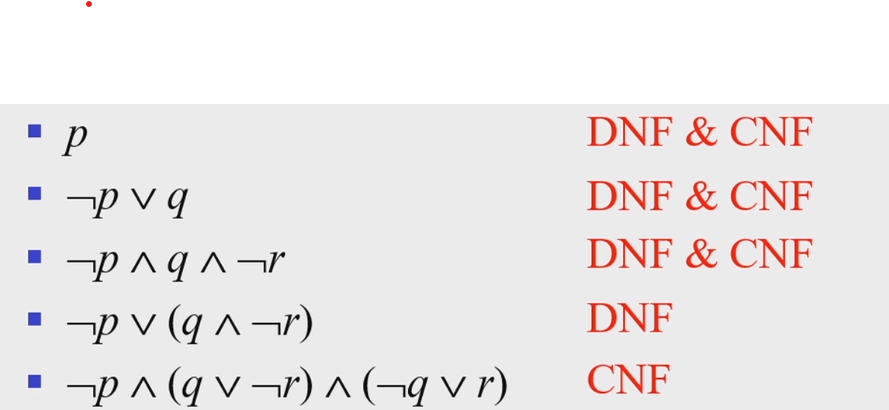

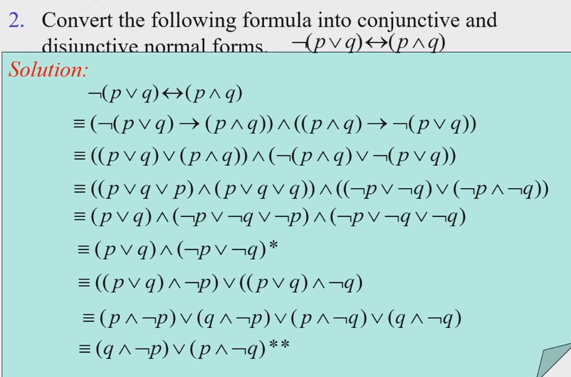

A minterm is a conjunction of literals in which each variable is represented **exactly once**. For$p,q,r$  $p \wedge q$ s not a minterm.  $p \wedge q  \wedge r$ is a minterm.

$2^n$ minterms.

Transforming into Full DNF:**First  $\wedge(p \vee \neg p)$, then use distributive law**

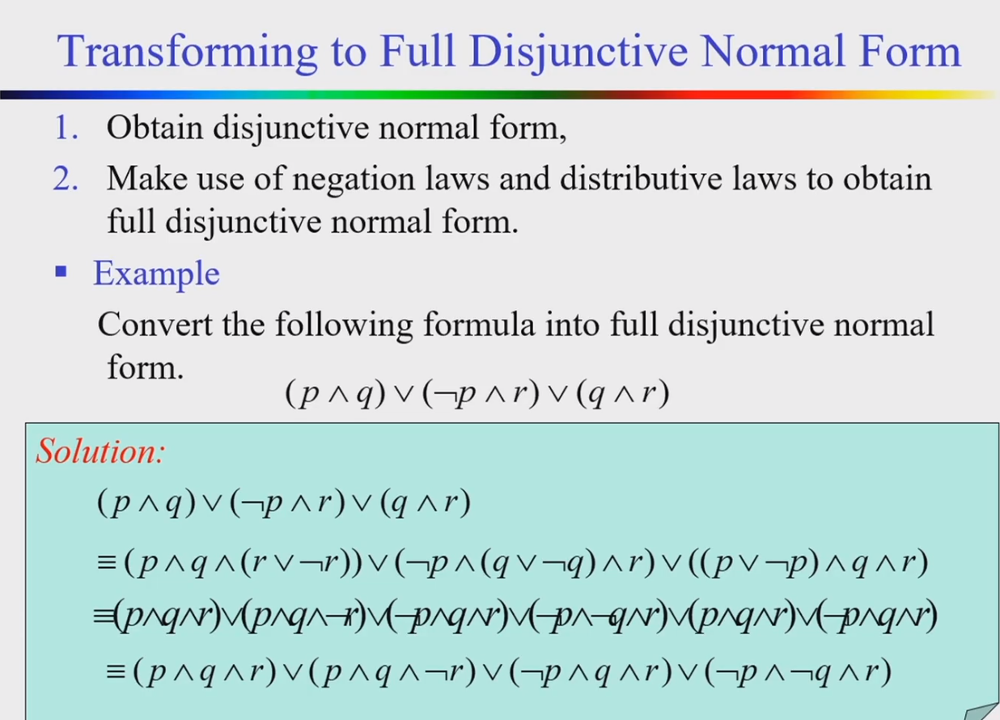

**Full** DNF can be used to **construct a proposition with a given truth table**.  etc. proposition consisting of 3 variables p,q,r is true when exactly two variables are true. $(p \wedge q\wedge \neg r)\vee(p \wedge \neg q\wedge  r)\vee(\neg p \wedge q\wedge  r)$. Therefore, **every compound proposition is logically equivalent to a full DNF.**

- Each minterm is true for **exactly one** assignment

- minterm $A,B,A\neq B \to A\wedge B=F$

- Same Full DNF $\leftrightarrow$ Logically equivalent.

A collection of logical operators is called **functionally complete** if every compound proposition is logically equivalent to a  compound proposition consisting of only these operators.

For example

- $\neg$ and $\wedge$  form a functionally complete collection.

- $\downarrow$(NOR $\neg(p \vee q)$) is a functionally complete collection.   $|$(NAND)  is functionally complete. 

- $p \downarrow p \equiv \neg p, (p \downarrow q)\downarrow(p\downarrow q)=\neg(p\downarrow q)=p\vee q$

    

## 1.4 Predicates and Quantifiers

### Predicates
> A predicate (propositional function) is a statement that contains variables. Once the values of the variables are specified, the function has a truth value.
>
> $P(x_1,x_2\dots x_n)$ is called n-ary or n-place predicate. such as $P(x)= x>0$

### Quantifiers

> Universal Quantifier: $\forall x\ p(x)$
> Existential Quantifier: $\exist x\ p(x)$
>
> Domain (domain of discourse / universe of discourse): range of the possible values of the variable x

Precedence: $\forall$ and $\exists$ have **higher precedence than all logical operators**

| Precedence | Operators             |
| ---------- | --------------------- |
| 1          | $\forall,\exist$      |
| 2          | $\neg$                |
| 3          | $\wedge,\vee$         |
| 4          | $\to,\leftrightarrow$ |

$\forall x P(x) \vee Q(x) \equiv (\forall x P(x)) \vee Q(x)$

### Binding Variables

Bound variable: a variable is bound if it is quantified.

All the variables in a propositional function must be quantified or set equal to a particular value to turn it into a proposition.

### Logical Equivalences Involving Quantifiers

Distribution:

$\forall (p(x) \wedge q(x)) \equiv\forall x p(x) \wedge \forall x q(x)$

$\exist (p(x) \vee q(x)) \equiv \exist x p(x) \vee\exist x q(x)$

note that **you cannot distribute  Universal Quantifier over OR ** 

De Morgan's Law:
 $\neg (\forall x\ p(x)) \equiv \exist x \ \neg p(x)$
 $\neg (\exist x\ p(x)) \equiv\forall x \ \neg p(x)$
注意右推左在证明里很常用
(1) $\quad \forall x P(x) \vee A \equiv\forall x(P(x) \vee A)$
(2) $\forall x P(x) \wedge A \equiv \forall x(P(x) \wedge A)$
(3) $\quad \exists x P(x) \vee A \equiv \exists x(P(x) \vee A)$
(4) $\exists x P(x) \wedge A \equiv \exists x(P(x) \wedge A)$
(5) $\quad \forall x(A \rightarrow P(x)) \equiv A \rightarrow \forall x P(x)$
(6) $\exists x(A \rightarrow P(x)) \equiv A \rightarrow \exists x P(x)$
(7) $\forall x(P(x) \rightarrow A) \equiv \exists x P(x) \rightarrow A$
(8) $\quad \exists x(P(x) \rightarrow A) \equiv \forall x P(x) \rightarrow A$
where the truth value of $A$ is not related to 

记忆方法：除了A做结果的时候改变量词，其他与、或等都可以直接提出括号

Proof:
(1)-(4) Discuss the truth value of A
(5)-(8) Use the **implication law**

$\exists x (\neg P(x)\vee A)=\exist x \neg P(x) \vee A=\neg(\forall x P(x))\vee A=\forall xP(x) \to A$

$\exists x (P(x) \to Q(x))=\exist (\neg P(x) \wedge Q(x))$

## 1.5 Nested Quantifiers

$\forall x \exist y P(x,y) \neq \exist x \forall y P(x,y)$. etc. $P(x,y)=x$ loves $y$

Negation: 交换符号、最后的条件否定

Prenex Normal Form:

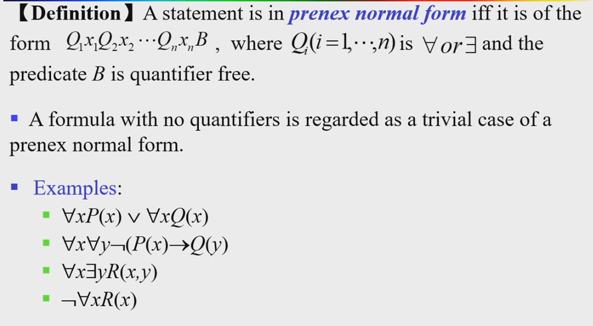

1. Get rid of arrowsImplication Law
2. Move negative
3. Change names
4. To the front

### Translating from English to Quantifiers

etc. All lions are fierce

$\forall x(P(x) \to Q(x))$, where the domain of $x$ is all animal

Note that we **can't write** $\forall (P(x) \wedge Q(x))$, which means all animals are lions and all animals are fierce

Some students in the class have visited Mexico

$\exist x(P(x)\wedge Q(x))$, where the domain of $x$ is all people

Note that we can't write $\exist (P(x) \to Q(x))$, because there can be $x$ that $P(x)=F,Q(x)=T$

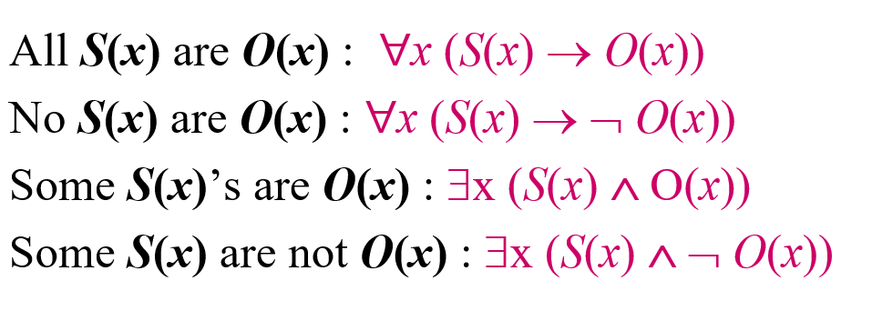

Nested Quantifiers

There is only one $x$ that $P(x)$.  $\exist x\forall y(x=y\leftrightarrow P(y))$

or $\exist x\forall y(P(x)\wedge(x\neq y \to \neg P(y)))$

Everyone except one $x$ that $P(x)$. $\exist x\forall y(x\neq y\leftrightarrow P(x))$

There is at least 2  $\exist x \exist y (x \neq y \wedge P(x) \wedge P(y))$

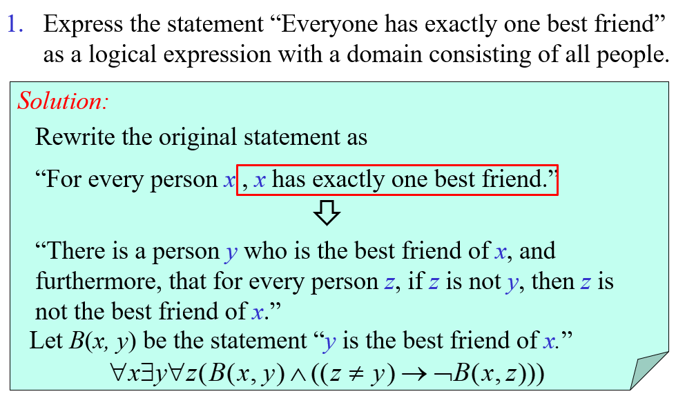

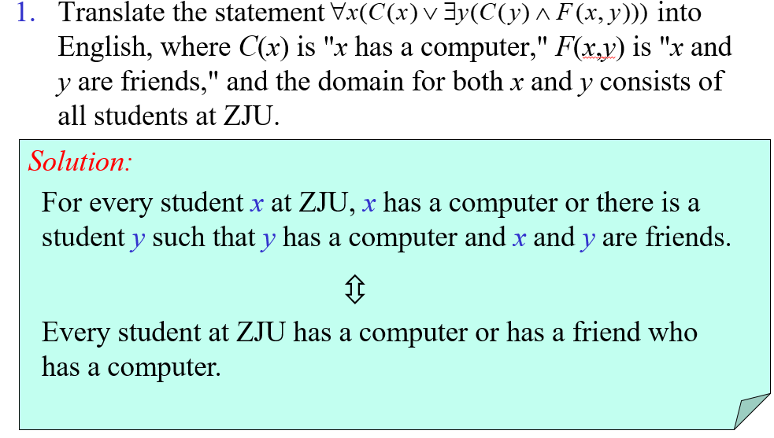

翻译成英文之后不要出现x,y,z等字母

## 1.6 Rule of Inference ☆

Argument: A sequence of propositions: If $(p_1 \wedge p_2 \dots \wedge p_n)\to q$ is tautology, then the argument is valid

**Formal Form**(考试时注意格式!不要忘了写∴)

$$\begin{aligned}&p_1\\&p_2\\\ &\dots\\&p_n\\ &\_\_\_\_\\ ∴&q \end{aligned}$$

Trick:
$p_1\dots p_n(\text{premises}),(q \to r)(\text{conclusion}) \equiv p_1\dots p_n,q(\text{premises}) ,r$

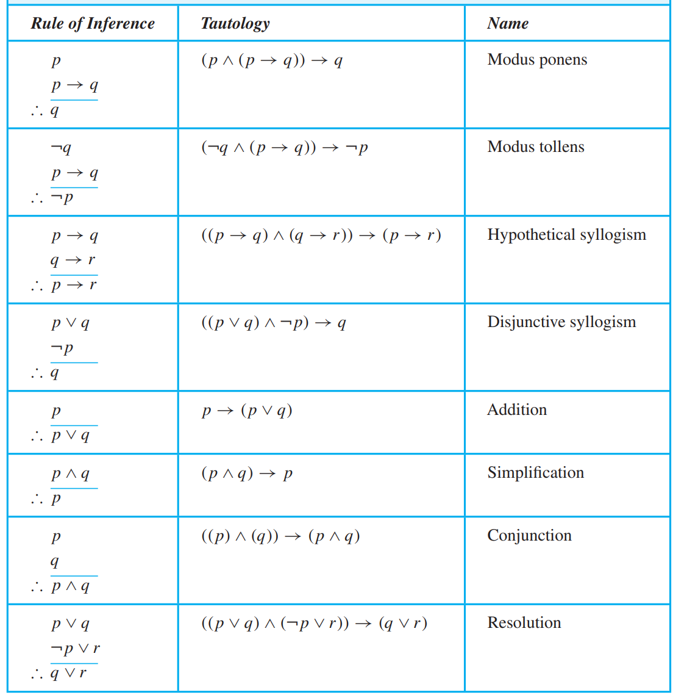

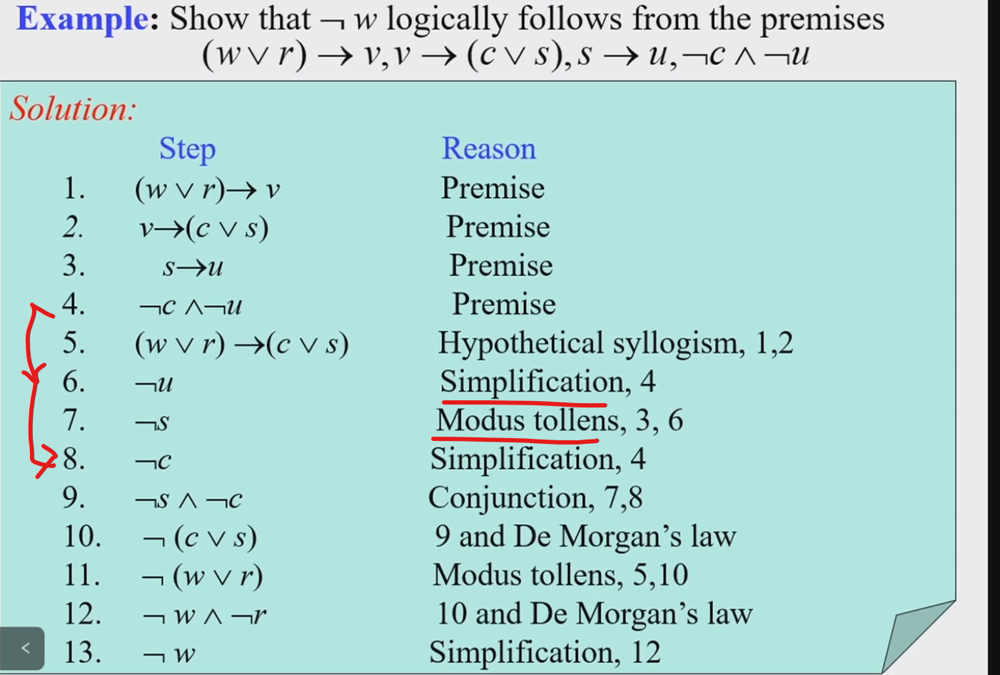

Resolution:

$$((p \vee q)\wedge(\neg p \vee s)) \to (q\vee s)$$

$p \vee q,\neg p \vee r ,\neg q \vee s$. 先对1,3，再对2用resolution

### Rules of inference for Quantified Statements

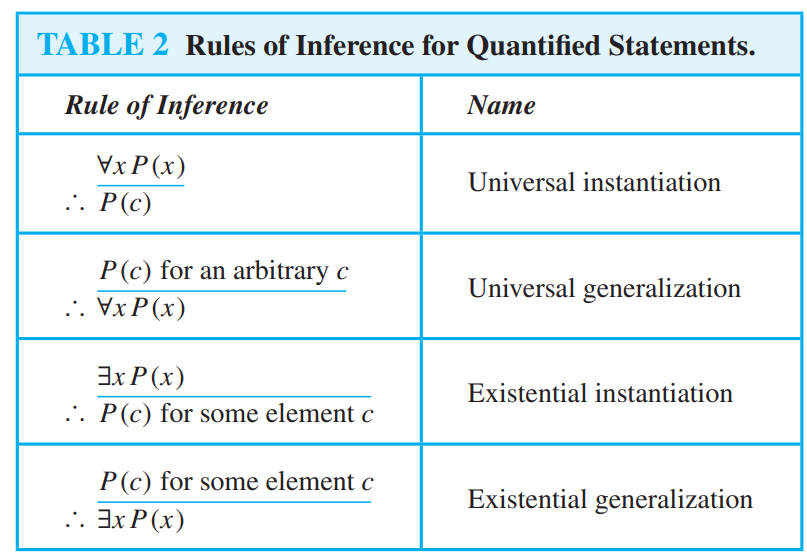

A:$\forall x \exist y P(x,y)$
B:$\exist x\forall y P(x,y)$
A不能推出B，B可以推出A

## Proofs

Terminology:
- theorem 定理
- axioms 公理
- lemma 引理
- corollary 推论
- conjecture 猜想

Vacuous proof: $p=F,p \to q=T$.  Trivial Proof:$q=T$

Proof by contraposition:

$p \to q \equiv \neg q \to \neg p$

Assume that $\neg q$ is true

Proof by contradiction:

Assume that $p,\neg q$ is true, deduce $(p \and \neg q)\to \neg p$, $p \and \neg p$ forms a contradiction

Proof of equivalence.

