复习时主要看第一节的定义，欧拉与哈密顿路径，平面图

https://www.cnblogs.com/birchtree/p/13219941.html

## Definition

$G=(V,E)$

$\color{red}{图的分类}$

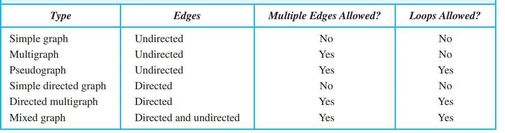

- 注意$\color{red}有向图的重边必须方向相同$.如果有(a,b)(b,a)这种还是算simple directed graph
- directed multigraph可以有自环,但Multigraph没有自环
- 没有重边，有自环就叫directed graph

### Terminology

$e=(u,v)\in E$ , then $u$ and $v$ are adjacent. $e$ is incident with u and v.

#### Undirected graph

degree $\deg(v)$, number of edges connected to v **自环算两次**

- $\deg(v)=0$, v is isolated
- $\deg(v)=1$, v is **pendant**

$\sum_{v \in V}\deg(v)=2|E|$

#### Directed graph

in degree $\deg^-(v)$.   out degree $\deg^+(v)$

underlying undirected graph（把边都变成无向的)

### Special graphs

**complete graph**: $K_n$ (完全图) $\color{red}{注意和C_n}区分开来$

**cycle**: $C_n$

wheel: $W_n$ 有n+1个点!

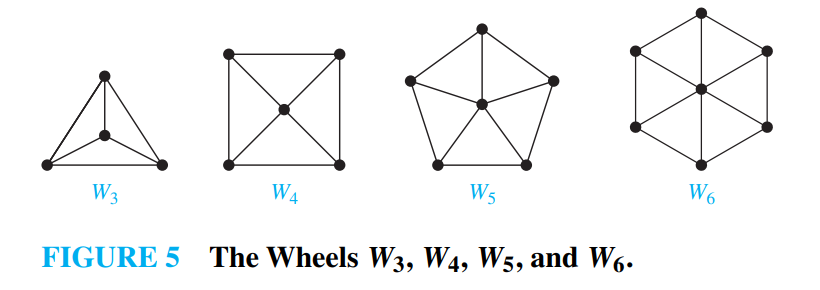

**n-cubes**: $Q_n$ Two vertices are adjacent if and only if the bit strings that they represent differ in exactly one bit position

$\deg (v)=2^{n-1}-1$

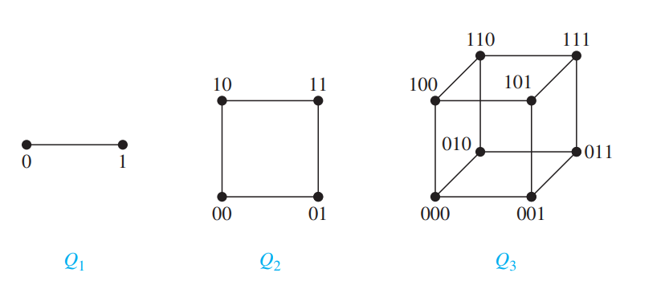

#### bipartite graph(二分图)

complete bipartite graph $K_{m,n}$. 两边各m,n个,两两相连

二分图的判定:染色法

> A simple graph is bipartite if and only if it is possible to assign one of two different colors to each vertex of the graph so that no two adjacent vertices are assigned the same color.

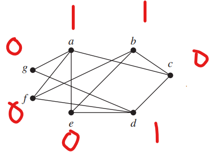

### Subgraphs

$G=(V,E),H=(W,F)$

- subgraph $W\subseteq V,F\subseteq E$

- spanning subgraph: $W=V,F\subseteq E$

> how many subgraphs with at least 1 vertex does $W_3$ have

- 1 vertex: 4
- 2 vertex: 2C(4,2)
- 3 vertex: $2^3C(4,3)$ (三条边任选)
- 4 vertex: $2^6C(4,4)$

这样的方法可以推广到任意一个完全图$K_n$

## Representing Graphs

### Graph representation

adjacent matrix(重边对应重数)

adjacent list

incidence matrix $M_{n \times m},m_{ij}=(e_j \text{ is incident with }v_i )$

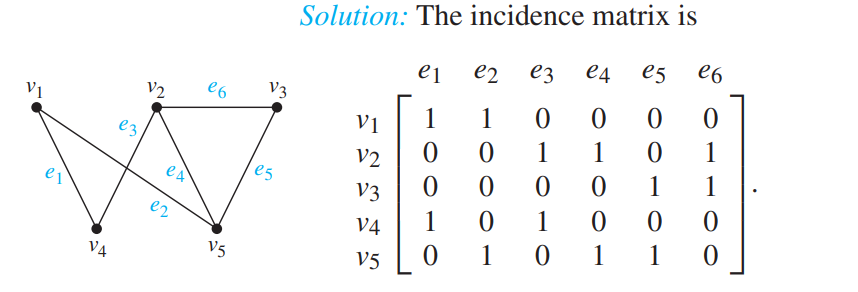

### Isomorphic (同构)

It is difficult to determine two graphs are isomorphic.(NP problem,but not NP-complete). 但是可以找一些不变的特征(invariants)判断两个图不同构

- 点数\边数
- 度数
-  bipartite 不变
- complete 不变
- wheel 不变

### Connectivity

> Show that every connected graph with n vertices has at least n − 1 edges

归纳

A path or circuit is simple if it does not contain **the same edge** more than once

#### Counting paths

> the number of different path of length r from i to j:$(M^r)_{i,j}$. where M is the adjacency matrix

$b_{ij}=\sum_{k=1}^n a_{ik}a_{kj}$

Undirected graphs

An undirected graph is called connected if there is a path between every pair of distinct vertices of the graph

- connected components

- cut vertices

- cut edge(bridge)

Directed graphs

strongly connected:  if there is a path from a to b and from b to a for all pairs (a,b)

weakly connected: the underlying graph is connected

#### Paths and Isomorphism

some other invariants

- number and size of connected components
- length of path and circuits

## Euler and Hamilton Paths

### Euler Graph

### Hamilton Graph

#### sufficient condition:Ore's Theorem
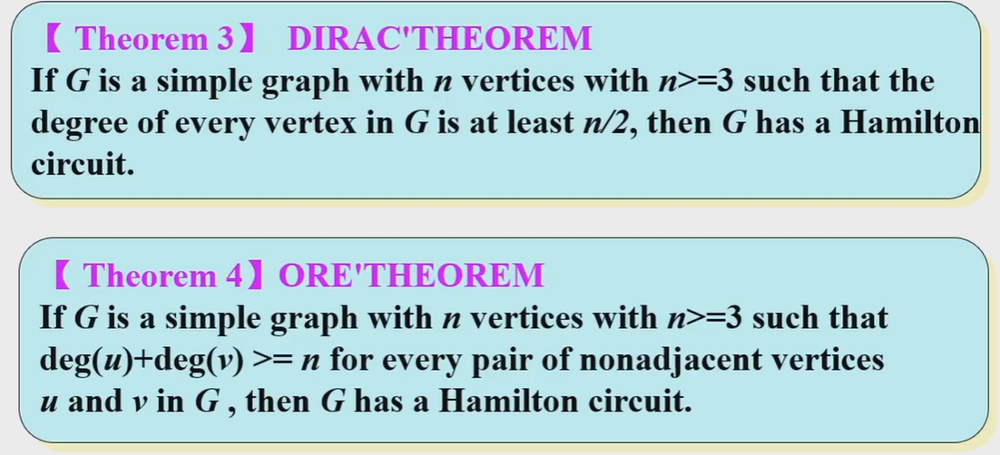

>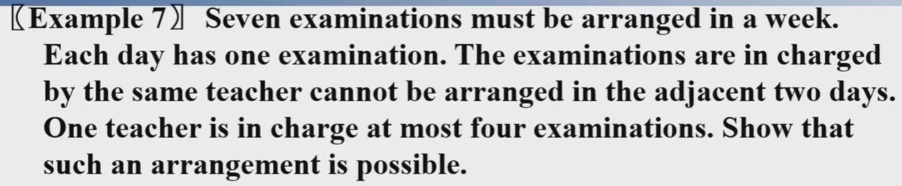

V:seven examinations  E:(u,v) u,v are examinations are not in charged by the same teacher. If there is a H path,than it is possible

because the teacher at most 4 exminations $\deg (v)\geq 3$. the sum of the degrees of a pair vertices is at least 6

However, Ore's theorem requires $\deg u+\deg v \geq 7$. We **add a new vertex $t$ and connect it to all other vertices in the original graph**. In the new graph $\deg u+\deg v \geq 8$. From Ore's theorem, there is a Hamilton Circuit. We remove $t$ from the circuit, and the remaining is a Hamilton path of the original graph.(因为哈密顿回路中新加的边只有到t和离开t的两条,否则就会重复经过t)

>the Hamiltonian path problem for graph G can be related to the Hamiltonian cycle problem in a graph H obtained from G by adding a new universal vertex x, connecting x to all vertices of G

#### necessary condition

>There are at most two vertices which degree are less than 2.
>

> $\forall S \subset V$, the number of connected components in $G-S$ is $\leq |S|$
>
> $\color{red}\text{重要!!!如果要找反例，尽量找“割点”去掉,构造尽量多的连通分量}$

因为有哈密顿环路,我们从环路上去掉S中的结点，就把环分成了若干段，每段都是连通的。如去掉1个节点，剩下n-1个构成1个连通分量。去掉2个节点，环至多分成2段(这两段可能有其他边连通...
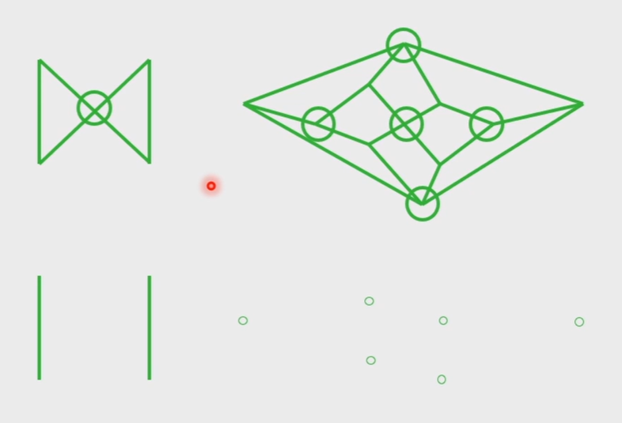

去掉1个出现2个      去掉5个出现6个连通块,所以这两个都没有哈密顿回路

## Shortest Path

## Planar Graph

drawn in the plane without any edges crossing

$K_4$ is planar  (画成三角形，有一个点在中间)

$K_{3,3}$ is not planar  Proof:

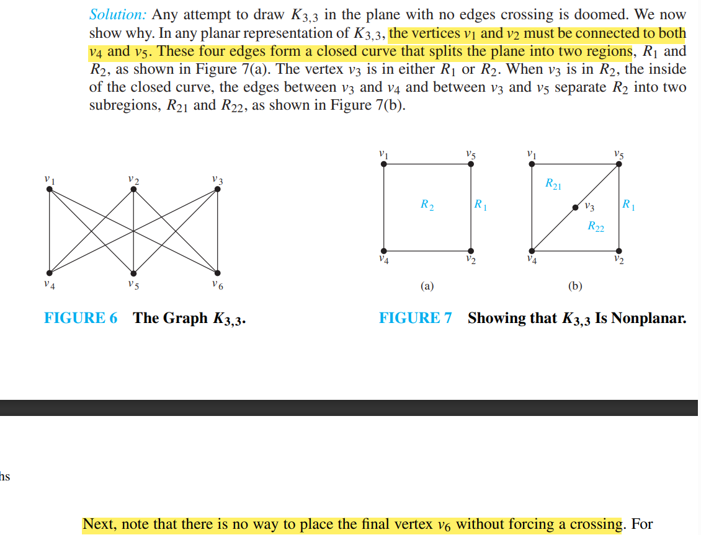

平面图的判定一般只能瞪眼，如果看不出来一般考虑跟$K_{3,3}$，用定理证明不是平面图

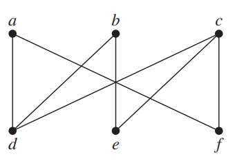=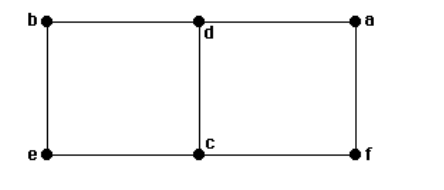
### Euler's Theorem

> $G$: $\color{red}\text{connected}$ planar simple graph. $r$
> 

$$
> \boxed{r=e-v+2}
> $$

> 

Proof: We will prove the theorem by constructing a sequence of subgraphs G1, G2,...,G, successively adding an edge at each stage. Use Induction

$n=1$, $v_1=2,e_1=1,r_1=1$(整个平面是一个区域)

Assume that $r_k=e_k-v_k+2$, we add a new edge $(a_{k+1},b_{k+1})$

- if $a_{k+1},b_{k+1}$ are in $G_k$, then $v_{k+1}=v_k,e_{k+1}=e_k+1,r_{k+1}=r_k+1$

- if $a_{k+1}$ or $b_{k+1}$ are not in $G_k$, then $r_{k+1}=r_k$. 相当于边缘上伸出一条边，不会分开区域。$e_{k+1}=e_k+1,v_{k+1}=v_k+1$

> 推论 $G$: $\color{red}\text{unconnected}$ planar simple graph, with $m$ connected components $r=e-v+m+1$
>
> $r=\sum_{i=1}^m(e_i-v_i+2)-(m-1)=e-v+m+1$ (对每一个连通块用欧拉定理，最外面的平面区域被重复算了m次)
>
> 这个定理中1个点也算连通块

### Degree of Regions and  Graph Inequalities 

> the degree of a region, which is defined to be the number of edges on the boundary of this region.(**绕着边界走一圈经过的边数,一条边可能会被算两次**)

Properties:

> $\sum\deg(r_i)=2e$

> Lemma: A connected planar simple graph with $v \geq 3$,the degree of each region is at least 3.

自环,$\deg r=1$. 重边$\deg r=2$. 但是这是简单图,所以没有这两种情况。$v \geq 3$排除了只有一条边(deg=2)的情况

>Theorem: If G is a connected planar simple graph with $v \geq 3$, then $\boxed{e \leq 3v-6}$

$2e=\sum \deg(r_i) \geq 3r$ (From Lemma)

将 $r=e+v-2$代入，得到$e \leq 3v-6$

etc $K_5,e=10,v=5$ is not planar

>If G is a connected planar simple graph, then G has at least one **vertex** of degree not exceeding five.

suppose that $\deg v \geq 6$. $2e=\sum_{i=1}^v \deg v_i \geq 6v$. but $e \leq 3v-6$, $2e \leq 6v-12$

>If a connected planar simple graph has e edges and v vertices with v ≥ 3 and **no circuits of length three**, then $e \leq 2v − 4$

no circuits of length three implies that $\deg r_i\geq 4$. 

$2e =\sum_{i=1}^r\deg r_i \geq 4r=4(e-v+2)$

etc. $K_{3,3},e=9,v=6$ not planar

### Kuratowski’s Theorem

> A graph is nonplanar if and only if it contains a subgraph homeomorphic to $K_{3,3}$or $K_5$

难点是：如何删除节点和边，看出$K_{3,3}$or $K_5$

> 例1 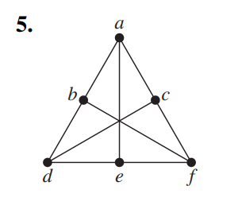

a,d,f和b,c,e构成$K_{3,3}$,所以不是平面图

> 例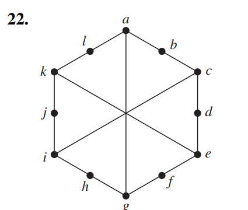

外圈的六边形也是$K_{3,3}$
## Graph Coloring

dual graph of planar graph

- each region is represented by a vertex

The **chromatic** number of a graph $\chi(G)$: the least number of colors needed for coloring

期末可能会考:给出一个图，手动求$\chi(G)$

> Example: prove that G is planar, $\chi(G)\leq 6$

归纳,考虑往n个点的平面图中加入一个点. 

> G is planar, $\chi(G)\leq 4$(四色定理)

$\chi(K_n)=n$

$\chi(C_n)=\begin{cases} 2,n=2k\\3,n=2k+1\end{cases}$

$\chi(G)=2,G$ is bipartite.