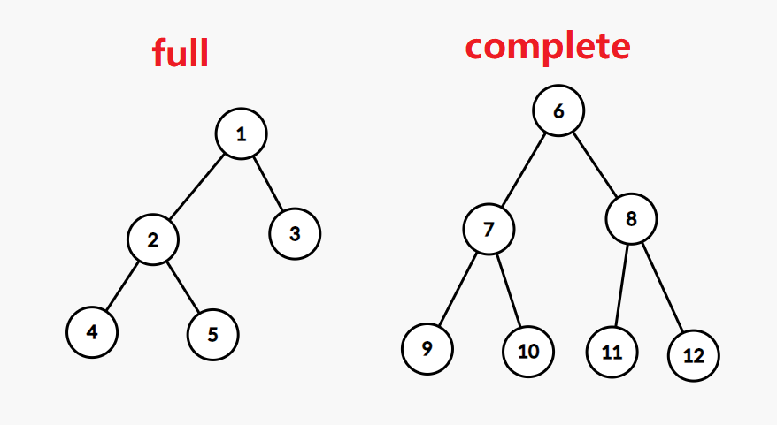

### Counting Trees

Counting nonisomorphic **unrooted** tree

- 枚举最长链 （跟数异构体的思路有点像

> etc.n=5:  3 trees

Counting nonisomorphic **rooted** tree

- 在无根树的基础上选

### Properties of Trees

> - internal vertices(have children)
> - leafs(no children)
> - m-ary trees: every internavertex at most m children
> - **Full m-ary trees**: every internal vertex m children
> - **Complete m-ary trees**: full m-ary tree that all leaves have  the same level

full m-ary trees只要求每个结点有m个或0个孩子,所以叶子可以在各种深度，比如哈夫曼树. 但是balance 必须在h或h-1

#### 叶子数,节点数，深度计算

> A full m-ary tree with i internal vertices contains $\boxed{n=mi+1}$ vertices

Proof: 除了根,每个结点的父亲都是internal vertices

如果知道叶子数$l$,就用$\boxed{n=m(n-l)+1}$找关系

> - Level: the length of paths from root to the vertex.(从0开始)
> - Height: maximum level(从0开始)
> - **Balanced tree**: all leaves are at levels $\color{blue}h$ or $\color{blue}h-1$

> There are at most $m^h$ leaves in an m-ary tree of height h

Proof: 归纳. 高度h+1的树有最多m个高度h的子树

推论$\boxed{h \geq \lceil \log_ml \rceil}$

> There are at least $m^{h-1}$ leaves in a **full and balanced** m-ary tree of height h

因为balanced,所以h-1层往上一定是complete m-ary tree,有$m^{h-1}$个叶子节点. 往$h$层添加叶子时，每去掉h-1层的1个叶子，就会增加1个或2个叶子,所以叶子节点数量$\geq m^{h-1}$

推论:a **full and balanced** m-ary tree, $h=\lceil \log_ml \rceil$

### Tree traversal

preorder traversal, inorder traversal, and postorder traversal 对应前、中、后序

reconstruct tree.

1. 根据前序和每个结点儿子个数? 无法确定只有一个结点在左/右

prefix(Polish),infix,postfix(Inverse Polish) notation  注意infix必须有括号.

表达式求值: prefix 从后往前, postfix从前往后，将数字放到栈里，每遇到操作符就取出最上面两个
根据表达式画出树: 如果是postfix也是用栈的思路从前往后，自底向上建树

### Spanning Tree

DFS/BFS

Mininum Spanning Tree: 

- Prim: 每次从与当前生成树T相邻的边里面选**一条**长度最小，且不成环的
- Kruskal

binary search tree

Huffman Tree
