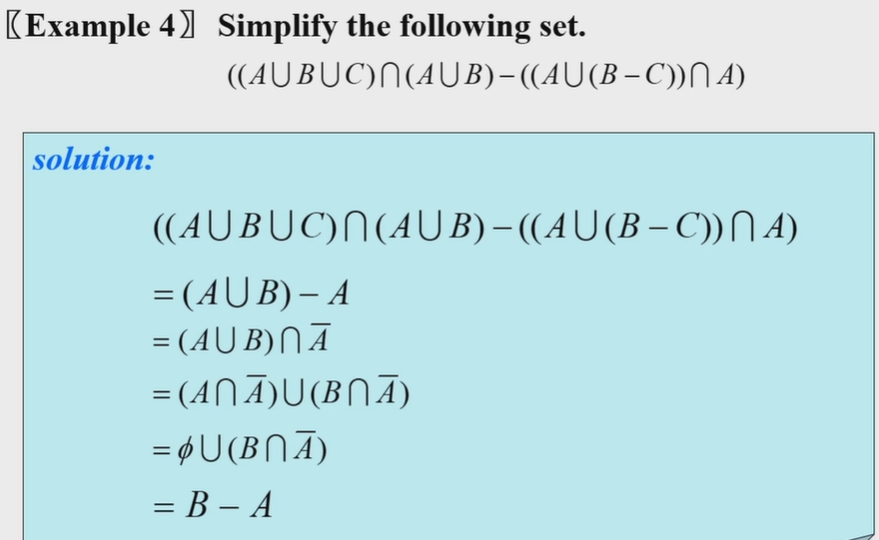
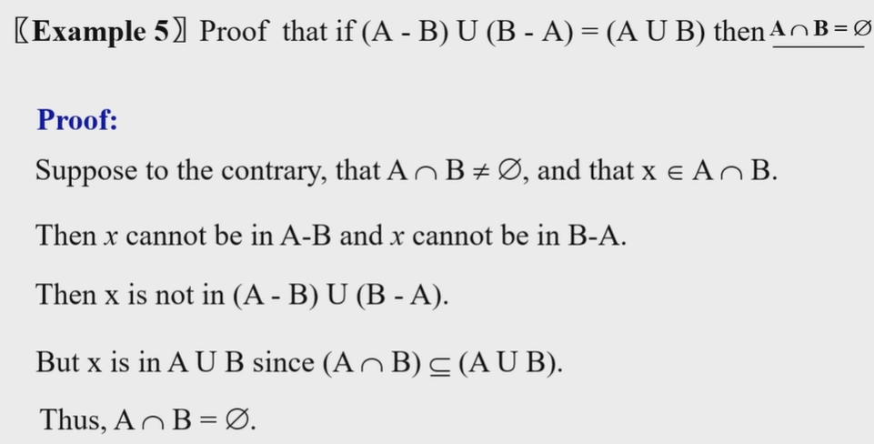
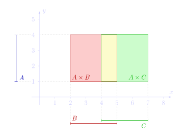
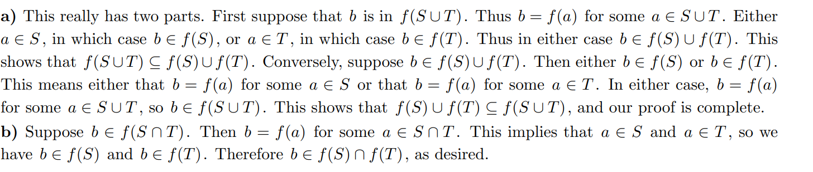
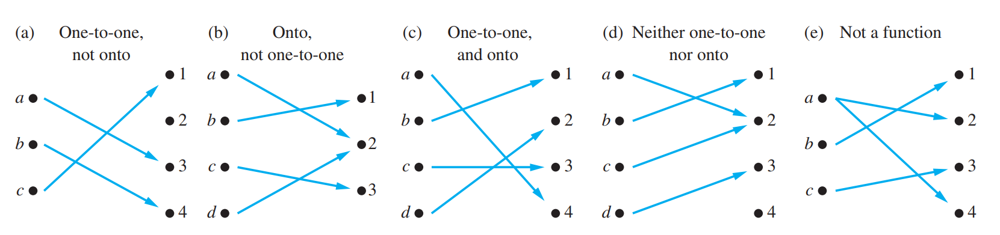
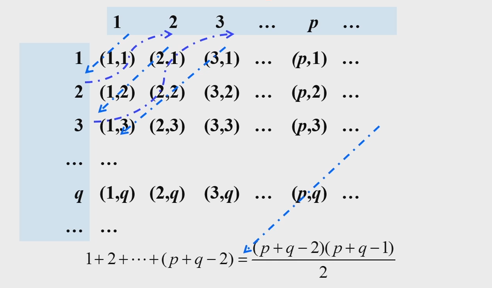
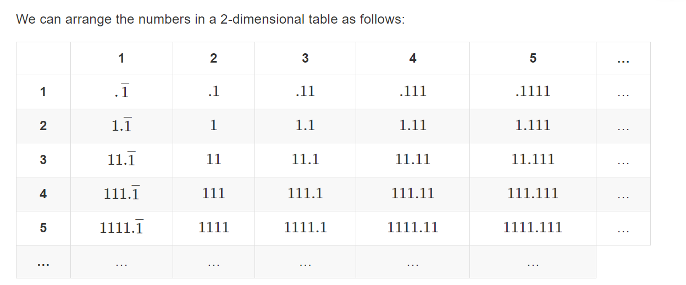

[TOC]

## 2.1 Definition of Set

Let S be a set. If there are exactly n distinct elements in $S$ where n is a nonnegative integer, we say that S is a **finite set** and that n is the **cardinality** of $S$ . $|S|$

Subset

### Power set
 $\mathcal{P}(S)=\{x|x \subseteq S\}$

- $x \in P(S) \to x \subseteq S$
- $x \in S \to \{x\} \subseteq S$
- $|S|=n \to |\mathcal{P}(S)|=2^n$

$\mathcal{P}(\emptyset)=\{\emptyset\}$

$\mathcal{P}(\{\emptyset\})=\{\emptyset,\{\emptyset\}\}$

**Prove theorems of power sets.**

>$A\subseteq B \leftrightarrow P(A)\subseteq P(B)$.

Proof:  the subset of $A$ is also subset of B, so $P(A)\subseteq  P(B)$.
if $P(A) \subseteq P(B)$ ,because $A \in P(A)$ (by definition), then $A \in P(B)$(properties of subset),then $A \subseteq B$(by definition of subset)

>$A=B \leftrightarrow P(A)=P(B)$.
>
>$P(A) \in P(B)\to A \in B$

注意用这两条定义进行$\in$ 和$\subseteq$之间的转换

## 2.2 Set Operations

symmetric difference $(A\cup B)-(A\cap B)$

### Identity

$(A-B)=A\cap\bar{B}$

$A \cap (A \cup B)=A$. 对应之前的absorption$p \wedge(p \vee q)=p$, 用集合的语言看更显然

### Cartesian Product
$$A × (B∩C) = (A×B) ∩ (A×C),\\
A × (B∪C) = (A×B) ∪ (A×C), \\
A × (B - C) = (A×B) - (A×C)\\ \boxed{\overline{A\times B}=(\bar{A}\times \bar{B})\cup (\bar{A}\times B)\cup (A\times \bar{B})}$$

可以用二维坐标系的方法表示

## 2.3 Functions

$f:A \to B$

Domain: $A$   Preimage:$a$

Codomain: $B$.  Image:$b$

**Range** of $f$( $\{f(x)|x\in A\}$)

$f(S)=\{f(x)|x \in S\}(S \subseteq A)$

$f(A \cup B)=f(A)\cup f(B)$ Proof: 注意证明集合相等的方法

$f(A \cap B)\subseteq f(A) \cap f(B)$

etc .$f(x)=x^2(x \in \mathbb{R}),A=\{x \leq 0\},B=\{x \geq 0\}$

The Graph of Functions $\{(a,b)|a \in A \wedge f(a)=b\}$

### Classification of Functions

- **One-to-One(injective)** $\forall a\forall b(f(a)=f(b)\to a=b)$ 
- **Onto(surjective)** $\forall b \in B\exist a \in A(f(a)=b)$
- Both one to one and onto(**bijective**/**one-to-one correspondence**) If bijective, then A  and B have same cardinality

Inverse Function: requires bijection

$f(x)=\frac{x+1}{x+2}$ bijection,but not $\mathbb R$ to $\mathbb R$
 ### Special Functions

$[x]$

证明性质的方法： $x=n+\varepsilon$

## Cardinality of Infinite Sets

### Definition of cardinality

 if and only if $f:A \to B$. $f$ is a **bijection**, then $|A|=|B|$

if $f: A \to B$, $f$ is an **injection**, then $|A| \leq |B|$

If $|A| \leq |B|$ and $|A| \neq |B|$. then $|A|<|B|$

> Example: prove $|(a,b)|$=$|(0,1)|$
>
> $f(x)=a+(b-a)x$ is bijective

> $A\subset B$, then $|A|\leq |B|$

可以取等,比如偶数和正整数

### Countable Sets

A set that is either **finite** or has the same cardinality as the set of positive integers called **countable.**
When an infinite set $S$ is countable, we denote the cardinality of $S$ by $\aleph_0$ ( **aleph null** $)$.
If $|A|=\left|\mathbb{Z}^{+}\right|$, the set $A$ is **countable infinite**.

> Example: prove $\mathbb{Z}$ is countable
>
> Try to rearrange the elements in a sequence. For example 0,1,-1,2,-2,3,-3...
>
> $f(n)=\begin{cases}\frac{n}{2},n =2k \\ -(n-1)/2,n=2k+1\\\end{cases}$

#### Cantor Table
> Example: prove $\mathbb{Q}^+$ is countable

Let $r=\frac{p}{q} \in\mathbb{Q^+},p,q \in \mathbb{Z}^+$.   $S=\{(p,q)\}=\mathbb{Z}^+ \times \mathbb{Z}^+, f(r)=(p,q)$

Then $f: \mathbb{Q}^+ \to S$ is one to one.

so $|\mathbb{Q}^+| \leq |S|$

Because $\mathbb{Z^+}\subset \mathbb{Q}^+$, so $|\mathbb{Z^+}|\leq |\mathbb{Q}^+|$

We only need  to prove $|S|=|\mathbb{Z}^+|$(aka $Z^+ \times Z^+$ is countable)

For every pair (p,q), $n=\frac{(p+q-2)(p+q-1)}{2}+q$ is a bijection. so $|S|=|\mathbb{Z}^+|$

> Show that the set of the real numbers with decimal representations consisting of all 1s is countable

 每一行的整数部分相同。每一列的小数部分相同(除了第一行,因为没有.0所以错开了)
#### Properties of Countable Sets

>- **No infinite set has a smaller cardinality than a countable set**
>- The union of two countable sets is countable. 
>- The union of **countable** numbers of countable sets is countable. For example, $Z^+\times Z^+$ is countable

Proof:

1.   Suppose that$|A|<|Z^+|$ , $f:A \to Z^+$ is one-to-one.Because the range of $f$ must be infinite. $\forall n \in Z^+$, we can always find the $n^{\text{th}}$  smallest element $m$ in the range of $f$.  Because $f$ is one-to-one, there exist a unique $x$ that $f(x)=m$ . so $g(n)=x$ is a bijection. $|A|=|Z^+|$, contradiction!.

2.   List the elements as $a_1,b_1,a_2,b_2\dots$

3. $A_i=\{a_{i1},a_{i2}\dots\}$ . List the elements as $a_{11},a_{12},a_{21},a_{13},a_{22},a_{31}$

    

#### Cantor Diagonalization Argument.

Construct an object that is **not a member of countable** set. 用于证明集合不可数

> The set of real numbers in $(0,1)$ is uncountable

$f: \mathbb{Z}^+ \to A=\frac{1}{n+1}$ is one-to-one, so $|\mathbb{Z}^+| \leq |A|$.  We need to prove $|\mathbb{Z}^+| \neq |A|$

Assume $A$ is countable, then let $A=\left\{r_1,r_2\dots r_n\right\}$
Represent each real number in the list using its decimal expansion. e.g., $1 / 3=.3333333 \ldots . . . . ., 1 / 2=.5000000 \ldots . . . . \text{but not }0.4999999 . . . \ldots .$.
$$
\begin{aligned}
& r_1=0 . d_{11} d_{12} d_{13} d_{14} d_{15} d_{16} \cdots \\
& r_2=0 . d_{21} d_{22} d_{23} d_{24} d_{25} d_{26} \cdots \\
& r_3=0 . d_{31} d_{32} d_{33} d_{34} d_{35} d_{36} \cdots
\end{aligned}
$$
Now construct the number $x=0 . x_1 x_2 x_3 x_4 x_5 x_6 x_7 \ldots$
$$
\begin{aligned}
& x_i=3 \text { if } d_{i i} \neq 3 \\
& x_i=4 \text { if } d_{i i}=3
\end{aligned}
$$
Then $x$ is not equal to any number in the list.(Because it has at least one digit different from $r_i$. For example, for $r_1$, $x_1 \neq d_{11}$)
Hence, no such list can exist and hence the interval $(0,1)$ is uncountable

>Example. Show that the set of the real numbers with decimal representations consisting of all 1s or 9s is uncountable(**all 1s or 9s是指由1和9组成，如0.1919**。不只是全1或全9)

$x_i=\begin{cases} 1,d_{ii}=9 \\ 9,d_{ii}=1 \text{\ or }d_{ii} \text{does not exist} \end{cases}$

### Schroder-Bernstein Theorem

> **Schroder-Bernstein Theorem**: $|A| \leq |B|$ and $|B| \leq |A|$, then $|A|=|B|$. 

Only need to find two one-to-one functions. 

> Example 1: $|(0,1)|=|\mathbb{R}|$ 

Method 1: $f(x)=\tan x(|x| \leq \pi/2)$ is bijection $|(-\pi/2,\pi/2)|=|\mathbb{R}|$. and $|(a,b)|=|(0,1)|$

Method 2: Use Schroder-Bernstein Theorem:  $f(x)=x((0,1)\to \mathbb{R})$ is one to one.  $f(x)=\frac{1}{1+e^{-x}}(\mathbb{R}\to (0,1))$ is one-to one.

> Example 2: $|[0,1]|=|\mathbb{R}|$

 We can also use$f(x)=x$  and $f(x)=\frac{1}{1+e^{-x}}$ . because $f$ is not required to be onto.

> Example 3: $|[0,1]|=|(0,1)|$

$f(x)=\frac{1}{3}+\frac{1}{3}x$ from $[0,1]\to [1/3,2/3]$.

> Example 4: The set of **infinite** subset of positive integers is uncountable.
>
> aka. $|\mathcal{P}(\mathbb{Z}^+)|=|\mathbb{R}|$

 $S\in \mathcal{P}(\mathbb{Z^+})$.  $d_i=\begin{cases}0,i \notin S \\ 1,i \in S \end{cases}$  $f(S)=0.d_1d_2\dots d_n \in (0,1)$

For $x \in (0,1)$, use the **binary** expansion $x=0.d_1d_2\dots d_n$.(use 0.110000...instead of 0.1011111..)

Then by Schroder-Bernstein Theorem, $|\mathcal{P}(\mathbb{Z}^+)|=|(0,1)|=|\mathbb{R}|$

> However,the set of **finite** subset of positive integers is countable

$\{a_1,a_2\dots a_n\}\to 2^{a_1}+2^{a_2}+\dots 2^{a_n}$ (because the set is finite,the integer exists)

This function($S\to Z^+$) is one-to-one and onto.(onto because base 2,use binary expansion of every integer). So $|S|=|Z^+|$

[ref](https://math.stackexchange.com/questions/200389/show-that-the-set-of-all-finite-subsets-of-mathbbn-is-countable)

### Cantor's Theorem

> **Cantor's Theorem**:  $|S|< |\mathcal{P}(S)|$

Proof: $f(x)=\{x\}$ is one to one. so $|S| \leq |\mathcal{P}(S)|$. We only need to prove that $|S|\neq |\mathcal{P}(S)|$. For all $f:S \to \mathcal{P}(S)$ , $f$ is not onto.

Let $\boxed{B=\{x \in A|x \notin f(x)\}}$. It is obvious that$B \subseteq S,B \in \mathcal{P}(S)$. 

For every $s\in A$. 

- If $s\in B$, then by definition of $B$, $s\notin f(s)$. so $B \neq f(s)$.   (Noted that this construction  is similar to  $x_i=3(d_{ii}\neq 3),x_i=2(d_{ii}=3)$ in **Cantor Diagonalization Argument**)
- If $s \notin B$, then $s \in f(s)$. so $B\neq f(s)$

Because we can't find $s$ that $f(s)=B$. so $f$ is not onto. Q.E.D.

### The Continuum Hypothesis(连续统假设)

from Example 4:$|\mathcal{P}(\mathbb{Z}^+)|=|\mathbb{R}|$.  记$|\mathbb{R}|=c$,则$2^{\aleph_0}=c$. 而连续统假设认为$\aleph_0$和$c$之间没有其他的基数, 即$\aleph_1=c$,或$2^{\aleph_0}=\aleph$

### Applications

> Show that the set of functions from $\mathbb{Z}^+$ to $\{1,2,3,4,5,6,7,8,9\}$ is uncountable

Hint: prove $|S|=|(0,1)|$

$x=0. d_1 d_2\dots d_n$. we associate a function $f$ to $x$ such that $f(n)=d_n(n=1,2,3\dots)$. (小数的每一位确定$f$的一个取值，不同的实数对应的函数不同). (A few functions are left out, because of forbidding representations such as 0.239999 . . ..). 

This is a bijection from $(0,1)$ to a subset of $S$. so $|S| \geq |(0,1)|$, uncountable. 

> Show that the set of finite strings S over a finite alphabet A is countably infinite

Assume an alphabetical ordering of symbols in A. Show that the strings can be listed in a sequence. First list

1. All the strings of length 0 in alphabetical order.
2. Then all the strings of length 1 in **lexicographic** (as in a dictionary) order.
3. Then all the strings of length 2 in lexicographic order.
4. And so on.

As the set of functions is uncountable while the set of finite strings(computer programs) is countable. So **not all functions are computable.**  这是计算理论的一个结论

References: 

- [wiki](https://en.wikipedia.org/wiki/Cantor%27s_diagonal_argument#General_sets)
- [DM explained in detail](https://iamncj.github.io/Discrete_Mathematics_Explained_in_Detail/CH02_Basic_Structures/CH02_03_Cardinality_of_Sets.html)

