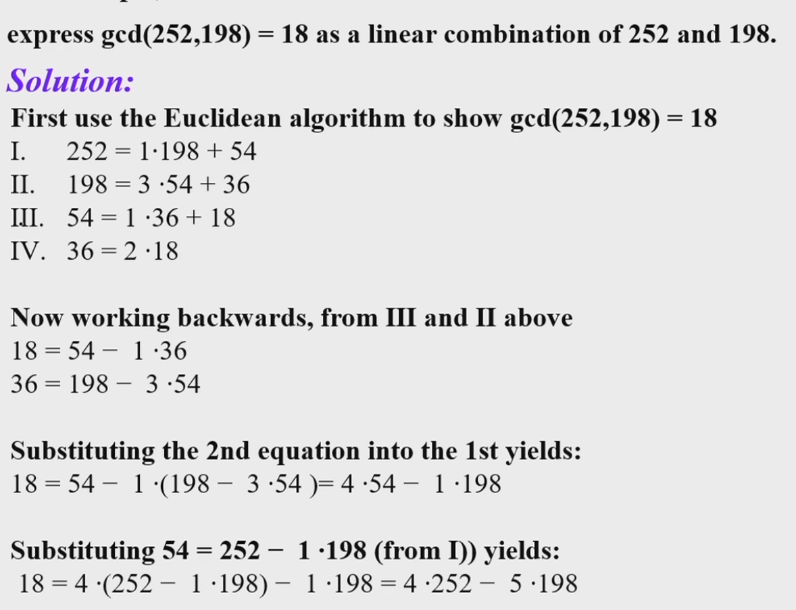

### Euclidean Algorithm

Bezoout's Theorem: $\gcd(a,b)=sa+tb$

use euclidean algorithm to find s and t

### Linear Congruence

$ax \equiv b \pmod m$

Find the inverse $\bar{a}$,$\bar a a\equiv 1\pmod m$. Use Euclid's algorithm($\gcd(a,m)=1$)

### Chinese Remainder Theorem

