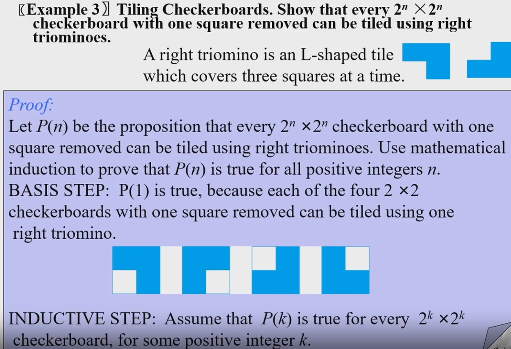

### Weak Induction
Prove $\forall n P(n)$
Basis step:$P(1)$is true
Inductive step: $\forall k (P(k)\to P(k+1))$
$\forall n P(n)$

use prepositional logic in Sec 1.6

$$(P(1)\wedge \forall k (P(k)\to P(k+1)))\to \forall n P(n)$$

>
>
>空格出现在1个正方形中
在另外3个中间放一个L形的，就剩下3个有空格的

### Strong Induction
Basis step :$P(1)$is true
Inductive step: $\forall k ((P(1)\wedge P(2)\wedge \dots P(k))\to P(k+1))$

> The Frobenius Coin Problem(postage stamp problem)
>
> Given $a,b \in N^+$, find minimum $k$ such that $\forall n>k(n \in N),n=xa+yb(x,y\in N)$
>
> if $\gcd(a,b)=1$, then $k=ab-a-b$ 
>
> 也就是说从$\boxed{ab-a-b+1}$开始
>
> (更一般的情况可以推广到n个整数，但3个整数时没有封闭形式的解，n个整数的情况是NP-hard的)
etc. a=4,b=11

我们首先证明$n \geq 4\times11-4-11+1=30$都可以表示

法一(Weak induction): $P(30)$ is true. Suppose that $P(k)$ is true, $k=4p+11q$. because $k \geq 30$, then $p \geq 8$ or $q \geq 1$. $k+1=4(p+3)+11(q-)$

法二(Strong induction): 容易证明$P(30),P(31),P(32),P(33)$. Suppose that $P(j)$ is true for $30\leq j\leq k$, where $k \geq 33$ then $k+1-4\geq 30$. $P(k+1)$ is true.

### Well-Ordering Property

#### Proof by well-ordering property

> Premise:$P(1)$, $P(n)\to P(n+1)$. Conclusion $P(n)$ is true for all $n \in A$, $A$ is a well-ordered set

Assume $\exist x \neg B(x)$. $S=\{x|\neg B(x)\}$ is nonempty. Then by well-ordering property $S$ has a minimum element $m$. because $P(1)$ is true, $m > 1$. so $P(m-1)$ is true, but $P(n)\to P(n+1)$ implies that $P(m)$ is true. There is a contradiction, so S must be empty.

### Structural Induction