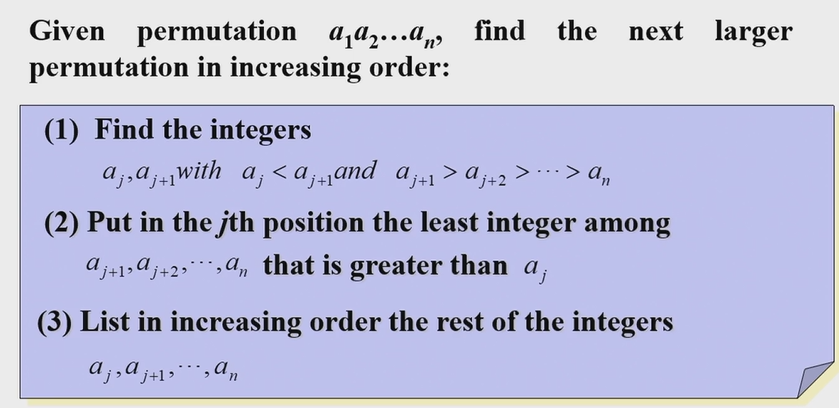

### Basic Principles

基本原理
$|S\cup T|=|S|+|T|-|S\cap T|$

$|S\times T|=|S|\times|T|$

> Eg1. $|A|=m,|B|=n,f:A\to B$
>
> - $n^m$ functions  给A中每一个元素选一个对应的
> - $n(n-1)(n-1)\dots(n-m+1)$ one-to-one functions($m\leq n$). 从B中选m个元素(有顺序),对应于A
> -  $n! S(m,n)$       onto functions($m \geq n$)

​		$S(m,n)$ is [Stirling number of the second kind](http://en.wikipedia.org/wiki/Stirling_numbers_of_the_second_kind). the number of ways of dividing A into n subsets.  We can use inclusion-exclusion principle

$$
n!S(m,n)=\sum_{k=0}^n (-1)^kC_n^k (n-k)^m
$$

减去不是满射的，第k项表示我们在$B$中钦定$k$个不被映射到的,其他的$n-k$个随便被A映射

### Pigeonhole principle(!)

> Eg1. In a party of 2 or more people,there are 2 people with the same number of friends in the party. You can't be your own friend and friendship is **mutual**

​    Pigeons: n people;  

​     Pigeonholes: Possible number of friends:0,1,2...n-1. But 0 and n-1 can't coexist.(n-1 means one knows everyone in the party, because friendship is mutual, then everyone must have a friend). so only n-1 possible number of friends

> The generalized pigeonhole principle: $n$ elements in $k$ boxes, there is at least one box containing at least $\lceil n/k\rceil$ elements

关键是构造$n,k,\lceil n/k\rceil$中的两个。注意$n$的计算, 如$k=2,\lceil n/k\rceil=3$, 则n最小可为5

> Eg2. Show that among any n + 1 positive integers not exceeding 2n there must be an integer that divides one of the other integers

$a_i=2^{k_i}q_i$, $q_i$ is odd. pigeons:$q_1,q_2 \dots q_{n+1}$    pigeonholes: n odd possitive integers less than 2n. So two of  $q_1,q_2 \dots q_{n+1}$ must be equal.

> Eg3. During a month with 30 days, a baseball team plays at least one game a day, but no more than 45 games. Show that there must be a period of some number of **consecutive** days during which the team must play exactly 14 games.

 对于连续区间的问题，考虑构造前缀和。Let $s_i$ be the sum of games played from the 1st day to i th day. We need to prove that $\existssss i,j(i<j),s_j-s_i=14$ .  Let $s_0=0$

Pigeons: $s_0,s_1,s_2\dots s_{30}, s_0+14,s_1+14,s_2+14,\dots s_{30}+14$. (62 Elements)    **书上的写法好像没有考虑到$s_0$**?

Pegeonholes: values  $0 \leq s_i,s_i+14 \leq 45+14=59$   (60 elements)

So there must be equal numbers in  $s_1,s_2\dots s_{30}, s_1+14,s_2+14,\dots s_{30}+14$

>- 法一：加入$s_0$
>- 法二: 分情况(如果刚好一一对应,那么一定有一个)（如果没有，根据鸽笼原理得出)

[参考](https://iamncj.github.io/Discrete_Mathematics_Explained_in_Detail/CH06_Counting/CH06_02_The_Pigeonhole_Principle.html#2-is-it-still-possible-to-show-that-there-must-be-a-period-of-some-number-of-consecutive-days-during-which-exactly-23-games-must-be-played)

> Eg4. Every sequence of $n^2 + 1$ distinct real numbers contains a subsequence of length n + 1 that is either strictly increasing or strictly decreasing

$(i_k,d_k)$ denotes the length of increasing and decreasing sequence start with $a_k$.  
Suppose that $\max \{i_i,d_k\}\leq n$,with $n^2$ pairs and $n^2+1$ elements, there must exist two equal pairs.
$i_s=i_t,d_s=d_t$. if $a_s>a_t$, then $a_s,a_t \dots$ forms a decreasing sequence of length $i_t+1$ starting with $i_s$.

> For every integer n,there there is a multiple of n whose decimal expansion contains only 0s and 1s

For every integer n, consider n+1 integers$1,11,111\dots,111111(n+1 \ 1s)$

Divide them by n,  there are at most n different reminders. so at least two of these numbers have the same reminder. 

Suppose that $a\equiv b \pmod n,a<b$ then $b-a$ is a multiple of n and its decimal expansion contains only 0s and 1s.(etc.11111-11=11100)
[ref](https://math.stackexchange.com/questions/2982895/decimal-expansion-of-an-integer)

> Mutual friend and enemies  . Ramsey number.
> 
### Ramsey number
https://math.mit.edu/~apost/courses/18.204_2018/ramsey-numbers.pdf

The minimum number of people at a party such that for all cases, there are either m mutual friends or n mutual enemies
(people=vertices, relation=edges, color the edge in two color,the least number of vertices that a graph must have so that in any red-blue coloring, there exists either a red
$K_s$ or a blue $K_t$($K_n$代表完全图))

$R(2,n)=n$

$R(3,3)=6, R(3,4)=9,R(4,4)=18,R(3,5)=14$

证明思路:
- 先证明$R(s,t)>n-1$, 只需要找一个$n-1$个点的,既没有$K_s$也没有$K_t$的图
- 再证明$R(s,t)=n$.  一般要选一个点$v$出来，考虑剩下的和$v$是friends 还是enemies

> $R(s,t)\leq R(s,t-1)+R(s-1,t)$

> if $R(s,t-1),R(s-1,t)$ is even, $R(s,t)\leq R(s,t-1)+R(s-1,t)$

proof: see pdf

etc $R(3,4)\leq R(3,3)+R(2,4)-1=9$

choose $A$, in the rest 8 people

1. $\geq 6$ friends ,$R(3,3)=6$, so 3 mutual friends
2.  $\geq 4$ enemies$R(2,4)=4$, so 4 mutual enemies
3. $5$ friends+3 enemies(impossible for every vertice,because 5*9=45,but each friends is count twice, the result should be even)  so there exist at least one vertex that satisfy case 1,2.

## Permutations and Combinations

#### Combinatorial Proofs

证明组合恒等式的时候，可以构造组合的例子。注意格式!

- 用两种不同的方法计数同一个集合(double counting proof)
- 证明两个集合之间存在双射(Bijective proof)

Pascal's Identity. 

$$\binom{n+1}{k}=\binom{n}{k-1}+\binom{n}{k}
$$

Proof:（Double Counting).   $A=\{x,a_1,\dots a_n\}$ The left side is the number of subsets of size k from set A.  For the right side, the subsets of size k 

- contains $x$
- not contain $x$

Vandemonde's Identity:

$$
\binom{m+n}{r}=\sum_{k=0}^r\binom{m}{r-k}\binom{n}{k}
$$

Proof:（Double Counting)

Corrollary $\binom{2n}{r}=\sum \binom{n}{r}^2$

$$
\binom{n+1}{r+1}=\sum_{j=r}^n\binom{j}{r}
$$

Proof: Left side: r+1 ones in a 01 sequence of length n+1.

​            Right side: j+1 is the position of the last 1-bit in the sequence

### Generalized Permutations

#### r-circle

 $P(n,r)/r$ .  r people sit in a round table of n chairs.

​           如果把顺时针/逆时针的看做一种，那么方法数是$\begin{cases} \frac{P(n,r)}{2r} ,r \geq 3\\ \frac{P(n,r)}{r},r \leq 2\end{cases}$. 注意只有1或2个人的时候

#### r-combination

 $C(n+r-1,r-1)$ (插板法)

​          $x_1+x_2+\dots x_r=n$ 非负整数解个数

变形:

-  $x_1+x_2+\dots x_r=n,x_i\geq 2$. Let $y_i=x_i+2$

- $x_1+x_2+\dots x_r \leq n$. Let $x_1+x_2+\dots x_r+x_{r+1}=n,x_{r+1}\geq 0$.  
- $x_i\leq k$. 减去$x_i \geq k+1$的情况

#### Distributing objects into boxes

1. distinguishable boxes. distinguishable objects. 
    

$$
    \frac{n!}{n_1!n_2!\dots n_k!} (\text{the kth boxes have\ }n_k\text{\ objects})
    
$$

    
2. indistinguishable boxes. distinguishable objects. 

​          (The second kind of Strling number: n objects in m same boxes, **no empty boxes**)

$$
\boxed{S(n,m)=\frac{1}{m!}\sum_{k=0}^m (-1)^kC_m^k (m-k)^n}
$$

$$
S(r,2)=\frac{2^n-2}{2}\\ S(r,r-1)=C(r,2)\\ S(r+1,n)=S(r,n-1)+nS(r,n)
$$

**If we allow boxes to be empty**, then the number will be $\sum_{k=1}^m S(n,k)$ **如果题目没有特别说明，默认是可以为空的，要对斯特林数求和!**

3. distinguishable boxes. indistinguishable objects.  (r-combination) $C(n+r-1,r-1)$
4. indistinguishable boxes. indistinguishable objects. (brute force)

> (HW) How many ways are there for a horse race with 4 horses to finish if ties(平局) are possible.

- no tie $4!$
- 2 tie(aabb+aabc) $C(4,2)\text{(choose 2 horses to be the first two)}+C(4,2)\times 3!$
- 3 tie(aaab) $C(4,3)\times 2$
- 4 tie $1$

### Algorithms generating permutations and combinations

#### next-permutation

124**653**-> 125346

