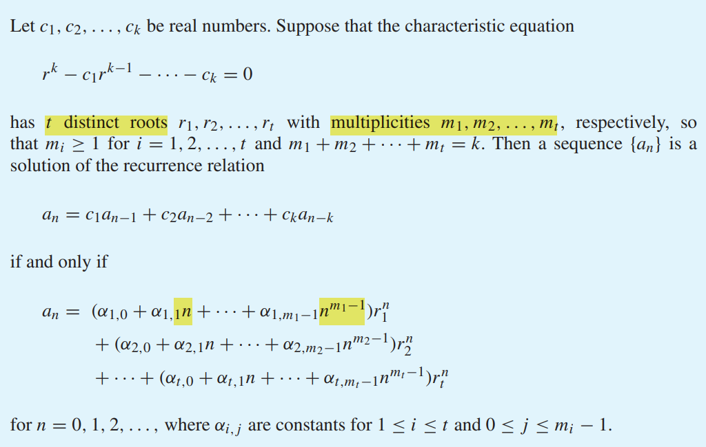
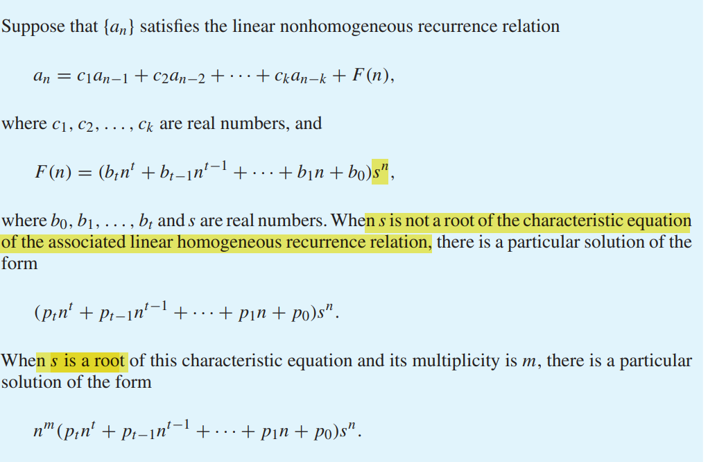
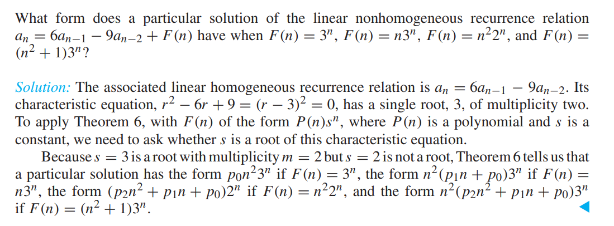
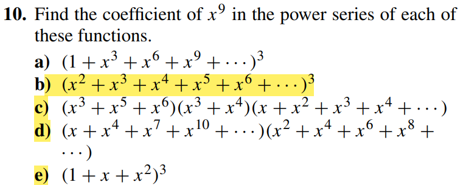
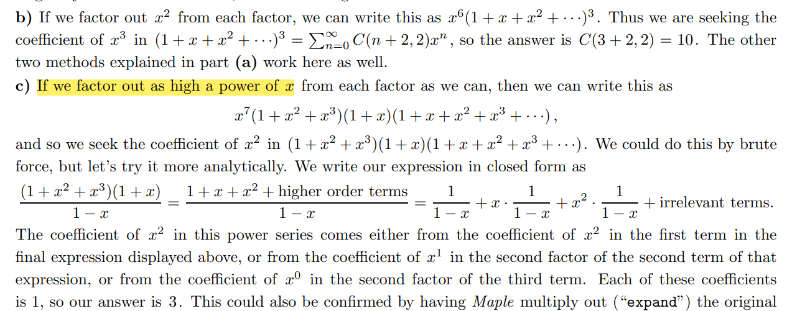
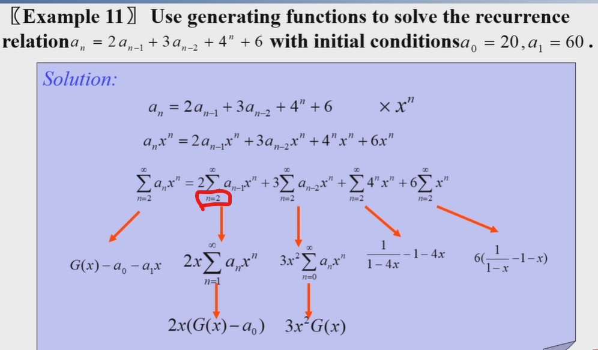
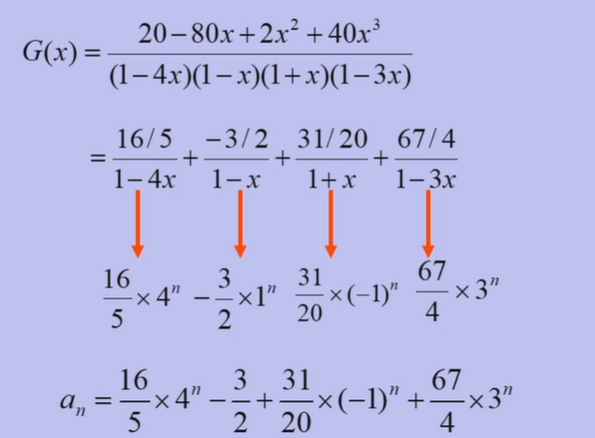
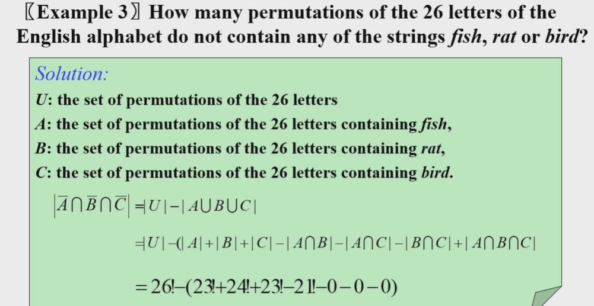

(这也不怎么advanced啊(笑))

**本课程作业需要写出具体数字，但在考试中只要用$C(m,n)$表示即可**

## Recurrence Relations

### Definition

- recurrence $a_n=f(a_1,\dots ,a_{n-1})$
- initial conditions. $a_0,a_1\dots$. to fixed the sequence
- **degree: number of initial conditions**.  $a_n=a_{n-1}+a_{n-8}$(degree=8)  

### Example Problems

> Let $a_n$ be the number of valid string of decimal digits containing an even number of 0 digits.

-  $s_n$ is not zero, then $s_{[1,n-1]}$ must be a valid string, $9s_{n-1}$

- $s_n$ is zero, then $s_{[1,n-1]}$ must contain odd number of 0. from the opposite side, $10^{n-1}-a_{n-1}$
    

$$
    a_n=8a_{n-1}+10^{n-1}
    
$$

    

> The number of bit strings of length $n$ that contain 3 consecutive 0s

~~这些题本来用几个数组的dp挺好做的，但强行只能用一个数列就需要一些技巧~~。

技巧1：这些题往往要枚举一段符合条件的序列的长度，后面任选

考虑最后位数

- 000，前面任选$2^{n-3}$
- 1, $a_{n-1}$
- 10,$a_{n-2}$
- 100,$a_{n-3}$

> the number of ternary strings that **do not** contain two consecutive 0’s or and consecutive 1’s

- $s_n=2$: $a_{n-1}$
- 枚举0101的长度k, 前面要不是1010,要不是0101,2种，且长度至少为2。 所以$\sum_{k=0}^{n-2}2a_{k}$

所以$a_n=a_{n-1}+2a_{n-2}+\dots 2a_0$

 **再写第n-1项作差**: $a_{n-1}=a_{n-2}+2a_{n-3}+\dots 2a_0$

得到$a_n=2a_{n-1}+a_{n-2}$

初始条件$a_0=1,a_1=3$

### Solving Linear Recurrence Relations

- constant coefficient
- linear/non linear

- homogeneous: etc. $a_{n}-a_{n-1}-a_{n-2}=0$

- nonhomogeneous:  $a_{n}-a_{n-1}-a_{n-2}=3^n$

#### Linear Homogeneous Recurrence Relations with Constant Coefficients

characteristic equation

characteristic roots

> etc. $r_1\neq r_2$, $p_1r_1^n+p_2r_2^n$
>
> ​        $r_1=r_2$, $(p_1+p_2n)r_1^n$

总结 **m重根r的待定系数**$(p_1+p_2n+\dots p_mn^{\color{red}{m-1}})r^n$

#### Linear Nonhomogeneous Recurrence Relations with Constant Coefficients

$$
a_n=c_1a_{n-1}+\dots c_ka_{n-k}+f(n)\\
$$

**associated homogeneous recurrence relation**

$$
a_n=c_1a_{n-1}+\dots c_ka_{n-k}
$$

Every solution is **the sum of** a **particular solution** and a solution of the **associated** linear homogeneous recurrence relation.

证明类似线性代数里解非齐次线性方程组的思想。$AX_0=c$叠加上$AX=0$,得到$A(X+X_0)=c$.

However,finding the particular solution is difficult. But for **some certain type of** $f(n)$, there is a easy solution.

总结：解非齐次线性递推式的过程

1. 写出对应的齐次递推数列，并求其通解

    $\sum (c_0+c_1n+c_{m_i-1}n^{m_i-1})r_i^n$ ($r_i$是$m_i$重特征根)

2. 写出一个特解的待定系数。形式与$f(n)$类似. 设$f(n)=q(n)s^n$  (若$f(n)$是多项式,则s=1)
    - 若$s$不是特征根，那么特解是$p(n)s^n$. 其中$p(n)=p_0+p_1n+\dots$和$q(n)$的次数相同
    - 若$s$是特征根($r$重), 那么特解是$n^rp(n)s^n$ 

3. 把特解代入原递推式并求出系数$p_t,p_{t-1}\dots p_0$.

4. 把通解和特解加在一起(所以最后的结果里面特解是常系数的，只有通解带上k1,k2的系数). 如果有初始条件，再确定通解的系数。

> etc

一个易错的情况是$F(n)=多项式$. 如$a_n=a_{n-1}+n$. 对应特征方程的解是$r=c$是任意实数. $1$显然是特征方程的根, 所以待定系数是$\color{red}{n}(p_1n+p_2)$

> 

$c2^n+n(pn+q)$

## Generating Functions

### Definition and operation

Sequences->Functions(of power series)

Ordinary generating function of $\{a_n\}$: $G(x)=\sum_{k=0}^{\infty}a_kx^k$ (**0-index**)

(根据数列求生成函数，就是对幂级数求和函数，微积分里已经讲的很清楚)

$a_n=1$, $G(x)=\sum_{k \geq 0}x^k=\frac{1}{1-x}$

$a_n=n$, $\boxed{G(x)=\sum_{k \geq 0}kx^k=x\sum_{k \geq 0}kx^{k-1}=x(\frac{1}{1-x})'=\frac{x}{(1-x)^2}}$

$a_n=n+1,G(x)=\sum_{k \geq 0}(k+1)x^k=(\sum_{k\geq1}x^k)'=(\frac{x}{1-x})'=\frac{1}{(1-x)^2}$

Application of Products:

> Eg. $\{a_k\}$ has the generating function $A(x)$, find the generating function of $b_n=\sum_{k=1}^n a_k$ 

$b_n=\sum_{k=1}^n a_k=\sum_{k=1}^n a_kc_{n-k}(c_k\equiv1)$  

$B(x)=\frac{A(x)}{1-x}$

> $b_0=a_0^2,b_1=2a_1a_0,b_2=a_1^2+2a_0a_2\dots, B(x)=A^2(x)$ 

>注意有限项的生成函数,如$(1+x)^n$
>
>

$$\sum_{k=0}^{m-1}x^k=\frac{1-x^m}{1-x}
$$

>Eg. $a_n=C(10,n+1)$. $\sum_{n=0}^\infty C(10,n+1)x^n=\frac{1}{x}\sum_{n=1}^\infty C(10,n)x^n=\frac{(1+x)^{10}-1}{x}$

根据数列求生成函数

- 记住常见生成函数，如等比。
- 利用泰勒展开
- 逐项积分/求导
- 生成函数的组合意义

根据生成函数求数列： 泰勒展开，常见的结论，还要对式子做因式分解等。如$\frac{1}{1-4x^2}=\frac{1}{1+2x}+\frac{1}{1-2x}$
- 本质是把函数展开成幂级数后$x^n$的系数
- 提公因数,拆成$x^mf(x)$,其中$f(x)$是比较好求的形式,如$\frac{1}{(1-x)^m}$
- 指数比较小的直接枚举. 注意如果指数大于n的项就直接舍去

> $a_n=n+1$, $f(x)=\frac{1}{(1-x)^2}$

法一: $\sum_{n\geq 0}(n+1)x^n=(\sum_{n \geq 0}x^{n+1})'=\frac{1}{(1-x)^2}$

法二(卷积): $b_n=1$, $a_n=\sum_{k=0}^nb_kb_{n-k}$.

> 

$$\boxed{a_n=C(m+n-1,m-1),f(x)=\frac{1}{(1-x)^m}}
$$

Extended binomial Theorem（本质是$(1+x)^a$的泰勒级数) 根据

$$
(1+x)^a=\sum_{k=0}^{\infty} \frac{a(a-1)\dots (a-k+1)}{k!}x^k=\sum_{k=0}^{\infty}\binom{a}{k}x^k(a \in \mathbb{R})
$$

展开$(1+x)^{-n}$即可

> $\color{red}{广义二项式定理的变式：}$ $a_n=C(n,2)$

$f(x)=\sum_{n \geq 2}C(n,2)x^{n-}=x^2\sum_{n \geq 0}C(n+2,2)x^n=\frac{x^2}{(1-x)^3}$

>Eg. 

### Solve Counting Problems

$x^k$ (k is the "size" of element)

> Divide $n$ indistinguishable objects into k distinguishable boxes(boxes can be empty)

$(1+x+x^2+\dots)(1+x+x^2+\dots)\dots=(\frac{1}{1-x})^k$.  Find the coefficient of $x^n$

> Divide $n$ indistinguishable objects into k distinguishable boxes(boxes can not be empty)

$(x+x^2+\dots)^k=\frac{x^k}{(1-x)^k}$. 没有$x^k$的话$x^n$的系数是$C(n+k-1,k-1)$. 乘了$x^k$,要把$n$换成n-k,所以是$C(n-1,k-1)$

生成函数的好处是可以更灵活的处理限制

- 如限制盒子内的物体数量 $(x^a+x^{a+1}+\dots x^b)$ 
- 一定要熟悉$[x^n]\frac{1}{(1-x)^m}=C(n+m-1,)$

> **！！！**2r red balls, 2r blue balls ,2r white balls. How many ways to select 3r balls?

$(1+x+\dots x^{2r})^3=\frac{(1-x^{2r+1})^3}{(1-x)^3}$

$$
=\frac{1-3x^{2r+1}}{(1-x)^3}+\frac{3x^{4r+2}-x^{6r+3}}{(1-x)^3}
$$

后面两项次数至少$4r+2>3r$**不考虑**. 第一项中$x^{3r}$系数$C(3r+3-1,3-1)$. 第二项中因为系数平移$-3C((3r-(2r+1))+2,2)$

因此答案是$C(3r+2,2)-3C(r+1,2)$

> `$1,$2,$5` to pay `$r` 
> the order matters

(etc. 3=1+2=2+1)  $\sum_{k=0}^{\infty}(x+x^2+x^5)=\frac{1}{1-x-x^2-x^5}$

### Solve recurrence relations 

好处: 不用区分齐次/非齐次

1. 乘上$x_n$,对方程两边求和.并把右边整理成关于$A(x)$和x的式子. 注意求和的时候需要让$a_{n-k}$有意义,所以$n$至少要从$k$开始
2. 解出A(x)此时应该是封闭形式
3. 将封闭形式展开成幂级数形式,第n项系数即为答案

### Prove combinatorial identities

## Inclusion-Exclusion Principle

>

捆绑法。注意两个字符串不能有字母相同

### Strling number of the second kind

n个不同元素分到m个不可区分的集合里，每个集合非空

$$
S(n,m)=\frac{1}{m!}\sum_{k=0}^m (-1)^kC_m^k (m-k)^n
$$

$$
S(r,2)=\frac{2^n-2}{2}\\ S(r,r-1)=C(r,2)\\ S(r+1,n)=S(r,n-1)+nS(r,n)
$$

变式: 
- 如果盒子是不同的，就不用除以$m!$
- 如果允许盒子为空，那么就是$\sum_{k=1}^m S(n,k)$

>In how many ways can seven different jobs be assigned
to four different employees so that each employee is assigned at least one job and the most difficult job is assigned to the best employee?

如果没有最后一个限制,答案就是$4!S(7,4)$
考虑most difficult job分别给到4个员工的方案数是相同的，因此答案就是$4!S(7,4)/4$

### Derangements

(错排问题)

A derangement is a permutation of objects that leaves no object in its original position

$$
D_n=n!\sum_{k=0}^n{\frac{(-1)^k}{k!}}
$$

枚举固定的k个元素,其他元素的排法就是$C(n,k)(n-k)!=\frac{n!}{k!}$

性质：

$\lim_{n \to \infty}\frac{D_n}{n!}=\frac{1}{e}$

$$
D_n=(n-1)(D_{n-1}+D_{n-2})
$$

1不能在第一个位置，设排列第一个位置是数字$k$,有n-1种取法。

- 如果1到了第k个位置,那么剩下n-2个位置错排即可,$D_{n-2}$

- 如果1不在第k个位置,那么就可以看成位置2到n的数的错排（因为1不能放在位置k，所以就相当于1变成了k）

变式: 用错排的思想，固定位置

> arran0,1,2,3,4,5,  no odd digit is in its original position

枚举有几个奇数在原来的位置, $6!-C(3,1)5!+C(3,2)4!-C(3,3)3!$