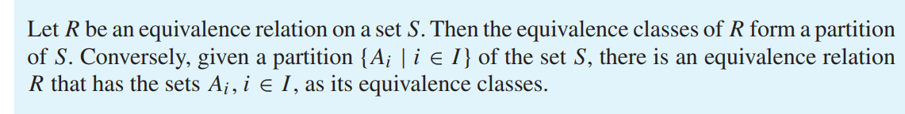
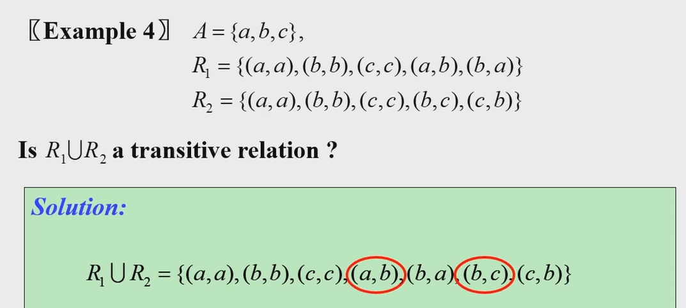
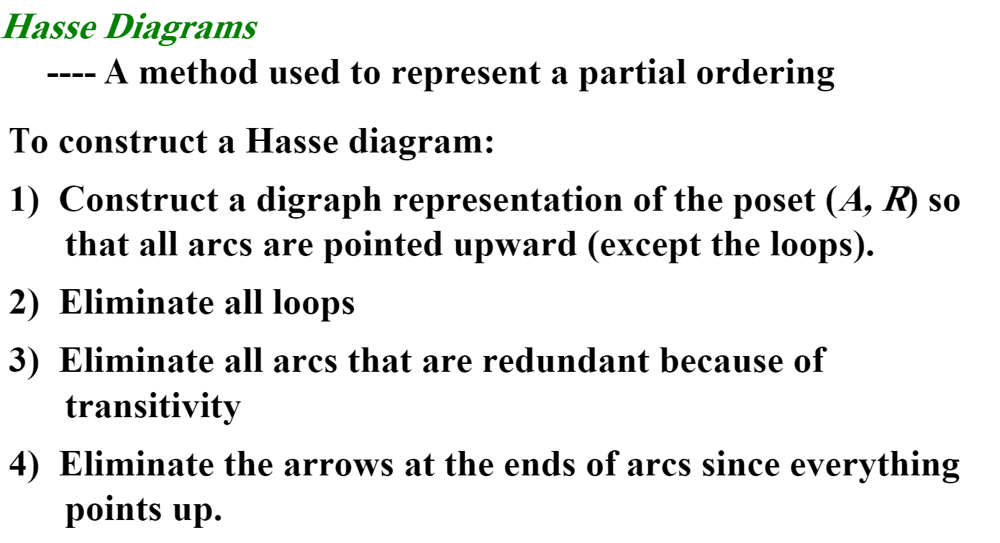
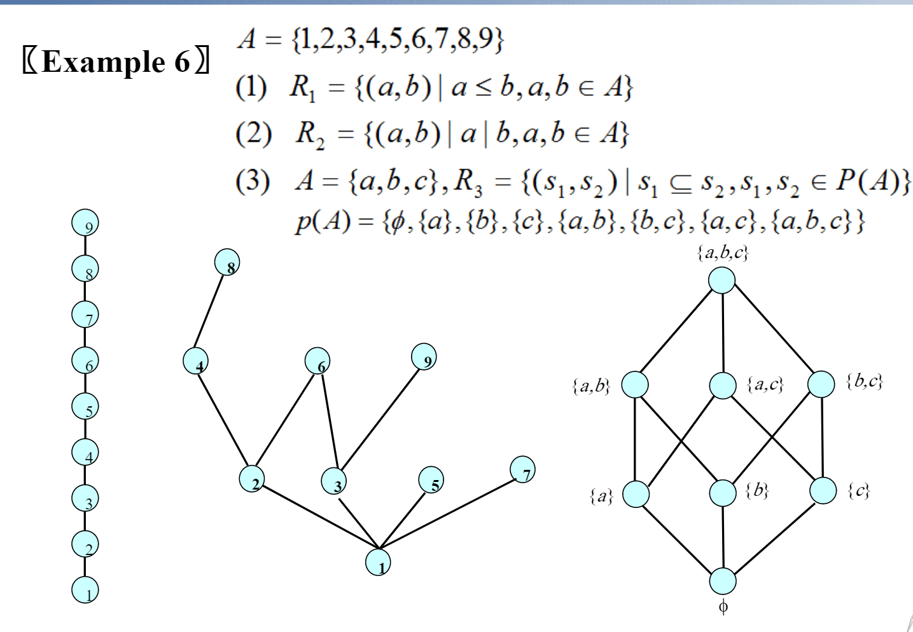
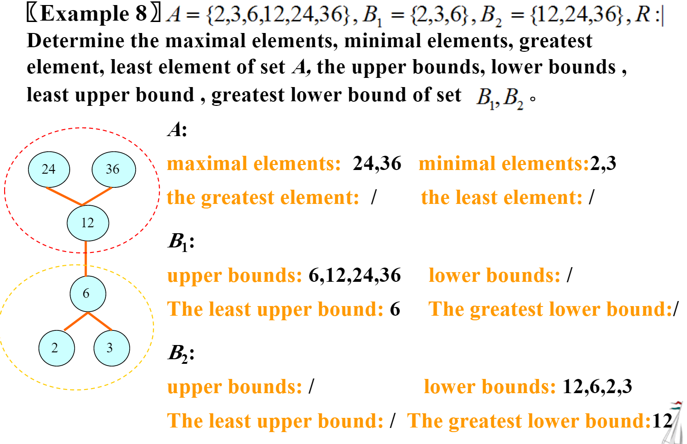

注意看关系的定义，计数不同性质关系(reflexive,symmetric,antisymmetric)的, 偏序关系

### Definition

> A binary relation from $A$ to $B$ is a subset of $A\times B$

The graph of function $f:A \to B$is a relation. 但反之不成立

> A relation on a set A is a relation from A to A

A relation can be expressed as

- Connection matrix $m_{ij}=[(a_i,b_j)\in R]$ 可以理解成图的邻接矩阵,只有0和1
- Directed graphs

### Properties

| Properties    | Definition                                                   | Connection Matrix                                | Digraph                                                      |
| ------------- | ------------------------------------------------------------ | ------------------------------------------------ | ------------------------------------------------------------ |
| reflexive     | $\forall x\in A,(x,x)\in R$                                  | 对角线全为1                                      | 每个结点都有自环                                             |
| irreflexive   | $\forall x\in A,(x,x)\notin R$                               | 对角线全为0                                      | 每个结点都没有自环                                           |
| symmetric     | $\forall x,y\in A,(x,y)\in R \to (y,x) \in R$                | $M=M^T$                                          | 每一条边都有反向边                                           |
| antisymmetric | $\forall x,y\in A,((x,y)\in R\wedge(y,x)\in R)\\ \to x=y$    | 对角线可以为0/1, 非对角线上的对称位置不能同时为1 | 每一条边都没有反向边，**可以有自环**                         |
| asymmetric    | $\forall x \in A,(x,y)\in R\to(y,x) \notin R$                | 对角线全为0,非对角线上的对称位置不能同时为1      | 每一条边都没有反向边,**不能有自环**                          |
| transitive    | $\forall x,y,z\in A ((x,y)\in R\wedge (y,z)\in R)\\ \to(y,z)\in R)$ | $M^2 \vee M=M$                                   | 对于每一条从$u$到$v$长度为2的路径，有一条边$(u,v)$. (即$R^2\subseteq R$) |

- 也就是说如果$(x,y) \in R且x\neq y$则$(y,x)\notin R$ . 如果R是antisymmetric的，那么可以包括(a,a).

A relation can be both symmetric and antisymmetric: $M=\begin{pmatrix}&1 \ &0\\&0 \ &1 \end{pmatrix}$

> symmectric+transitive=reflexive?

No, for example $M=0$

错在symmetric不代表对于任意的$a$都存在$b$使得$(a,b)\in R$

#### Counting relations on set

> |A|=n, how many relation on set A is
>
> - reflexive: $2^{n^2-n}$
> - symmetric: $\color{red}2^{(n^2-n)/2}\times 2^n=2^{(n(n+1)/2)}$ 注意对角线上可以是0或1
> - **antisymmetric**: $\color{red}3^{n(n-1)/2}\times 2^n$ 对于矩阵非对角线上的一对对称的元素, 只能是(0,0),(0,1),(1,0). 对角线上可以是0或1
> - asymmetric $3^{n(n-1)/2}$，对角线上全为0

### Operations

> $R^{-1}=\{(b,a)|(a,b)\in R \}$

$M_{R^{-1}} =M_R^T$

> $S\circ R=\{(a,c)|(a,b)\in R \wedge \color{red}(b,c)\in S\}$

**注意顺序，S在后面！！！！**

对应邻接矩阵的乘法(用与运算代替乘法，或运算代替加法) 

$$
M_{S\circ R}=M_R \times M_S
$$

$R^n=R\circ R \circ \dots R$

或者对应有向图中长度小于等于n的路径(Floyd传递闭包（确信))

> The relation R on a set A is transitive if and only if $R^n \subseteq R$ for n = 1, 2, 3,...

### Closures

> If there is a relation S with property P containing R, such that S is a subset of every relation with property P containing R, then S is called the closure of R with respect to P

证明分3步

- $R \subseteq S$

- $S$ 满足性质$P$

- 证明S是最小的，可以反证，或者证明任意一个满足P的关系都包含S

    

reflexive closure: $R\cup I_a$

symmetric closure:$R \cup R^{-1}$

transitive closure:  $\cup_{i=1}^{\infty} R^i$

Warshall's Algorithm

手算，每次取第k行和第k列. 用第k列(`a[i][k]`)和第k行`a[k][j]`两两匹配,如果有2个都是1的,就把`a[i][j]`设为

### Equivalence Relations

**reflexive,symmetric and transitive**-> equvalence relation

#### Equivalence class
Equivalence class of $x$: $[x]_R$ or $[x]$  The set of all elements that are related to an element $x$

> Eg. $R=\{(a,b)|a \equiv b\pmod 3\}$

$[0]=\{3k|k \in Z\},[1]=\{3k+1|k \in Z\},[2]=\{3k+2|k \in Z\}$

#### Partitions of a set and Relations

> Theorem
左推右很好证。考虑右推左

$R=\{(a,b)|a,b \in A_i\}$ $pr(A)=A_1,A_2\dots A_n$

- reflexive: $\forall a \in A,\exist A_i, a \in A_i$
- symmetric
- transitive: $aRb,bRc$, $a,b\in A_i\ \ b,c \in A_j$. because $A_i \cap A_j=\emptyset(i \neq j)$, so $i=j$

[4a48fe0446513dfdb3c3cc67cb93c5e7.png](../../_resources/4a48fe0446513dfdb3c3cc67cb93c5e7.png)

> $|A|=n$, how many different equivalence relations on the set $A$ are there

Consider the partition of A. $\sum_{k=0}^n S(n,k)$

#### Operation of equivalence relations

$R_1,R_2$ is equivalence relation, $R_1 \cup R_2$ is not 

因为不满足Transitive, 对$R_1 \cup R_2$ 再跑传递闭包就可以

### Partial Orderings

a **reflexive,antisymmetric and transitive **relation is a partial order.

- 验证是partial order,前两项容易，注意transitive relation要枚举3个点

S is a set, R is a partial order on S, $(S,R)$ is called a **poset**

The elements a and b of a poset $(S, \leq)$ are called **comparable** if either $a \leq b$ or $b \leq a$. (这里的≤代表抽象的大小关系，不是实数的比大小)

If $(S, \leq )$ is a poset and every two elements of S are comparable, S is called a totally ordered or linearly ordered set, or a chain.

#### Hasse Diagrams

先把偏序关系表示成有向图，根据传递性去掉不需要的边。再分层画出节点，去掉箭头。

画$(A,|)$的Hasse diagram，可以不必用通用的方法

1. 如果有1,则1在最底部
2. 接下来一层是质数
3. 依次放上质数的倍数

#### Chain and antichain

A subset of a poset is called a chain if every two elements of this subset are comparable. 

A subset of a poset is called an **antichain** if **every two elements** of this subset are incomparable

> Dilworth's theorem:
>
> every finite poset can be partitioned into k chains, where k is the largest number of elements in an antichain in this poset

#### Special Elements

- maximal element $m$:  不存在$a \in S,a \geq m$ （可能有多个，也可能不存在) (top element of Hasse diagram)

- minimal element: (bottom element of Hasse diagram)

- greatest element: $\forall a \in S,m \geq a$ (唯一)

- least element: (唯一)

- upper bounds: for $A \subseteq S$, $\exist a, \forall b \in A, a \geq b$, then $a$ is upper bound of $A$

    - least upper bound(lub)

- lower bounds

    - greatest lower bound(glb).

#### Lattice

a poset is called a lattice if **each pair** of elements have a glb and lub.

every totally ordered set is a lattice

**$(Z^+,|)$ is a lattice. (glb=两个数的最大公因数，lub=最小公倍数) 
$(P(S),\subseteq)$ is a lattice (取并集、交集)**

#### Well-ordered set

a well-ordered set is a poset that every nonempty subset of A has a least element.
a well-ordered set is a totally ordered set.(choose subset of size 2)

mathmatical induction(见Section 5)

#### Topological Sorting

