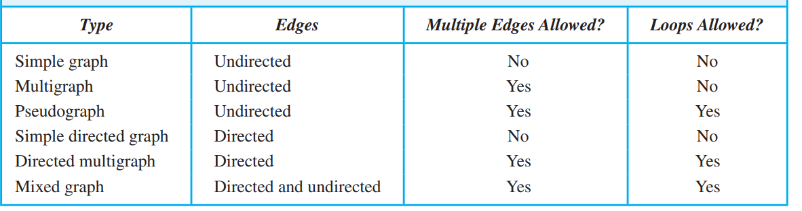

[TOC]

## Sets

### Definitions and Theorems

- Functions

    -  categories
        - one-to-one 单射,不能有两个变量对应函数值相同
        - onto满射
        - bijection

    - Growth of functions
- Set Cardinality

    - Infinite sets: a set is infinite if and only if it has an infinite **proper subset**
    - Cardinality: $f: A\to B$
        - bijection $|A|=|B|$
        - one-to-one $|A| \leq |B|$
    - Countable infinite  $|A|=|Z^+|$
        - $Q^+$ is countable infinite: $|Q^+|=|Z^+\times Z^+|$. $n=1+2+\dots(p+q-2)+q$
        - The union of countable number of countable sets is countable.
        - the set of **finite** subset of positive integers is countable: $\{a_1,a_2\dots a_n\}\to 2^{a_1}+2^{a_2}+\dots 2^{a_n}$
    - Uncountable infinite
        - $(0,1)$ is uncountable
            - Cantor Diagonal Argument $x_i=0$ if $d_{ii}\neq 0$, $x_i=1$ if $d_{ii}=0$
        - The set of **infinite** subset of positive integers is uncountable. (use decimal representation)
        - the set of functions from $\mathbb{Z}^+$ to $\{1,2,3,4,5,6,7,8,9\}$ is uncountable (use decimal representation)
    - Schroder-Bernstein Theorem: $|A|\leq |B|$ and $|B|\leq |A|$, then $|A|=|B|$
    - Cantor's Theorem $|S|<|\mathcal{P}(S)|$:  construct $B=\{x|x\in A \wedge x \notin f(x)\}$, proof that no $f(s)=B$

找集合恒等式的反例: 构造空集

> (×）(2003 Fall)  if $A\times B\subseteq C\times D$, then $A \subseteq C$ and $B \subseteq D$ 

反例: $B=\emptyset$,$A,C$可以任意取,不需要是子集关系

## Relations

### Definitions and Theorems

- Definition: a relation is a subset of $A \times B$
- Properties
- Equivalence Relations
    - **Equivalence Relation** 和Set partition 一一对应
- Partial Ordering: reflexive,antisymmetric,transitive
    - Totally ordered set: **every two elements of the poset is comparable**  (aka chain,linearly ordered set)
        - Well ordered set:  $(S,\leq)$.  $\leq$ is **a total ordering** and every non empty subset of $S$ has a least element.  (every well-ordered set is a totally ordered set.)
    - Elements in a poset
        - Maximal:没有向上的边  Minimal:没有向下的边
        - Upper bound and Lower bound of set $S$.  $\forall a \in S, l \geq a$
        - lub and glb
    - Lattice: every **pair of elements** has a lub and glb
        - $(\mathbb{Z}^+,|)$, $(\mathcal{P}(S),\subseteq)$ is a lattice   用最大公约数/最小公倍数，交集/并集
        - every totally ordered set is a lattice
    - Topological Sorting: A total ordering $\leq$ is compatible with the partial ordering $R$: for all $aRb$ ,  $a \leq b$ (相当于把partial order 变成了total order)

> (×）(2003)  $(A,\leq)$ is a poset, if there is a unique maximal element of $A$, then it is the greatest in $A$

反例: $A$ 可以是一个无限集合,没有greatest. 但是可以分支出一个maximal

> (2005) |A|=n,
>
> > - reflexive: $2^{n^2-n}$
> > - symmetric: $\color{red}2^{(n^2-n)/2}\times 2^n=2^{(n(n+1)/2)}$ 注意对角线上可以是0或1
> > - **antisymmetric**: $\color{red}3^{n(n-1)/2}\times 2^n$ 对于矩阵非对角线上的一对对称的元素, 只能是(0,0),(0,1),(1,0). 对角线上可以是0或1
> > - asymmetric $3^{n(n-1)/2}$，对角线上全为0
>
> (1)How many relations are symmetric and antisymmetric? (2)How many total ordering relations on A

- （1）矩阵非对角线的位置都是0,所以是$2^n$
- （2）是一条链,$n!$

> (2015) $A=\{a,b,c\}$(1)How many equivalence relations on A (2)How many partial order on A

(1) $S(n,1)+S(n,2)+\dots +S(n,n)$

> $\boxed{S\circ R=\{(a,c)|(a,b)\in R \wedge \color{red}(b,c)\in S\}}$  对应矩阵$M_R \times M_S$. S是放在后面的，类比函数复合‘
## Graphs and Trees

- Basic concepts

- Graph Isomorphism

- Graph Connectivity

- Bipartite Graph

- Euler Graph

    - A connected multigraph has an Euler circuit if and only if each of its vertices has even degree.
    - A directed multigraph **having no isolated vertices** has an Euler circuit if and only if  the graph is weakly connected and the in-degree and out-degree of each vertex are equal.

- Hamilton Graph

    - (充分条件)Ore's Theorem: **simple** graph with $n \geq 3$,$\deg u+\deg v \geq n$, Hamilton circuit. 
        - 如果是哈密顿路径,只需要$\deg u+\deg v \geq n-1$  (添加一个虚拟节点,之后变成n+1个点的图,度数和$\geq n+1$
    - 必要条件
        - $\forall S \subset V$, **the number of connected components in** $\boxed{G-S}$ is $\leq |S|$.  (用于证明图没有哈密顿回路,尽量选割点割掉)

- Planar Graph

    - Euler's Theorem: **connected planar simple graph**  $\boxed{r=e-v+2}$
        - non-connected $r=e-v+k+1$.   k  connected components
        - degree of regions $\deg r_i$. $\sum \deg r_i=2e$
        -  If G is a connected planar simple graph with $v \geq 3$, then $\boxed{e \leq 3v-6}$
        - G has at least one **vertex** of degree not exceeding 5
        - If a connected planar simple graph has e edges and v vertices with v ≥ 3 and **no circuits of length three**, then $e \leq 2v − 4$ ($\deg r_i \geq 4$)
    - A graph is nonplanar if and only if it contains a subgraph homeomorphic to $K_{3,3}$or $K_5$
    
    
- Graph coloring

    - every planar graph is 4-colorable

- Trees

    - full(every vertices have m children) m-ary tree $n=mi+1$
    - complete
    - balanced

