## Chapter 1

(1.3.1)The notion of Abstraction

hardware/software

(1.5)Two important ideas:

- All computers are capable of computing exactly the same things if they are given enough time and enough memory.

- It is necessary to transform our problem from the language of humans to the voltages that influence the flow of electrons.(language of computer)

    - Problem:ambiguity of natual languages
    - Algorithm: a step by step procedure, each procedure have 3 properties: (离散数学中讲过)
        - **effective computability**:each step can be carried out by a computer
        - **definiteness**:each step is precisely defined
        - **finiteness**:the procedure terminates after a finite period of time.
    - Programming Language
        - high level: Python,C++...
        - low level: Assembly 
        - Compiler: High-level Lang.  -> Intermediate Form -> ISA
	- ISA: Instruction Set Mechanism
		1. **opcodes**:  operations the computer can perform
		2. **data types**:  acceptable representations for operands
    	3. **addressing modes**: mechanisms that the computer can use to figure out where the operands are located
    - Microarchitecture:  is the **digital logic** that allows an instruction set to be executed. (implementation)  ISA是抽象的指令（类似于接口），而microarchitecture是搭建电路实现这些指令
    - Logic Gates
    - Circuits  
    
    从最顶层的Problem到最底层的circuits，就是从具体到抽象

## Chapter 2(重点)

### Integer representation

- Signed Magnitude  原码
- 1's Complement  反码
- 2's Complement  补码

补码转原码: 取反+1

补码加法:  符号位也参与运算，符号位的进位不要管

**范围**$[-2^{\color{red}n-1},2^{n-1}-1]$

**不同长度补码的转换**：**正数前面补0，负数前面补1** (有符号拓展,SEXT)

> (HW1 2.17):0101+110=0101+1110=0011=3

溢出(overflow): 用二进制判断:  **符号位前的进位和符号位后的进位不同，则溢出**

> (HW1 2.20)

  16进制补码:如果是正数,直接转16进制,前面加x.  如果是负数,那么就以转完16进制后的长度(4*k)做补码

> (HW2 2.48)

### Floating point

32-bit(float) 

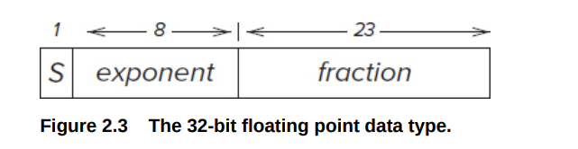

(16bit: 1 / 5 / 10   64bit: 1/11/52)

- 8位的**exponent是无符号的**，范围是$[0,255]$
- 23位的`fraction`

当$1 \leq \text{exponent} \leq 254$  (Normalized Form)

 $\boxed{N=(-1)^S\times 1.\text{fraction}\times 2^{\text{exponent}-127},1 \leq \text{exponent} \leq 254}$

绝对值最小 $1.0000...0\times 2^{-126}=2^{-126}$

绝对值最大 $1.1111\dots 1\times 2^{127}\approx 2^{128}$

> (2.40) 1 10000000 10010000000000000000000
>
> $(-1)^1\times 1.1001\times 2^{128-127}=-3.125$

当$\text{exponent}=255$ (infinities)

​        用来表示无穷. 如`inf`就是exponent=255,fraction全0.  如果exponent=255,fraction不是全0,就是`NaN`

当$\text{exponent}=0$ (subnormal numbers)

​      $N=(-1)^S\times 0.fraction \times 2^{-126}$

​      最大$0.111\dots1\times 2^{-126}=(1-2^{-23})\times 2^{-126}$

​      最小$0.000\dots 1\times 2^{-126}=2^{-149}$

​     **注意这里是0.fraction,而不是Normalized Form中的1.,且指数换成了-126.**  去掉要求的1,这样可以表示的指数范围就从-127变到了-149。

## Digital Logic Structures

### Transitors

PMOS  $U_G-U_S<-1.2V$导通    一般作上管(和$U_S=1.2V$相连,此时若$U_G=0$则导通)   

N-type    $U_G-U_S>1.2V$   一般作下管(接地$U_S=0$,此时若$U_G=1.2V$则导通, $U_G=0$则断路
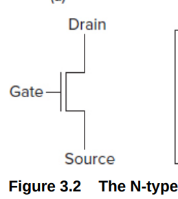

### Gates

**NOT Gates**

横线代表正极，三角形代表接地

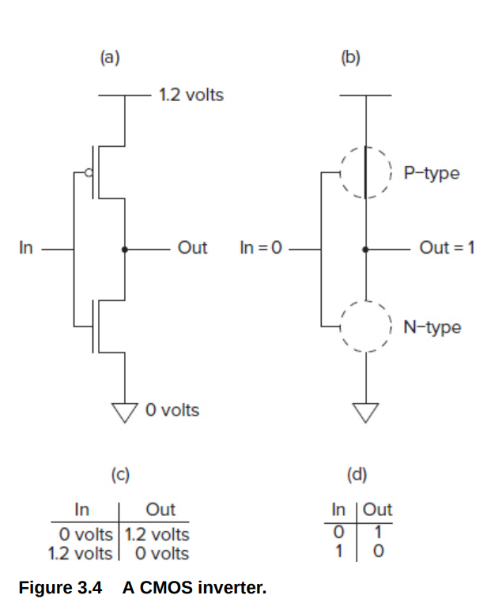

**NOR/OR**

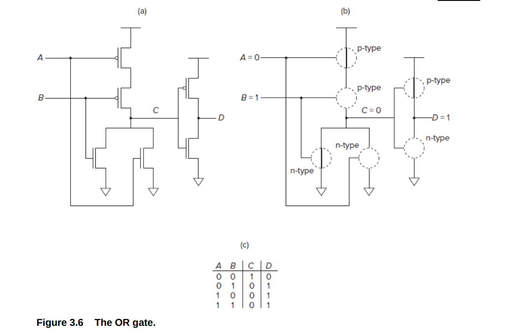

OR=NOR+NOT,所以只需要看左边的NOR

NOR，当且仅当输入是两个0的时候为1, 因此上面用两个P-type串联,仅两个都是0的时候导通，输出为1。下面用两个N-type并联，只要有1个为0的时候就导通接地，输出为0。

**上半部分选择什么时候高电势(1)，下半部分选择什么时候接地(0)   串联代表"与"  并联代表"或"**

如果是多个输入,只需要把多个输入串联起来或者并联起来即可。

**NAND/AND**

同理对于NAND,只要输入有1个0,输出就为1,所以上面用两个P-type并联, 下面用两个N-type串联

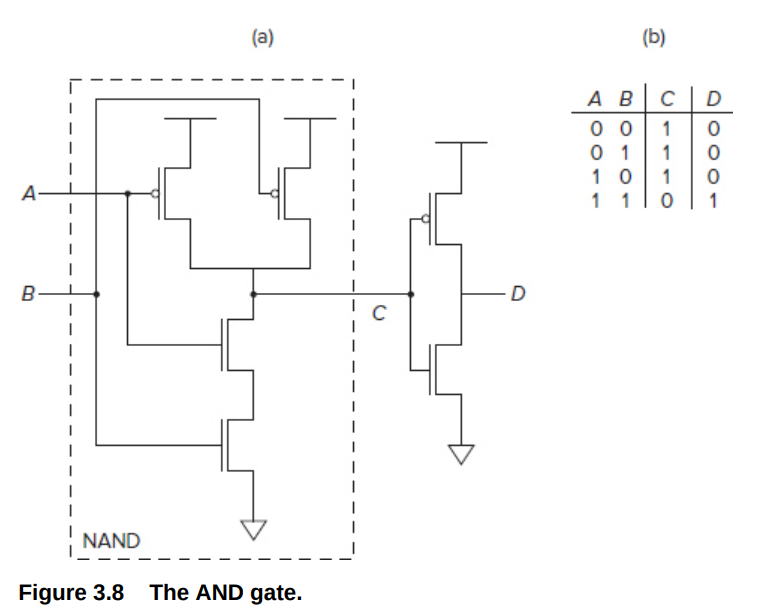

### Combinatorial Logic Circuits

对前面半导体的结构进行进行封装，就得到了常见的逻辑门，符号如下

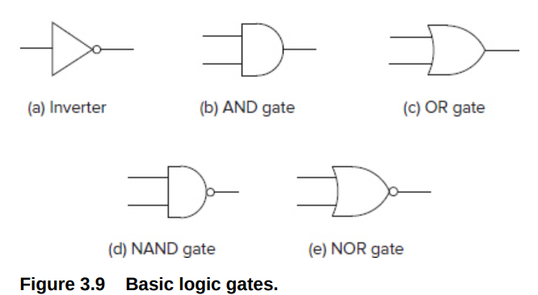

**NOT Gate有时也简化成一个小圆圈.** 

表达式：  $A+B$ 表示$A$ OR $B$.      $AB$ 表示 $A$ AND $B$  $\bar{A}$ 表示 NOT $A$

**Decoders**

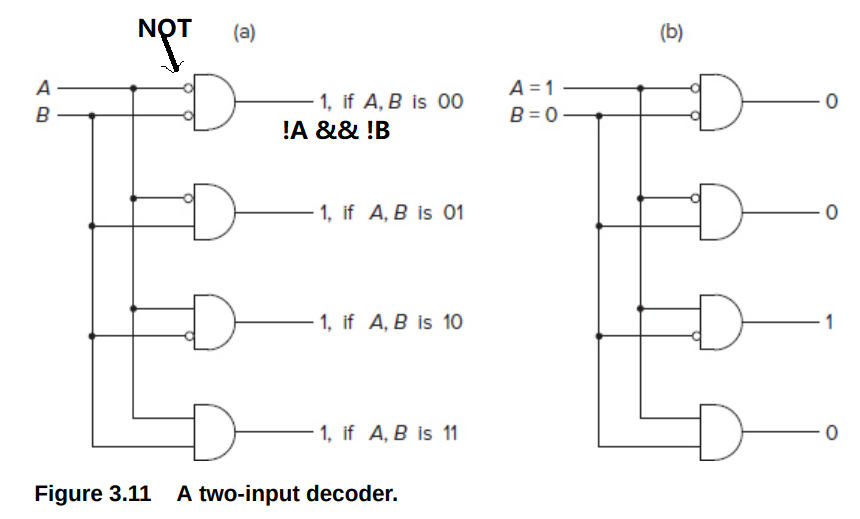

 用AND和NOT组成(**注意前面的空心圆圈代表NOT**)

分类所有输入的组合。可用于解析opcode

**MUX**

- $2^n$ inputs, 1 output, n select lines

通过S来选择对应的输入

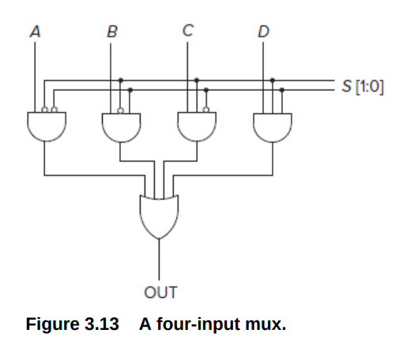

S=00,01 10 11 分别输出A,B,C,D

**1-bit adder**

本质上也是decoder,对输入的$A_i,B_i,C_{i-1}$输出对应的$S_{i},C_{i}$.  如果为1就连向对应的输出
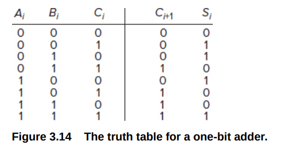
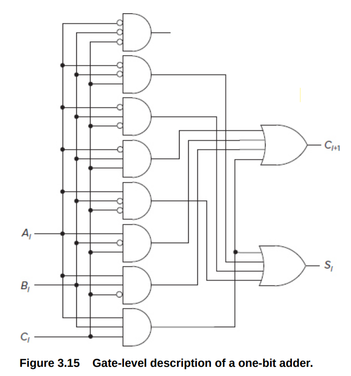

从上到下对应000,001...111  

**The Programmable Logic Array (PLA)** 

对1-adder进行进一步抽象, 相当于decoder+内部自定义连接+一系列or gates

这种思路很重要。对于一些过程，如比较，加法等，我们不需要关心实现思路，只需要列出真值表然后用PLA解析即可。对于n-bit输入,m-bit的输出, 对于每一个输入$x$(共$2^n$个), 对应输出$y$,  把$x$对应的AND Gate 连向  $y$中为1的bit对应的OR Gate

*Patt在这本书中强调的是更简单的去设计逻辑电路，而不是追求用更少的逻辑门*

> HW2 3.3

### Storage Elements

**R-S latch**

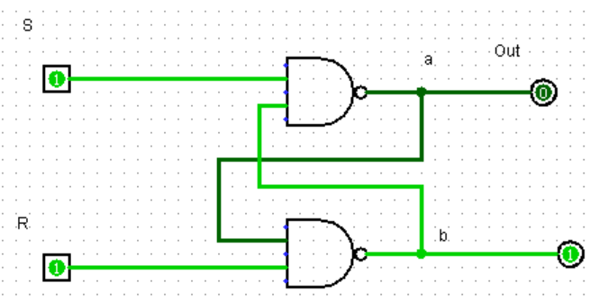

R = S = 1:**hold current value in latch**   (Out can be 0 o)

S = 0, R=1:**set value to 1** (set)

R = 0, S = 1:**set value to 0** (reset)

R = S = 0(•*Don’t do it!*)

•**both outputs equal one**

•**final state determined by electrical properties of gates**

**Gated D latch**

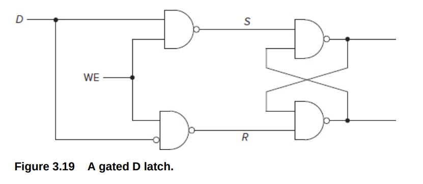

WE=0, S=R=1 no matter what D equals to(Write is not enabled, store the previous state)

WE=1(Write Enable, **Set the value to D**) 

   D=1,S=0,R=1,Out=1  D=0,R=0,S=1,Out=0

Prevents S=R=0

### Memory

**address space**:the total number of uniquely identifiable locations
**addressability:** The number of bits stored in each memory location

$n$ bits of address, $2^n$ locations in the address space. $A$代表地址  $D_l[2:0]$代表要写的值 $D[2:0]$代表要读的值

每一行对应一个地址,每个gate D latch存储一位二进制

decoder用于选择对应的行

mux用于读出latch里面的值

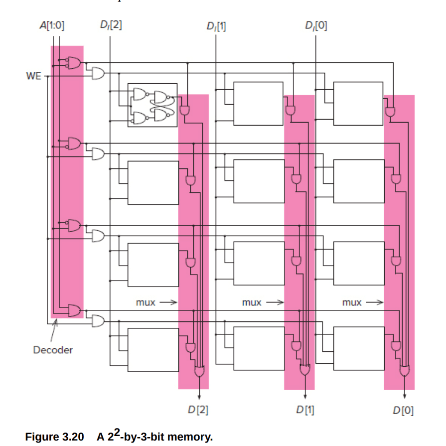

左边第一列是用来选写的行   其余是用来的    

### Finite State Machines

#### Synchonous Finite State Machines

**the clock is a signal whose value alternates between 0 and 1.**

**synchronous**:the state transitions take place, one after the other, at identical fixed units of time

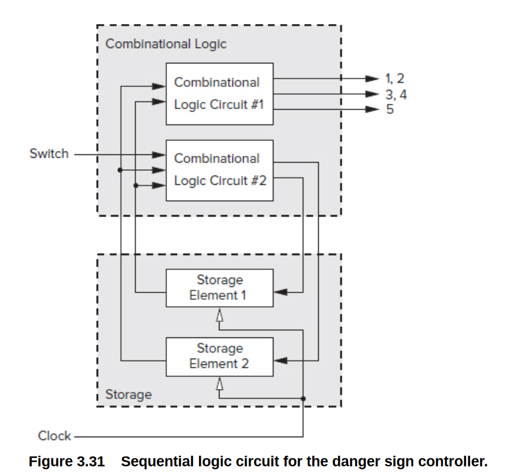

原理:Combinational Logic Circuit #1是输出模块

Combinational Logic Circuit #2 **本质上是一个PLA,  输入是状态机的当前状态和开关Switch，输出的是状态机的下一个状态**，状态编码存储在Storage里

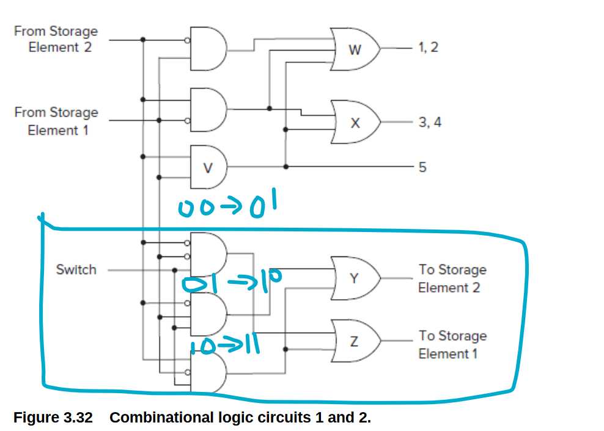

把状态机的变化关系(带时序的真值表) 画成电路

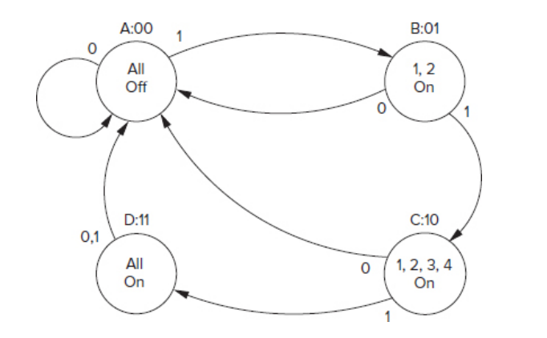

状态机:
- 点上要写状态$S$
- 线上写输入$X$表示状态转移
- 输出如果和输入无关，就写在点上。否则写在输入后面

#### Flip-Flop

防止状态快速变化

We do not want the input to the storage elements to take effect until the end of the current clock cycle.

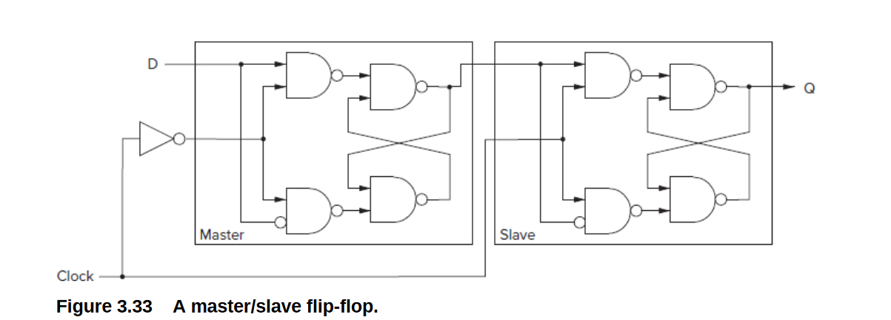

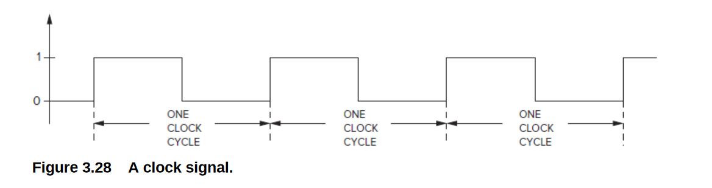

原理: 

- 在时钟周期的前一半(A),Clock=1, Master不可写,Slave可写, Master存储的状态$S_n$被写入Slave
- Combinatorial Logic根据Slave的状态$S_n$计算$S_{n+1}$
- 在时钟周期的后一半(B),Clock=0,Master可写,Slave不可写,新的状态$S_{n+1}$被写进Master, 下一个时钟周期再进入Slave

​           *Master*起到了缓存下一个状态的作用