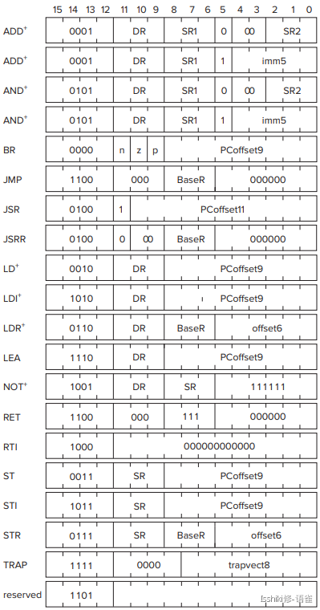
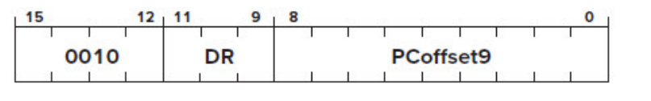
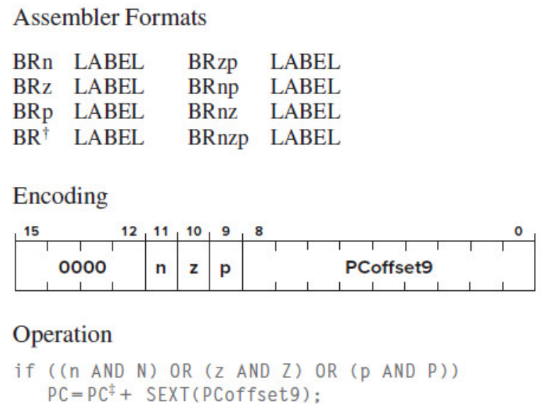

https://www.yuque.com/isshikixiu/codes/ics#xLzvZ

[TOC]


## Chapter 4

### von Neumann machine

- Input: input data to the machine

- Output: display the results

- Memory: stores data

- **Processing Unit**: processes infomation and do calculations

- **Control Unit**: controls the execution of computer program

### LC-3

The LC-3 memory has an address space of 2 16 (i.e., 65,536) locations, and an addressability of 16 bits

- **ALU**:  一次处理的二进制串长度称为word, LC3为16，一般为32/64
- **MEMORY** consists of the storage elements, along with the **MAR** for addressing individual locations and the **MDR** for holding the contents of a memory location on its way to/from the storage
- The **IR** (**i**nstruction **r**egister) is also an input to the finite state machine since the LC-3 instruction being processed determines what activities **must** be carried out.
- The **PC** (**p**rogram **c**ounter) is also a part of the control unit; it keeps track of the next instruction to be executed after the current instruction finishes.
- 8 general purpose register (GPR) R0-R7


指令执行的六个阶段(4.3.2)

1. FETCH
    1. MAR ←PC
    2. 访问内存,结果放入MDR
    3. IR ←MDR
2. Decode
3. Evaluate Address
4. Fetch operands  用到MAR,MDR
5. Execute
6. Store Resu

### Data Path

附录`C.3`  或PPT


## 实验课相关 LC3TOOLS

注意调试时如果Randomize Machine,要Reload object files,否则内存中指令的位置会被覆盖

## LC-3 ISA

附录A

程序开头指定第一条指令在内存中存储的位置`x3`

PC寄存器:存储**下一条**指令在内存中存储的地址。每执行一步则+1

### Addressing Modes

- **PC-relative**  `PC'=PC+offset`  比如LD,BR,JMP
- **Indirect**  比如LDI,STI
- **baseR+offset**: LDR,STR

后面两种都可以了解决offset长度不够的问题,因为offset一般是9位，而地址可以到16位

baseR+offset可以做数组的寻址,baseR就是数组首地址

### ADD,AND,NOT

**注意Imm5范围是[-16,15]**

### LD,LDI,LDR

 汇编
 - `LD DR,LABEL` (汇编器会自动计算PCoffset，但如果距离太远就会报错) `DR=mem[LABEL]`

-  `LDI DR,LABEL` `DR=mem[mem[LABEL]]` (可以实现任意地址的跳转)


- `LDR DR,BaseR,LABEL` `DR=mem[BaseR+LABEL]`

二进制:



`DR`:目标寄存器(000-111), `PCoffset9`是`PC`中的地址到内存中想要的数据地址的偏移量

意思是`DR=mem[PC+PCoffset9]` 

### LEA

It does not really operate on data, it simply **loads** a register with an **address**.

`DR=PC+offset`

### BR

见5.4.1

除了8个GPR之外,还有三个寄存器N,Z,P. 每次写入GPR时(通过**ADD,AND,NOT,LD,LDR,LDI**,没有LEA）,计算机会设置N,Z,P.  

- N代表写入的数<0 Z代表=0, P代表>0    如写入5,那么N,Z,P分别是0,0,1

BR操作指定n,z,p, 表示需要判断哪些寄存器为1

注意n,z,p是程序的指令,是不变的。N,Z,P是寄存器的值(condition code),在运行中会变,且每个时刻N,Z,P有且仅有一个是1



举例: 计算$R3=R1\times R2$的机器码 (循环,每次R2-=1,R3+=R1)

```plain
0011 0000 0000 0000  ;.ORIG x3000
0101 011 011 1 00000 ;AND R3,R3,0   R3=0
0010 001 000000100   ;LD R1,
0010 010 000000100   ;LD R2,
0001 011 011 0 00 001;				R3=R3+R1
0001 010 010 1 11111 ;R2=R2+(-1)
0000 101 111111101   ; if R2>0 or R2<0 then PC=PC-3(回到R3=R2+R1)       
```

注意最后BR的指令是101,这是为了处理**乘以负数的情况**   如果用001,当R2是负数的时候就直接退出了

为什么R2是负数的时候不断-1,结果还是正确的??

注意汇编器的`BR`等价于`BRnzp`,即无条件跳转


**0000 000 000000000代表什么都不做**,执行下一条

**0000 111 000000001代表跳过BR后面的一条指令**

## LC-Assembly

```asm
LABEL OPCODE OPERAND ;COMMENT
```


### **Labels**

symbolic names that are used to identify memory locations that are referred to explicitly in the program （不需要像机器码那样手算)

实际上就是一个地址

- 存值 `LD R1,ALPHA`  `ST R1,SUM`

- 分支  `BRp LOOP` (汇编器会自动计算offset)

Offset有符号


### **Assembler Directives**

(pseudo-ops):

`.ORIG ADDRESS `: 指定起始地址。和`.END`配对

`.END`: 告诉汇编器结束

---


`LABEL .FILL VALUE`: set some place in the memory to VALUE, and can be loaded using LABEL. etc. `LD R1,LABEL`  will set `R1=mem[VALUE]`

这种情况下**LABEL**相当于指向VALUE的"指针"

**LD R1,x不是赋值，而是把R1设成mem[x]（类似于C语言中的`*`运算符),如果要把R1设成x,可以先置0再ADD R1,R1,x**


*此时执行`LD R0,LABEL`*得到的是数组第一个元素的值(0). 要想得到地址,必须`ADDR .FILL LABEL` 然后`LD R0,ADDR`

读取指定地址的内容 (这样可以读取任意地址的内容,而LD,LDR受offset长度限制,不能跳的太远) ADDR是直接附在代码最后的，距离调用时的PC不会太远
```assembly
LDI R0,ADDR
ADDR .FILL x4000

.ORIG x4000
.FILL 
.END
```

---

`LABEL .BLKW N` **分配N个word(在LC-3是16-bit)的连续内存，指向内存的第一个元素**

LABEL `.STRINGZ "abcd"`  **分配len+1个word,每个word存一个字符,末尾0,指向第一个字符**


### The Assembly Process

2-PASS

1. pass 1: construct symbol table(each LABEL, find memory address)  计算内存地址的时候，记得每条指令本身占一个地址
  - 注意.ORIG第一行不算
  - 注意写成16进制，不要写成10进制
3. pass2: translate

```assembly
.ORIG x8003
AND R1,R1,#0
ADD R0 ,R1,#5
ST R1,B
LD R1,A
BRz SKIP
ST R0,B
SKIP TRAP x25
A .BLKW #7
B .FILL #5
BANNER .STRINGZ "we are done ! "
C .FILL x0
.END
```