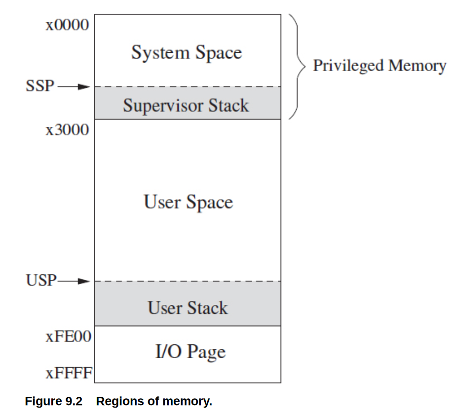
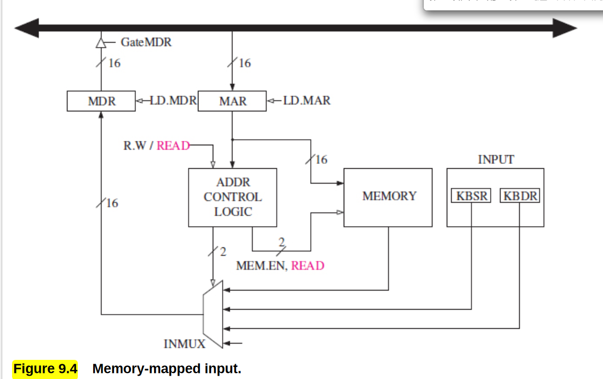
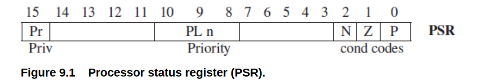
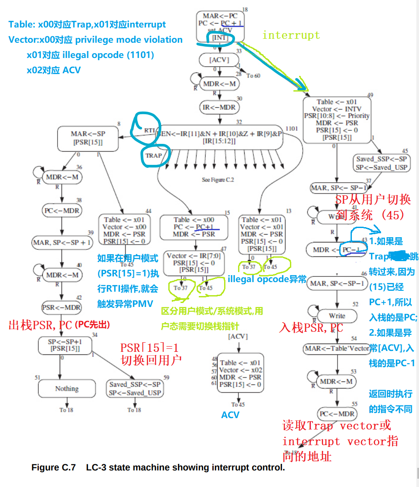
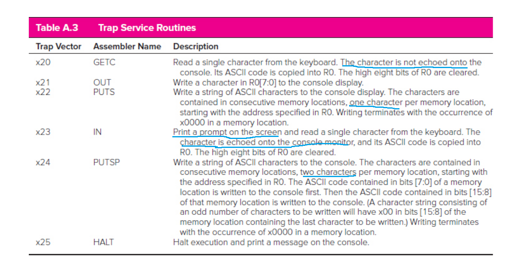
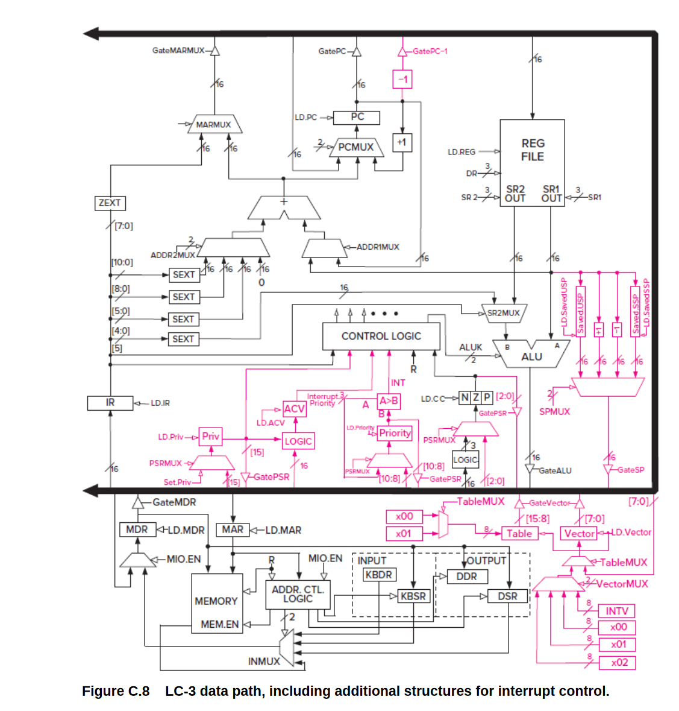

[TOC]


## Data Structure

用汇编实现...

### Subroutine,**JSR,JSRR,RET**

汇编中的"函数"  **调用函数用的是J**

- `JSR LABEL` 将原来PC的值放入R7，跳到LABEL对应的命令（PC+offset)

- `RET` 从子过程中返回，将PC设为R7  相当于`JMP R7`

- `JSRR Rn` 将原来PC的值放入R7,跳到Rn存储的地址(baseR)

- ​    `JMP Rn`只跳转`PC=Rn`,但不会保存原来PC

**Call-return:**

```asm
;main code
JSR SUBPROC
HALT

SUBPROC ;subprocess code
;code...
;用BR跳到ENDSUB可以在中途返回
;
ENDSUB RET
```

**Caller Save/Callee Save**

子过程的计算过程中需要寄存器，防止对主过程干扰。在子过程中先把原来寄存器的值存在内存里，计算完成后再恢复寄存器的值
**局部变量要Save,返回值不用Save**
Figure 8.1

```assembly
SUBPROC ST R1,SaveR1
        ;....code
        LD R1,SaveR1
        RET

SaveR1 .BLKW 1
```

### Stack

Figure 8.11  P359
Overflow/Underflow

```assembly
R6 ;stack pointer  (push -1, pop +1)
R0 ;value
R5 ;errorinfo

ADD R6,R6,#-1;
STR R0,R6,#0 ;(push)
```

### Queue

- FRONT: point to the location just before the first element of the queue. 

- REAR: point to the location containing the most recent element that was added to the queue
- Empty: `FRONT==REAR`
- Overflow `FRONT=REAR+1`

### Recursion

**如果连续调用了多个/次subroutine,只使用JSR和RET是回不去的,因为PC寄存器只有一个，只能回到上一个调用JSR的地方然后无限循环**
利用栈进行函数调用 `R6`是栈指针

把当前过程用到的**所有局部变量**，指令存储的地址(JSR中被放到R7)，函数的**返回值**都放到栈上

比如求阶乘 ans=f(n-1)*n  就需要放`ans,n,R7`

```c
```


## I/O

### LC-3 memory



x3000-xFE00

memory-mapped I/O: 

- **Address control logic 控制访问的是内存，还是设备寄存器**
- Addresses xFE00 to xFFFF are reserved for input/output device registers
- **KBDR `xFE02`  KBSR `xFE00`**

Supervisor Stack Pointer (SSP) and User Stack Pointer (USP)

- Register 6 is generally used as the stack pointer (SP) for the active stack.

- Two registers, Saved_SSP and Saved_USP , are provided to save the SP not in use.

### PSR

Privilege: **the right** to do something, such as execute a particular instruction or access a particular memory location.

Priority:  the urgency of a program to execute.

两个概念没有关系。程序可以有高Priority,但低privilege(比如访问不了系统空间)



`PSR[15]=0` **means superisor privilege**   **注意0是supervisor,1才是用户**


### Basic Input-Output 

异步asynchronous: 输入不会按CPU的时钟周期来

- interrupt-driven:
- polling:

 KBSR `xFE00`KBDR `xFE02`    DSR `xFE04` DDR `xFE06`

- Each time the typist types a character, KBSR[15] = 1. Each time the computer reads a character, KBSR[15] =0(硬件自动实现)
- 显示器空闲时,DSR[15]=1。 显示器正在处理输出时,DSR[15]=0

### Manual I/O code
```assembly
.ORIG x2000 ;在系统区里，否则没有supervisor权限
			;如果放在x3000,访问KBSR会出现Access Violation
START LDI R3,KBSR; .FILL命令,mem[KBSR]=xFE00,R3=mem[mem[KBSR]]
	  BRzp START ;test R3 input,如果第一位是0,就循环
	  LDI R0,KBDR
	  BRnzp NEXT_TASK
KBSR .FILL xFE00
KBDR .FILL xFE02


START STI R3,DSR
      BRzp START
      STI R0,DDR
```


KBSR[14]是interrupt enable bit，设为1时输入会导致中断，跳到`x0180`

### IO实现的一些细节

回显：直接读完KBDR后显示是没有任何变化的，读取完后再将读取的字符输出，这样的显示效果才符合我们平时用命令行的操作

## TRAP

程序请求操作系统接管，执行一些操作(service routine)。这些操作是写好存在内存里的

Trap vector: 8bit $2^8=256$

**Trap vector table:**  **starting addresses** of these 256 service routines.(**0000-00FF**)


### **TRAP**  instruction


Execute phase:

1. PSR and PC are both pushed onto the **system stack** (a linkage back to the user program)
    - If the the program is executing in User mode(PSR[15]=1), the USP must be saved and the SSP load

	    2. PSR[15]=0
	
	    3. `PC=mem[ZEXT(trapvector)]`
	

### **RTI** instruction  

opcode=1000, no operands

1. pop PC and PSR

2. set PSR[15] 0 or 1

2. If `[PSR[15]]=1`, load USP and save SS

    

SP是当前的栈指针,一般用`R6`

Saved_SSP和Saved_USP是两个寄存器 (见Figure C.8




Trap访问内存3次(两个入栈，一个读取地址)

### Trap vector及其功能



mem[x0020]里面存的是x0300,对应输入操作的起始地址


HALT把MCR的第一位设为0



## Interrupt

Trap是软件请求操作系统接管（软中断)

Interrupt是硬件(如IO)导致的中断   (硬中断)    

Interrupt Vector Table: **x0100-x01FF**

​		跳转过程和Trap类似，看Figure C.7

### Exception

对应Interrupt vector x0100,x0101,x0102

- The privilege mode violation: occurs if the processor attempts to execute the RTI instruction while running in User mode.

- The illegal opcode exception occurs if the processor attempts to execute an instruction having the unused opcode (bits [15:12] = 1101).
-  The ACV exception occurs if the processor attempts to access privileged memory (i.e., a memory location in system space or a device register having an address from xFE00 to xFFFF while running in User mode


TRAP 回到PC

Interrupt回到PC-1 (当前指令)，Exception回到PC-1 （当前引起异常的指令)
