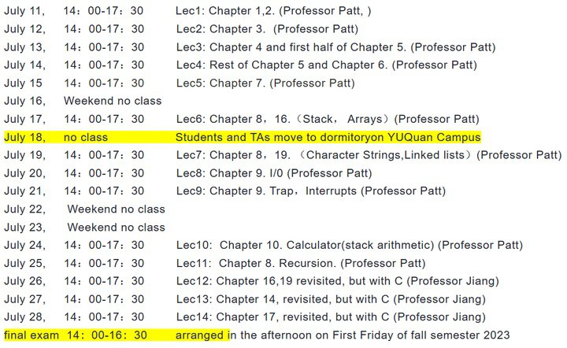
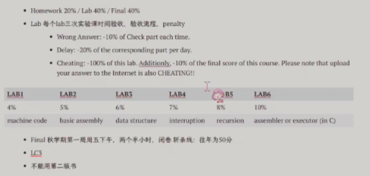

HW20% Lab 40%  Final 40%

6个Lab，每个3-4天
代码打包成.zip发到Check, 实验报告发在Report(不超过2页A4)


看课本
附录A,C

期末闭卷

```
考试
2.5小时
1-13章

汇编编程

选择题，问答题，填空题。。。
```

没有签到
[hw solutions](https://github.com/QSCTech/zju-icicles/tree/master/%E8%AE%A1%E7%AE%97%E6%9C%BA%E7%B3%BB%E7%BB%9F%E6%A6%82%E8%AE%BA/%E4%BD%9C%E4%B8%9A%E7%AD%94%E6%A1%88)