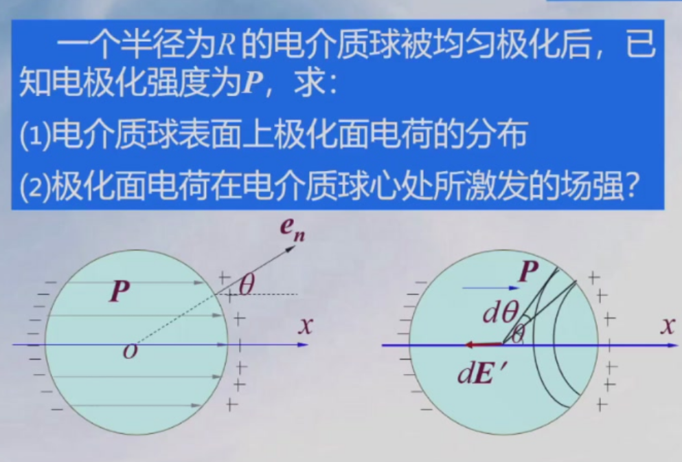
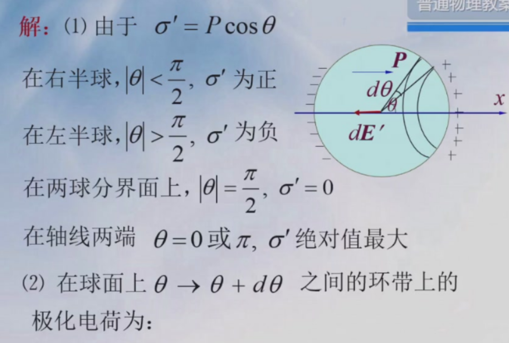
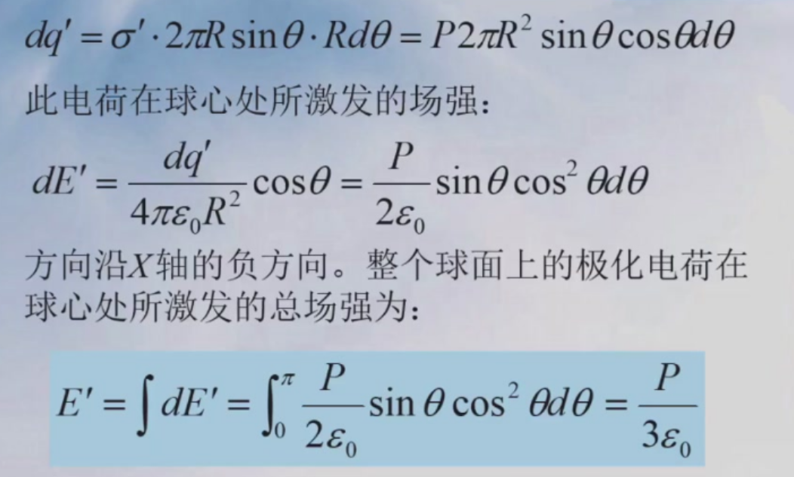
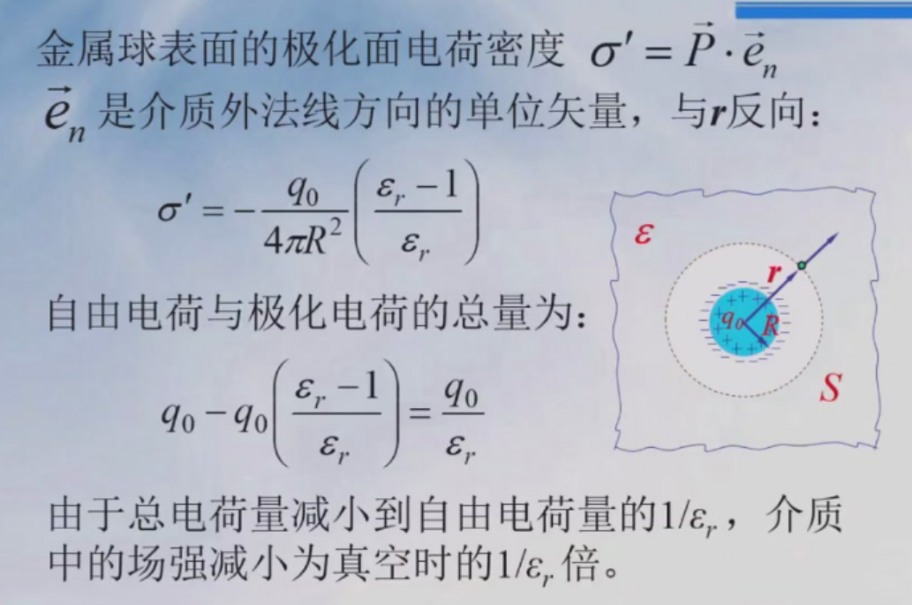
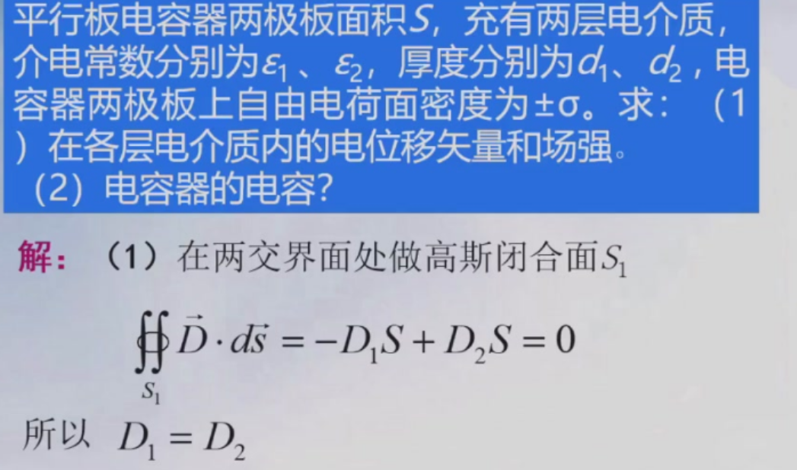
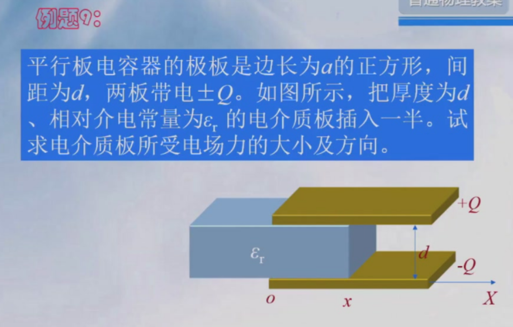
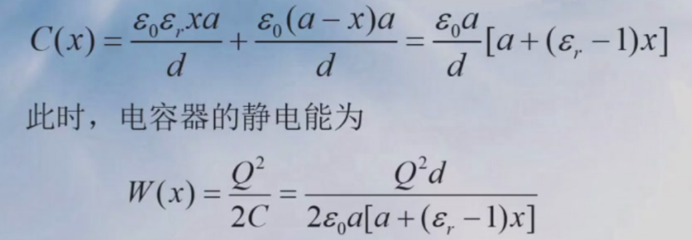
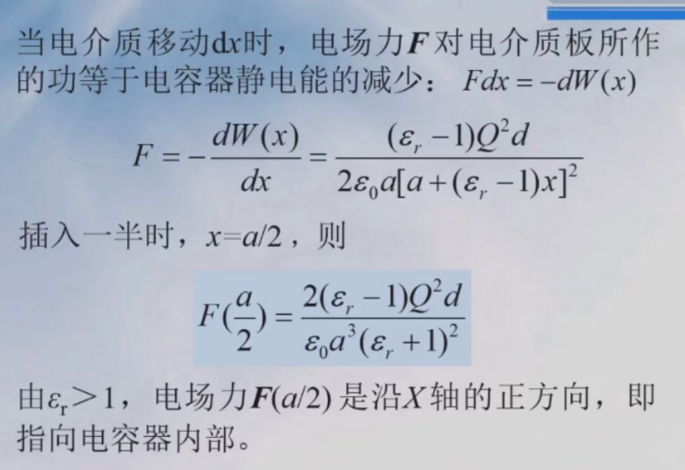
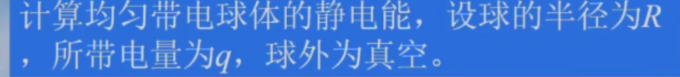

电势$V=\frac{q}{4\pi\varepsilon_0 r}$  注意电场强度是二次方，电势是一次方

无穷远处电势为0，P点点数电势$V_P=\int_P^{\infty} Edx$

$\vec{E}=-\nabla V$   负号，注意混合项的偏导

## 电容

$C=\frac{Q}{U}=\frac{Q}{U_A-U_B}=\frac{Q}{\int Edl}$

孤立球形导体,$U=\frac{1}{4\pi \varepsilon_0}\frac{Q}{R},\boxed{C=4\pi \varepsilon_0R}$

平行板 $\boxed{E=\frac{\varepsilon_0 S}{d}}$, 有电介质就乘上$\varepsilon$  串并联注意$d$是否相等

平行柱面: $E=\frac{\lambda}{2\pi \varepsilon_0 r}$

​            $U_A-U_B=\int_{R_A}^{R_B}Edr$  （注意积分上下限A,B和电压是反过来的

​            $C=\frac{\lambda l}{U_A-U_B}=\frac{2\pi \varepsilon_0 l}{\ln (\frac{R_B}{R_A})}$

## 电介质

### 电介质的极化

极化强度$P=\frac{\sum \vec{p_e}}{V}$   单位体积电偶极矩矢量和

介质$P=x_e \varepsilon_0 E$ 

表面束缚电荷密度$\sigma'=P\cos\theta$, $\theta$是$\vec{P}$与平面法线夹角

圆环,半径$R\sin \theta$, 宽度$Rd\theta$

### 电介质中的场强

$\vec{E}=\vec{E_0}+\vec{E'},E'$为极化电荷激发的电场，方向与自由电荷激发的电场相反

$E=\frac{\sigma_0}{\varepsilon_0}-\frac{\sigma'}{\varepsilon_0}$

### 电位移矢量

定义$\boxed{\vec{D}=\varepsilon_0\vec{E}+\vec{P}}$

**极化电荷面密度**$\sigma'=P\sin \theta$, 内表面$-P$,外表面P

在各向同性介质中,将极化强度的定义代入$D=(1+x_e)\varepsilon_0E=\varepsilon\varepsilon_0 E$

$\boxed{D=\varepsilon\varepsilon_0 E}$   $\varepsilon$: 相对介电常数

### 有电介质的高斯定理

$$
\boxed{\oint \vec{D}\cdot d\vec{S}=q_0}
$$

注意对介质来说,$P$和$e_n$方向相反。类似于前面电介质球最左侧的情况

注意第二类曲面积分符号，向内侧和外侧符号相反

$D_1=D_2=\frac{\sigma}{\varepsilon_0}$  $E=$

静电场的环路定理(静电场是保守场，绕一圈回到原点，电势不变，做功为0）:  

$$
\oint \vec{E}\cdot d \vec{l}=0
$$

如果用高斯定理解不出来，再加上环路定理列方程

例:两个电容器并联

## 电场的能量

### 电荷相互作用的静电能

$$
W=\frac{1}{2}\sum_{i=1}^n q_i U_i
$$

$U_i$是**其他电荷**在$q_i$处产生的电势。积分形式

$$
W=\frac{1}{2}\iiint_V Udq
$$

这里的$V$是对带电导体

### 电容器的静电能

已经带$q$,增加电荷$dq$, $U=q/C$  $dW=Udq$

积分$\int_0^Q \frac{qdq}{C}$

$$
\boxed{W=\frac{1}{2}\frac{Q^2}{C}=\frac{1}{2}QU=\frac{1}{2}CU^2}
$$

> 

用能量法,$F=-dW/dx$

看成两个电容器并联$C=C_1+C_2$

### 静电场的能量

$U=Ed,Q=\sigma S,E=\frac{\sigma}{\varepsilon \varepsilon_0}$

代入得$W=\frac{1}{2}\varepsilon\varepsilon_0 ESEd=\frac{1}{2}\varepsilon\varepsilon_0E^2 V$   $V$是电容器体积

定义电场能量密度$w_e=\frac{W}{V}$

$$
\boxed{w_e=\frac{1}{2}\varepsilon\varepsilon_0E^2=\frac{1}{2}ED}
$$

对任何静电场$w=1/2\vec{E}\cdot \vec{D}$

$$
W=\frac{1}{2}\iiint_V \vec{E}\cdot \vec{D}dV
$$

注意这里的$V$不是对带电导体，而是**对整个空间**积分

> 例: 均匀带电球壳产生电场的能量，球壳外真空

 $w_e=\frac{1}{2}\varepsilon_0 E^2$

$E=\begin{cases}0,r<R \\\frac{q}{4\pi \varepsilon_0 r^2} ,r>R\end{cases}$

$$
W=\int_R^{\infin}w_e 4\pi r^2dr=\frac{q^2}{8\pi \varepsilon_0 R}
$$

> 
>
> 这里没说导体球, 是绝缘体，所以内部电场强度不为0

$E=\begin{cases} \frac{qr}{4\pi \varepsilon_0 R^3} ,r<R \\\frac{q}{4\pi \varepsilon_0 r^2} ,r>R\end{cases}$

分$(0,R)$和$(R,+\infin)$两段积分

> 计算均匀带电Q **导体球**的静电能,球外为介电常数$\varepsilon$电介质
>
> **带电导体**内部场强为0

内部$D=E=0$

外部$D=\frac{Q}{4\pi r^2},E=\frac{Q}{4\pi r^2\varepsilon_0\varepsilon}(r>R)$

$$
\int _{R}^{\infin} \frac{1}{2}DE\cdot \color{cyan}4\pi r^2dr=\frac{Q^2}{8\pi \varepsilon_0\varepsilon R^2}
$$

