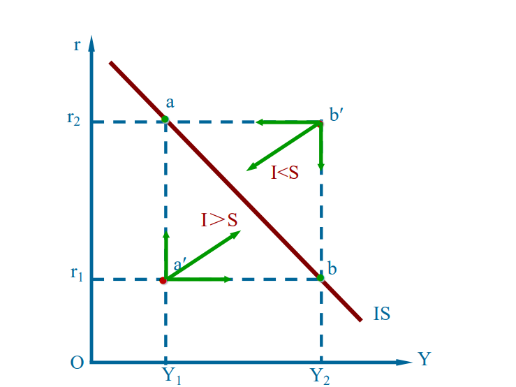
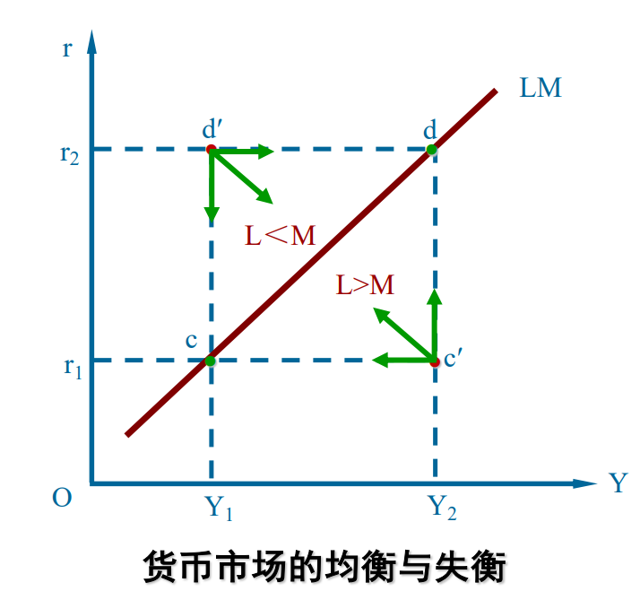
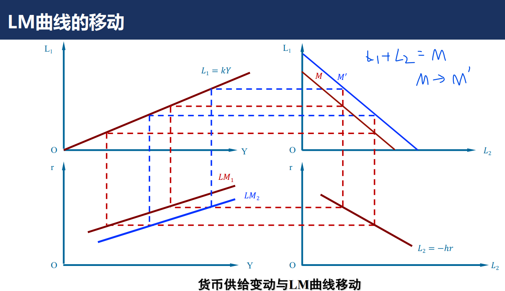
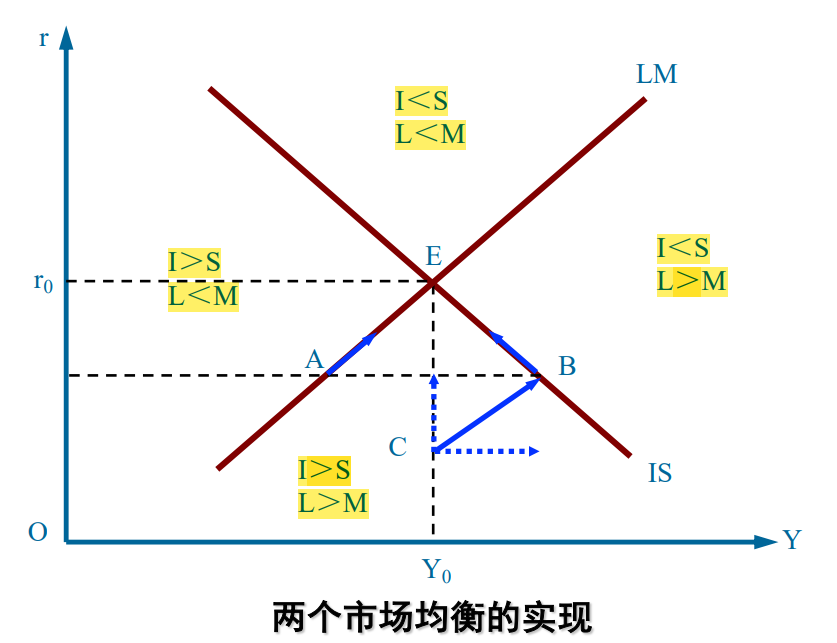

# IS-LM曲线

## IS曲线

#### 两部门经济

两部门经济: 产品市场均衡 $Y=C+I$

​                   （也可以写成$I=S$

$$
\begin{cases}Y=C+I\\ I=e-dr \\ C=\alpha+\beta Y \end{cases}
$$

解得

$$
r=\frac{\alpha+e}{d}-\frac{1-\beta}{d}Y
$$

#### 三部门经济

$$
\begin{cases}Y=C+I+G\\ I=e-dr \\ C=\alpha+\beta (Y-T) \end{cases}
$$

这个时候就不要用$I=S$,直接用$Y=C+I+G$.解出$Y$

### IS曲线的含义

> **AB曲线的上方A<B**

### IS曲线的斜率

$$
r=\frac{\alpha+e}{d}-\frac{1-\beta}{d}Y
$$

- $\beta$越大,斜率越小
- $d$越大,斜率越小 产出对利率变化更敏感

### IS曲线的移动

- **储蓄增加，IS曲线向左移动**
- **投资增加, IS曲线向右移动**

## LM

 ### 货币的概念

货币的职能:

- 价值储藏

- 计价单位：提供了人们标记价格和记录债务的单位

- 交换媒介：是人们用于购买产品和服务的东西。一种资产可以转变为交换媒介和用于交换其他东西的容易程度被称为该资产的流动性（liquidity）

    货币具有非常高的流动性

中央银行的主要职能：发行货币

分类:

- 商品货币
- 信用货币

### 货币需求

**利率越高，债券价格越低，投机性货币需求越少！**

- 交易性货币需求 （交易动机+预防动机):  收入水平的增函数 $L_1=L_1(Y)=kY$   

- 投机性货币需求： 人们**愿意持有**的货币和债券

    购买债券   票面价值100元，利率5%，债券价格为 100 /(1 + 5%) = 95.24

    是$r$的减函数   $L_2=L_2(r)=-hr$        $r$越大,债券价格越低，用来购买债券的货币越少

**利率越高，债券价格越低，投机性货币需求越少**

**流动性陷阱**: **利率极低时,债券市场获利空间较小时,人们对货币的流动性偏好趋于无限大**

### 货币供给

货币量是政府的一种政策工具。政府对货币供给的控制被称为货币政策。 (公开市场操作 \法定准备金率 \再贴现率

货币一般指M1（**现金+活期存款**)

##### !货币乘数

货币供给$M$, 现金$C$,活期存款$D$   **现金存款比**$\boxed{cr=\frac{C}{D}}$

$M=C+D$

准备金$R$：银行收到的但没有贷放出去的存款。**存款准备金率**$\boxed{rr=\frac{R}{D}}$

基础货币$B=C+R$

$$
\frac{M}{B}=\frac{C+D}{C+R}=\frac{C/D+1}{C/D+R/D}=\boxed{\frac{cr+1}{cr+rr}=\mu}
$$

不考虑cr的时候$\mu=1/rr,rr$是存款准备金率

**货币乘数**$\mu>1$，代表 每1元的基础货币产生$\mu$ 元货币供给

##### 影响货币供给的因素

- 基础货币量
- 法定准备金旅$rr$越高, $\mu$越小  （银行能贷出的钱变少了
- $cr$越高,$\mu$越小  (都是现金,不存款,银行无法把存款贷给别人
- **货币供给与利率无关,r-Y图上是垂线**
- 还受超额准备率，现金提取率等因素的影响

### 货币政策

- 公开市场操作：政府通过发行国债，回收货币，减少货币供给量。 
- 法定准备金率: 法律规定的最低限度的准备金率
- **再贴现率**：**商业银行从中央银行贷款  央行在这些贷款收取的利率**  **再贴现率下降，增加基础货币和货币供给**

### LM曲线的推导

货币需求函数 

$$
\boxed{L=kY-hr}
$$

-  $k$代表交易性货币需求，收入Y越高,需求越大
-  $h$代表投机性货币需求，利率越高，会把所有现金换成有价证券，需求越少。当利率越低，流动性偏好，需求越大

$$
\begin{cases}
L=M \text{(实际货币供给=货币需求)}\\ 
L=kY-hr\\
M=\bar{M}/P,左边是实际货币供给,P\text{代表产品价格指数}\\ 
\end{cases}
$$

$$
\boxed{r=\frac{k}{h}Y-\frac{\bar{M}}{Ph}}
$$

- 横轴$Y$,纵轴$r$, 上升的直线

图示推导见ppt

### !LM曲线的含义

- 曲线上的点都是平衡点L=M
- 右下方代表供给<需求： c'点产出比平衡点c多，说明c'交易性货币需求更多  
- 左上方代表供给>需求

### LM曲线的3个区域

- **凯恩斯区域(水平)**  利率过低,投机性货币需求无限增加,流动性陷阱  此时**货币政策无效**(增加货币供给并不能降低利率,因为货币需求无限大) 财政政策有效(IS右移)
- 古典区域(竖直):  **财政政策无效**(财政政策使IS曲线向右上移动,但产出不会增加)   扩张型货币政策有效(LM曲线右移)

### !LM曲线的斜率

$\frac{\Delta r}{\Delta Y}=\boxed{\frac{k}{h}}$

- **$k$越大,斜率越大**,**产出对利率反应越迟钝**

     利率提高，投机性需求降低一定量，供给不变且总需求=供给，所以交易性需求升高一定量, k越大,Y变化越小

- **h越大,斜率越小**,产出对利率反应越敏感

    h 越大，一定的利率变动会引起投机性货币需求较大的 变动，给定货币供给量不变，从而导致用于交易的货币供给较 大的变动，则对应着较大的收入变动

    

### !LM曲线的移动

实际货币供给变动:$M \to M+\Delta M$,  **LM曲线向右平移$\Delta M/k$** (令r=0求出与横轴交点)

- 增加货币供给, 相同产出，实际利率下降, 又会影响产品市场的投资I

图示推导:  

## IS-LM曲线

### IS-LM的含义

利率r和收入水平Y连接两个市场

分析：**AB曲线上方A<B**
        I<S表示产品市场供大于求。 因为S代表未被消费的供给  I是企业购买产品用于扩大生产的需求
		

A点, I>S, 收入Y上升, 导致LM曲线中L上升, 利率上升。但利率上升又会使得I下降,使得Y0上升的没有那么多(差值为$Y_B-Y_0$)

### IS-LM移动

$$
r=\frac{\alpha+e}{d}-\frac{1-\beta}{d}Y\\
r=-\frac{M}{hP}+\frac{k}{h}Y
$$

扩张性**财政政策**(如**政府购买增加、减税、增加转移支付**)  改变$\alpha$:    IS向右移动

扩张性**货币政策**(增加**货币供给**)  改变$M$:     LM 右移

货币政策和财政政策是不同的

如何在利率r不增加的情况下增加国民收入Y？

LM曲线的古典区域:

-