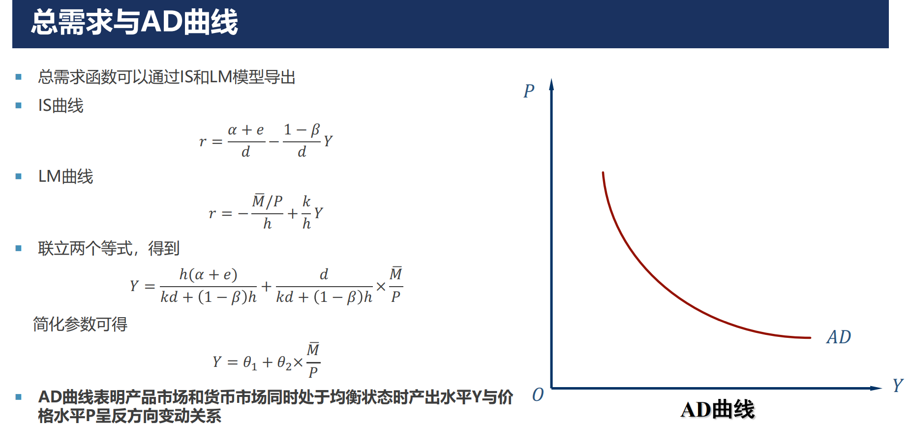
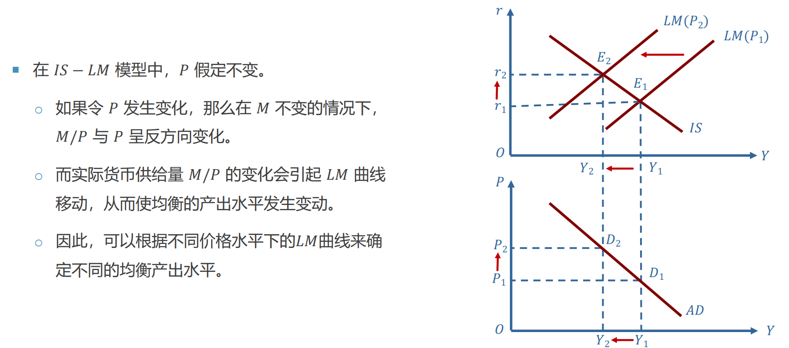
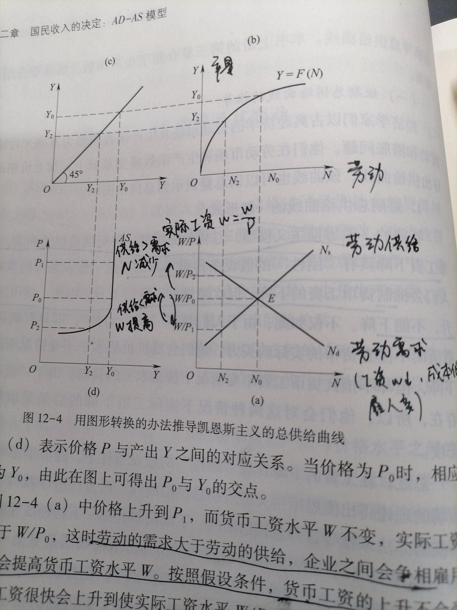
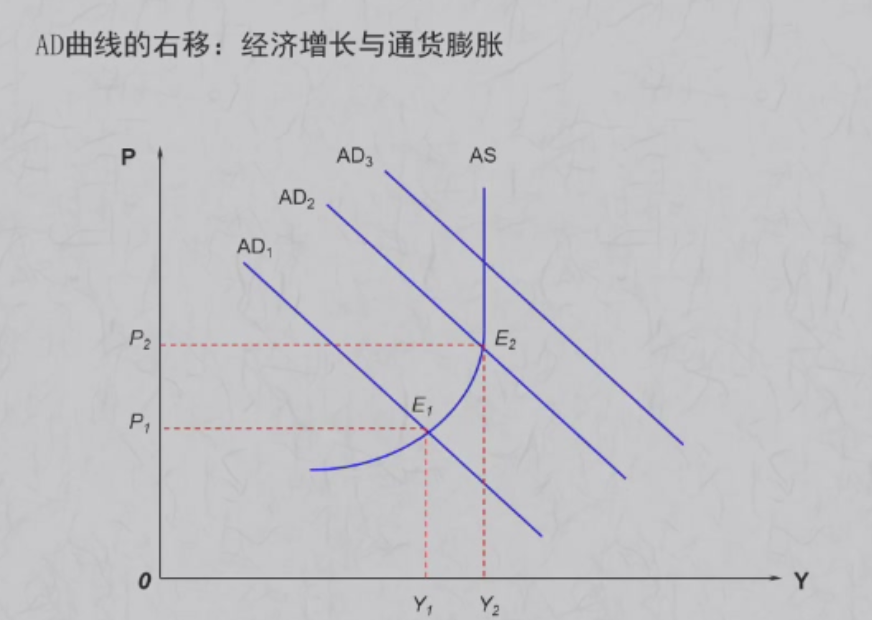
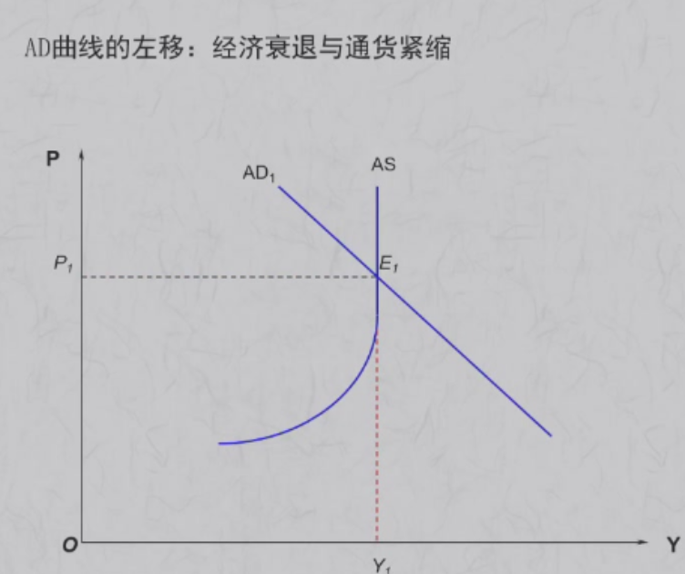
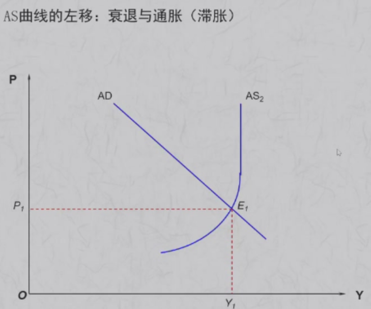
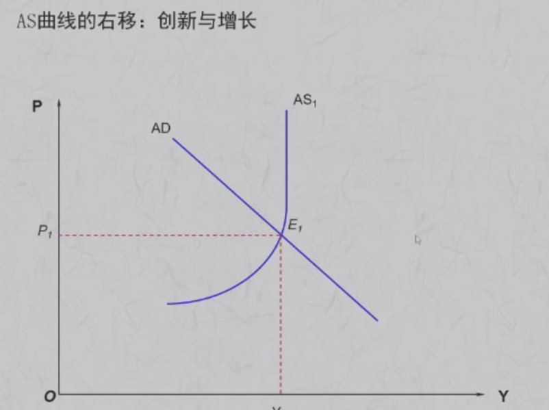

## AD

总需求Y与价格水平P的关系

### AD曲线的推导

代数推导:

AD曲线上的每一个点，都对应某个IS-LM曲线的平衡点

图示推导: 在IS-LM中改变LM

### AD曲线的经济学含义

**AD曲线向下倾斜的原因**:  P↑ ->  M↓   ->  r↑ -> I↓ -> Y↓
（利率效应）

价格上升，财富相对减少，消费水平下降，需求减少（财富效应）

### AD曲线的斜率

$$
\frac{dP}{dY}=-(k+(1-\beta)\frac{h}{d})\frac{P^2}{M}
$$

短期内主要看$h$ 和$d$

- $h$是投机性货币需求对利率的反应 $L=kY-hr$
- $d$是投资对利率的反应 $I=e-dr$

P下降->实际货币供给增加->供过于求->市场利率降低->L增加量一定,h越小,r降低幅度越大->I增加幅度越大->Y=C+I的增加幅度越大。

因此**h越小,斜率越小,Y对于P的变化越敏感**(**Y是横轴**)  **d越大,斜率越小,Y对于P的变化越敏感**  

图示推导: 

$r=\frac{k}{h}Y-\frac{\bar{M}}{Ph}$

### AD曲线的移动

向右移动的情况：
- 扩张性财政政策
- 扩张性货币政策（央行在公开市场**买入政府债券**，**降低再贴现率**，降低法定准备金率）

## AS

总供给曲线: 总展出与价格水平之间的关系

取决于时间范围 

短期：**工资向下刚性**  人们会抵制货币工资的下降，但欢迎货币工资的上升。货币工资是票面数值$W$. 实际工资是$W/P$

### AS的推导

- P0上升到P1,货币工资水平W不变，实际工资减少，劳动需求>供给， 企业会提高货币工资水平。直到W1/P1=W/P0. 就业量回到N0
- P0上升到P2, 如果W下降，可以使得实际工资水平不变，就业量回到N。但工资有刚性。因此就业量只能为N2

### AS的含义

Y和物价水平P成正向关系: P↑ -> 实际工资水平W/P↓ ->  劳动需求大于劳动供给， 企业雇佣，就业率N↑ -> Y↑

水平段（短期，凯恩斯区域）：到达充分就业的Y0之前， 价格水平大致不变（ 萧条时期，存在大量闲置劳动力）
中间区域： 由于成本上升，产量增加将伴随物价水平的上升，且闲置资源越来越少，产量 增加越来越困难。
垂直段（古典区域) ：  已经达到**充分就业**，无论价格水平怎么提高，Y也不会增长 

### AS的移动

假设物价不变，总供给增加，AS曲线向右移动。

- 技术进步  （F(N)变的更大
- 劳动需求增加
- 劳动供给增加   （如果人们更注重休闲，劳动供应量减少）
- 减税

## AD-AS

