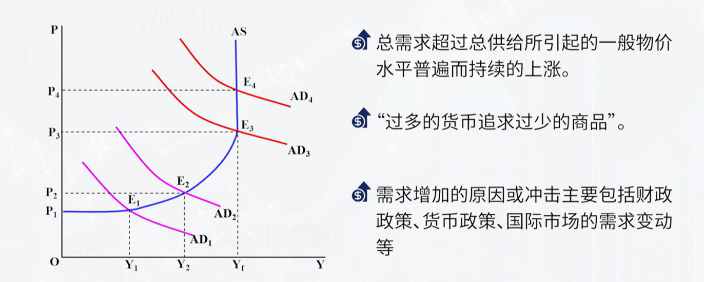
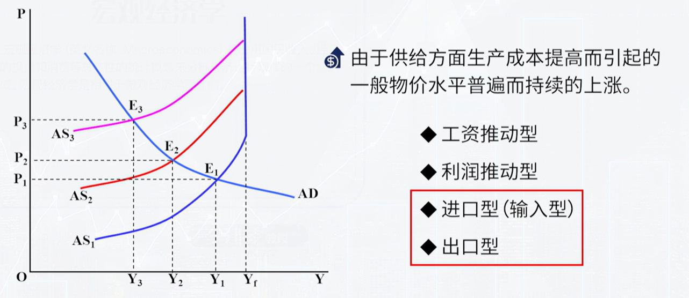
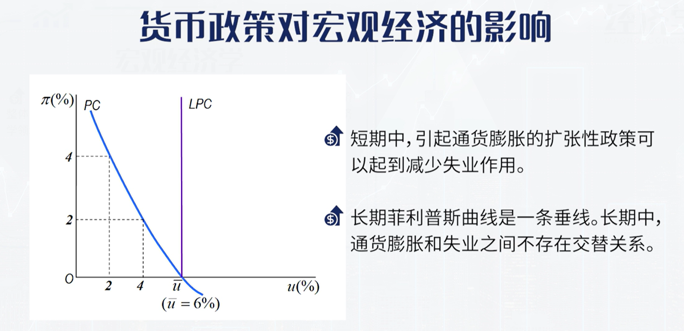
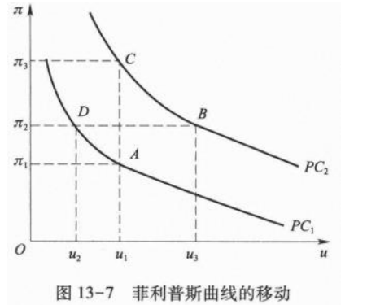
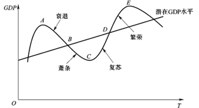

## 失业

### 劳动力的分类

劳动力：就业者+失业者

不属于劳动力的： 学生，退休

**失业率=失业人数/劳动力人数**

### 失业的分类,充分就业

失业的分类

- 摩擦性失业：正常的劳动力周转
- 结构性失业：技术或经济结构变化导致工作所需技能或工作地域变化
- 周期性失业：**指一个经济周期内随经济衰退而上升，随经济扩张而下降的波动性失业**。.周期性失业是政府最为关注的失业，也是宏观经济学研究的主要失业类型

①充分就业：当一个经济体中**不存在周期性失业**，所有失业都是摩擦性、结构性和季节性的，则该经济体达到了充分就业。（**不是人人就业**  (凯恩斯:**不存在非自愿失业**)

②自然失业率：**充分就业情况下的失业率被称为自然失业率。**

③潜在GDP：**指在现有资本和技术水平条件下，一个经济体在充分就业状态下所能生产的GDP**。反映的是经济处于充分就业时的实际GDP水平。

### 失业的原因

新古典经济学：不存在非自愿失业

凯恩斯：有效需求不足  **当有效需求不足,充分就业无法实现.三大心理规律: 边际消费倾向递减,资本边际效率递减,流动性偏好**

工资刚性

- 推导倾斜的AS曲线
- 实际工资w/P=名义工资/价格水平
- 原因：雇佣合同，政府规定最低工资，

### 奥肯定律

$$
\frac{Y-Y^*}{Y^*}=-\alpha(u-u^*)
$$

$Y^*,u*$ 自然产出和自然失业率

失业和产出负相关

## 通货膨胀

### 通货膨胀的定义

一定时期内物价水平**持续**而**普遍**（物价总水平)的上升

### 通货膨胀率

$$
\pi_t=\frac{P_t-P_{t-1}}{P_{t-1}}\times 100\%
$$

价格水平$P$ 可以用CPI,PPI,IPD

消费者物价指数CPI

生产者物价指数PPI： 描述制造商出手工业水平

国内生产总值平减指数

$$
IPD=\frac{名义GDP(以现期价格计算)}{实际GDP(以基期价格计算)}\times 100
$$

GDP平减指数与CPI区别：

1. IPD的商品数量权重不是固定的
2. IPD衡量生产的所有商品和服务的价格
3. IPD只计算本国的

温和的通货膨胀：年物价上升水平在10%以内

### 通货膨胀的原因

1. 需求拉动型：社会总需求超过总供给

如消费增长

2. 成本推动型
    

  工资推动：  价格上涨->工会要求提高工资-> 成本上升->价格进一步上涨

  利润推动： 垄断企业提高价格

  进口型：进口原材料价格上升

3.  结构型通货膨胀
    1. 需求结构的变动  各部门的需求不同
    2. 各部门劳动生产率增长速度的差异：工业生产率>服务业，但工资增长速度相同
    
4. 货币主义： 通货膨胀是货币供给增加的结果
    

$$
    MV=PT=PY\\
    \ln M+\ln V=\ln P+\ln Y
    $$

    ​       流通速度$V$不变

     取全微分，  $d\ln M=\frac{dM}{M}$  $dV=0$ 代入得
    

$$
    dP/P=dM/M-dY/Y
    $$

    **通货膨胀率=货币增长率-实际收入增长率**

​      通货膨胀产生主要是因为货币供给增加

​        

### 通货膨胀的影响

社会成本:

- **持有货币的“鞋底成本”**
- **“菜单成本”**（调整价格的成本
- **税收扭曲**
- **价格体系的“噪音”**

对个人

1. 有利于债务人，不利于债权人
2. 有利于雇主，不利于工人
3. 有利于政府，不利于民众（税收增加）  **货币铸造税**       不利于固定工资、福利金者

对财富：

1. 价格可变的资产(实物资产)(土地、房屋、股票等)： 实际价值不变
2. 金额固定的资产(货币资产)：实际价值降低
3. 债务：  通货膨胀对债务人有利

对产出：

1. 在存在闲置资源、通货膨胀未被预期且较温和的情况下：产出增加
2. 在不存在闲置资源或通货膨胀已被预期的情况下：产出不变
3. 在严重或恶性通货膨胀情况下：产出减少

课本P154

费雪效应: **通货膨胀率升高，导致名义利率增加。如果名义利率不变，则购买力减少**

- 名义利率i：银行支付的利率
- 实际利率r:  实际购买力的增加

$\boxed{i=r+\pi}$

### 菲利普斯曲线(失业和通货膨胀的关系)

- 凯恩斯： 通货膨胀会使得失业减少
- 货币主义：短期内通货膨胀会使得失业减少，长期内无作用

短期菲利普斯曲线：

$\pi=\pi^E-\beta(u-u^*)+\mu$

​      预期通货膨胀率$\pi^E$  失业对自然失业率的偏移   供给冲击

适应性预期: 用上一期的通货膨胀率预计当前的膨胀率

理性预期：极端情况是家庭和企业根据政策消息，选择相信并迅速下调自己的通货膨胀预期，那么政 府就能实现在不提高失业的情况下降低通货膨胀率

通货膨胀率=工资增长率-劳动生产率增长率

长期菲利普斯曲线：

短期:E到F 长期:E->F->A,失业率不变。因此**长期菲利普斯曲线是垂线**

## 滞涨

滞胀是指经济生活中出现工厂生产停滞、**失业增加和物价上涨同时并存的现象**

### 用菲利普斯曲线解释

原因：**菲利普斯曲线发生了整体移动**

### 用AD-AS解释

AS向左上移动(供给冲击)

## 经济周期

- **长周期（康~：50~60年**
- **中周期  (朱) ： 9~10**
- **短中期（基）（存货周期：2~4年** 

①繁荣阶段②衰退阶段③萧条阶段④复苏阶段

### 乘数-加速数

总需求增加，会通过乘数效应带来总产出的加倍增加

总产出的增加又会通过加速数效应要求企业进行新的投资