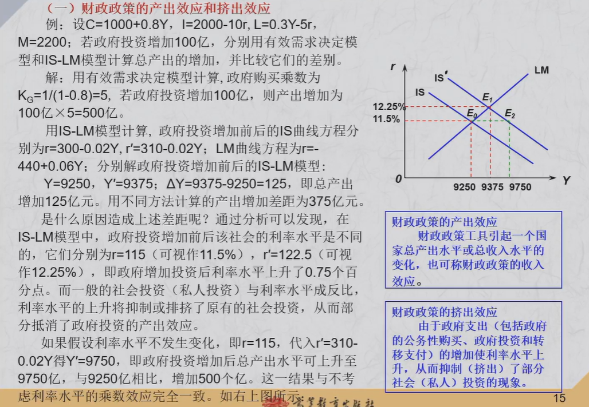
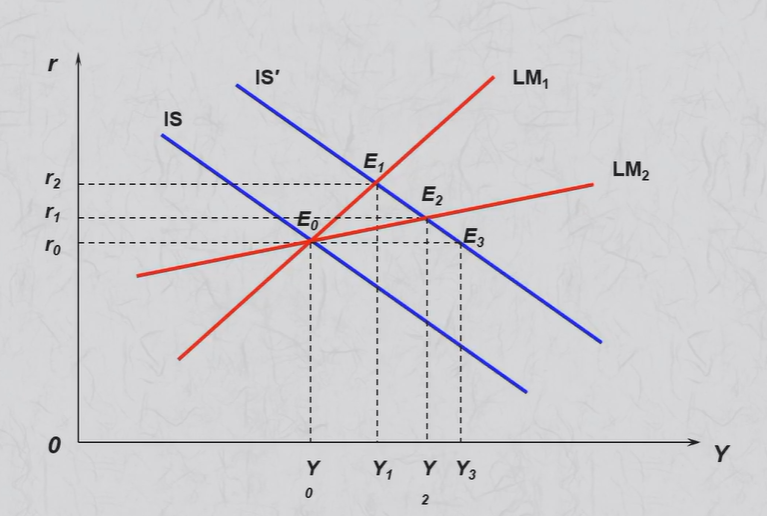

## 宏观经济政策的目标

> 宏观经济的目标: 
>
> - **充分就业**  (不存在非自愿失业)
>
> - **稳定物价** (控制物价上涨的幅度)
>
> - **经济增长** (在较长时间跨度内人均产出水平的持续增加)
>
> - **国际收支平衡**

- **充分就业和稳定物价是冲突的的** (菲利普斯曲线)

- 充分就业和经济增长不矛盾

> **"米德冲突"**:  顺差+通货膨胀   逆差+经济疲软

- 贸易顺差->发行货币,平衡国际收支->国内货币供应增加->物价上涨
- 贸易逆差->通货紧缩->经济增长放慢->失业增加

## 财政政策

政府支出

- 政府购买   (会增加债务)
- 转移支付   转移支付不是国民收入的组成部分  总收入不变
- 净利息支付

政府收入

- 税收: 政府收入最主要的来源
- 公债:   货币政策和财政政策双重性质

### 自动稳定器

课本P213

> **失业保障制度, 农产品价格维持制度,所得税税收体系**

### 相机抉择的财政政策

> 政府根据宏观经济指标使用, "逆经济风向"而行
>
> - 扩张型
> - 紧缩型
> - 平衡型

### 财政政策的效应 

> 产出(收入)效应: 引起国家总产出或总收入水平的变化 
>
> 挤出效应: 由于政府支出的增加,使利率水平上升,从而一直了私人投资的现象

- 用IS-LM曲线 解出变化前后的平衡点$(Y_1,r_1)(Y_2,r_2)$   $Y_2-Y_1$ 就是收入效应
- 利率r越大,挤出效应越大
- 假设利率不变,将$r_1$代入新的IS曲线, 解出$Y_3$,  $Y_3-Y_2$就是挤出效应  (或者用乘数法算,因为政府购买乘数$\Delta G/(1-\beta)$推导假设投资不变)

> 财政政策: IS曲线斜率越大越好, LM曲线斜率越小越好
>
> 货币政策: LM斜率越大越好,IS越小越好

## 货币政策

- 公开市场业务
- 再贴现率
- 法定准备金

其他: 信用控制 道义劝告 窗口指导

### 货币政策的效应

>财政政策: IS曲线斜率越大越好, LM曲线斜率越小越好
>
>货币政策: LM斜率越大越好,IS越小越好
>
>**调整哪条曲线,那哪条曲线的斜率越大越好**

> 货币政策的挤出效应: 增加货币,利率水平下降,从而使一部分资金流向投机市场,导致产出减少(投机性货币需求增加)