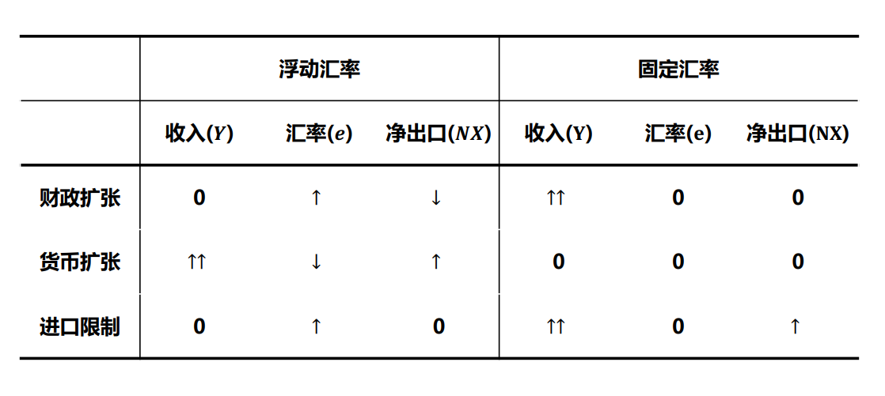
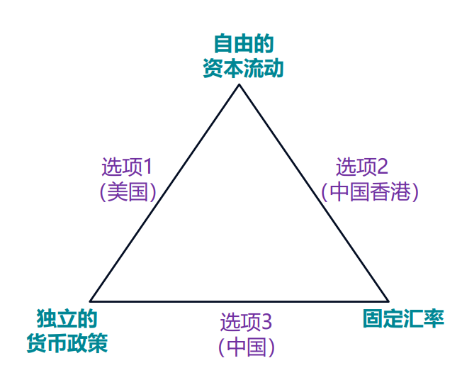

## 汇率

名义汇率 $e$

- 间接标价法:1单位本国货币 应收多少单位外币  (**默认用**)
- 直接标价法: 1单位外国货币...

人民币对美元汇率上涨是人民币升值

实际汇率$\varepsilon$  名义汇率*本国商品价格/外国商品价格 （相当于都换算到外国货币)

$$
\varepsilon=\frac{eP}{P_f}
$$

$d\ln e=d \ln \varepsilon+d\ln P_f-d\ln P$

名义汇率变化= + 通货膨胀率之差

如果本国发生通货膨胀，名义汇率下降。

## 国际收支平衡

> 国际收支平衡是指**资本净流出**与**净出口**相等

### 净出口函数

$NX=X-M$

$$
NX=q-\gamma Y+n\frac{eP}{P_f}
$$

- **收入$Y$越高,进口增加, 净出口减少**

- 本国汇率下降 将增加净出口

### 资本净流出函数

$$
F=\sigma(r_w-r)
$$

- 跟投资曲线的区别: F表示的是资本供给，不是需求
- 主要取决于利率：**r越大，资本越少流出，F越小**

### BP曲线

恒等式 $F=NX$ (净出口=资本净流出)

$$
r=\frac{\gamma}{\sigma}Y+(r_w-\frac{n\varepsilon+q}{\sigma})
$$

含义:

含义: BP曲线上代表给定汇率下，国际收支平衡时的利率和收入。**左上方NX>F**(顺差)  右下方逆差

## M-F

小型经济体：不影响世界利率$r^*$

完全资本流动性: 资本跨国境自由流动

$r=r^*$

$e$ 和$Y$是内生的 $Y=C+I(r^*)+G+NX(e)$

开放经济，利率不变，没有挤出效应，所以效果更好。

固定汇率制和独立的货币政策是矛盾的： 货币政策唯一的目标是固定汇率。而在浮动汇率制下，货币政策可以用来调控物价、就业。

