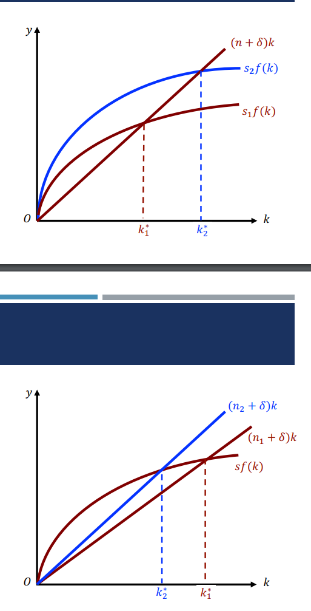
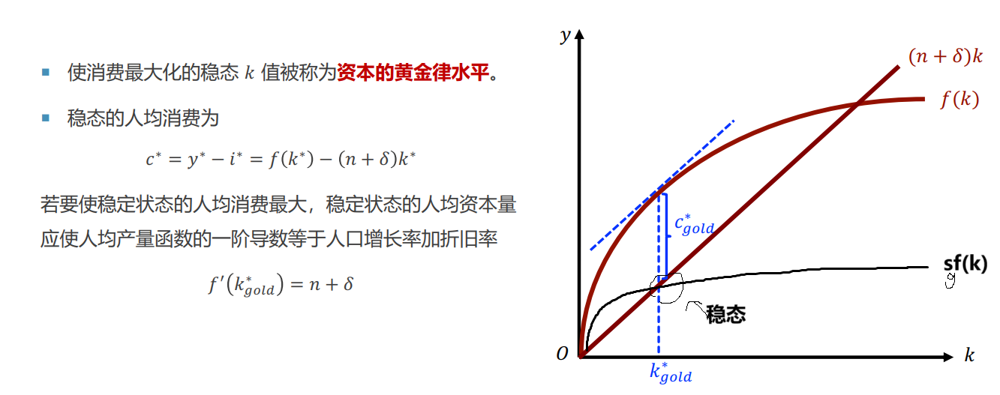

## 经济增长理论

### 增长率

$g_z=\lim_{\delta t\to 0}\frac{z(t+\delta t)-z(t)}{z(t)}=\frac{d z(t)}{z(t)dt}=\boxed{\frac{d\ln z(t)}{dt}}$

$Z=XY$ 两边取对数对t求导, 则$\boxed{g_{XY}=g_X+g_Y}$

### 索洛增长理论(新古典增长模型)

模型结论 P272

内生变量: **劳动L, 资本K**

#### 没有技术进步

$Y=F(K,L)$   Y实际产出   K资本  L劳动

**规模报酬不变** $\lambda Y=F(\lambda K,\lambda L)$

边际产出为正,且边际产出递减

$\frac{Y}{L}=F(\frac{K}{L},1)$   (设人均产出$y=Y/L,k=K/L$. 因此对人均, $y=F(k,1)=f(k)$

考虑两部门经济,设储蓄率=投资率=$s$ 平衡的时候$I=S,S=sY$

假设资本折旧率为$\delta$,则   $\dot{K}=I-\delta K=\boxed{sY-\delta K}$    (上面加点表示对时间求导)

假设人口增长率$n=\frac{dL/dt}{L}$, 没有技术进步

那么人均资本积累$\frac{d(K/L)}{dt}=\frac{\dot{K}L-K\dot{L}}{L^2}=\frac{sY-\delta K}{L}-\frac{K}{L}n=sf(k)-(\delta+n)k$

$$
\boxed{\dot{k}=sf(k)-k(\delta+n)}
$$

解释: $sf(k)$是人均储蓄   $(\delta+n)k$是"必要"的投资: 为了阻止人均资本k下降,需要$\delta k$来抵消折旧, $nk$来抵消人口增长对资本的影响

#### 有技术进步

$Y=F(AL,K)$ $A$代表技术进步   记$\hat{y}=\frac{Y}{AL},\hat{k}=\frac{K}{AL}$ 表示按 **有效劳动** 平均的资本和产量, 而$y=\frac{K}{L}$是 **人均**

​     $\hat{y}=f(\hat{k})$

$\frac{d\hat{k}}{dt}=\frac{\dot{K}AL-K(A\dot{L}+\dot{A}L)}{(AL)^2}=\frac{sY-\delta K}{AL}-\frac{K}{AL}(\frac{\dot{L}}{L}+\frac{\dot{A}}{A})$

因此

$$
\dot{\hat{k}}=sf(k)-k(\delta+n+g)
$$

### 稳态

课本P264-267

稳态 $\dot{k}=0$ 

稳态增长率:  分别考虑人均(小写字母)  和总量(大写字母)

人均资本$\frac{K}{N}=\hat{k}A$  显然增长率只取决于$A$

| 内生变量    | 稳态增长率(无技术进步)   | 稳态增长率(有技术进步) |
| ----------- | ------------------------ | ---------------------- |
| 人均资本$k$ | 0                        | $g$ (等于技术进步速率) |
| 人均产量$y$ | 0                        | g                      |
| 总资本$K$   | $n$ (等于人口自然增长率) | g+n                    |
| 总产出$Y$   | $n$ (等于人口自然增长率) | g+n                    |

储蓄率增加, **收入稳态水平提高**,但**稳态增长率不变**  (只有水平效应,没有增长效应)

**人口增长率增加, 人均收入水平下降**

资本黄金律水平

消费=$f(k)-sf(k)$  最大的$k$.     

$k_{gold}$需要需要通过调整积累和消费政策， 以一个特定的储蓄率来支持它。储蓄率$s_{gold}$

含义:**资本边际产出=人口增长率+折旧率**

### 内生增长理论

**不存在资本边际产出递减**

## 经济增长核算

$Y=AF(K,L)$   $A$是全要素生产率, 衡量技术水平

$dY=F(K,L)dA+A\frac{\partial F}{\partial K}dK+A\frac{\partial F}{\partial L}dL$

$\frac{dY}{Y}=\frac{dA}{A}+\frac{MPK\cdot K}{F}\frac{dK}{K}+\frac{MPL\cdot L}{F}\frac{dL}{L}$

又因为$\lambda F(K,L)=F(\lambda K,\lambda L)$  对$\lambda$求导得 $F(K,L)=K\cdot MPK+L\cdot MPL$  两个系数和为1. 因此可以写成

$g_Y=g_A+ag_K+(1-a)g_L$

实际上$g_A$是由其他量间接测出来的  $g_A$**被称为索洛余量**,  是**全要素生产率**的增长率

- 鼓励资本形成
- 鼓励技术进步
- 建立适当的制度