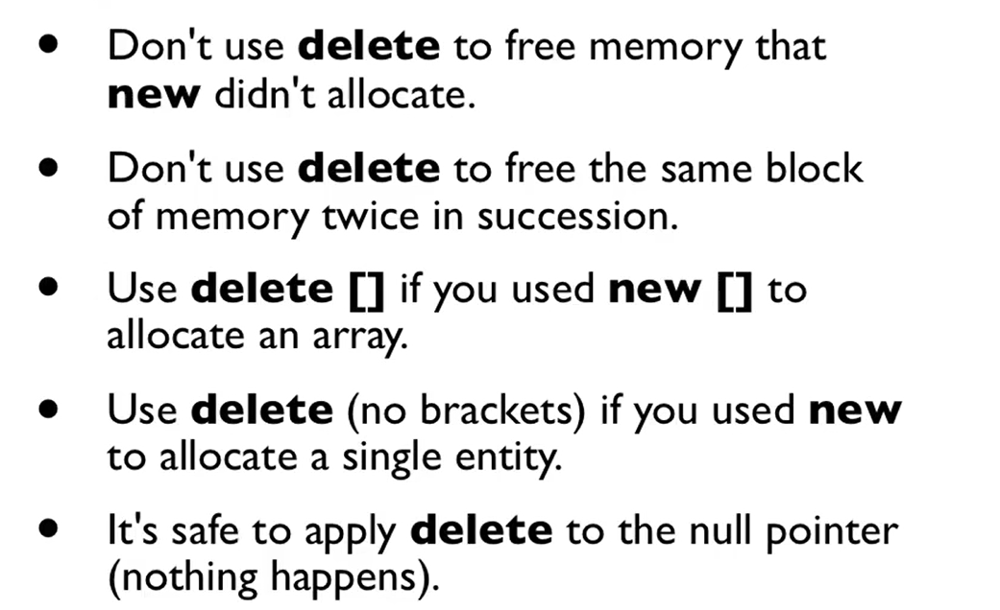

[TOC]

### Intro

class 相当于类型

object是实例

### Class Definition

- `.h`文件里放类的声明
- `.cpp`放类的实现

`<class name>::<function name>`:  用于给类里的函数写实现


`this`

### public/private

- private: 只能在本类的成员函数/友元中访问
    - 使用指针访问本类的其他对象的私有变量


- public: 所有人都可以访问

- protected: **外界不能访问**，但**可以在派生函数访问** 

- class中,成员（包括变量和函数）默认都是私有的

- struct中默认都是公有的，可以从外部访问

### constructor

- **不能是虚函数**

```cpp
class A{
    private:
    	int i;
    public:
        A(int _i);
    	~A();//不能有参数
}
A a=A(10);
/*更常见的用法*/A a(10);
```

default constructor:  无参数  `A()`

`A a;`的时候会调用default constructor

### destructor

当变量作用域结束时，释放内存之前会自动调用析构函数

- 作用域以大括号为界, **先构造的后析构**
- 一般要写成**虚函数 **  (不一定是抽象类)
- 如果声明了拷贝构造函数、拷贝赋值函数、析构函数三个其中的一个，就需要把三个全部声明

### initializer list


`A(float xa,float ya):x(xa),y(ya){}`

```c++
class A{
    private:
    	float x,y;
    	A(float xa,float ya):x(xa),y(ya){}
}
```

- 先初始化，再执行构造函数花括号中的内容
- 初始化列表中的初始化顺序与**变量的声明顺序**一致，**与初始化列表中书写的顺序无关**
- 用于初始化非静态成员变量或基类

初始化与赋值的区别

```cpp
class A{
    B i;
    A(){i=0;}
}
```

这样会先调用成员变量B的默认构造函数进行构造，再进行赋值。如果B没有默认构造函数,就会报错.

因此**建议使用初始化列表**，不要用赋值。

### new/delete

- **new时会调用构造函数,delete的时候会调用析构函数**
- new和delete对应, 注意[]的对应使用
- delete只是释放内存空间，指针的值没有变。为了避免野指针,建议delete完把p设为0

```c++
A *p= new A[10];
delete p;//只调用p所指的对象的析构
delete[] p;//调用数组每个元素的析构函数，然后释放整个数组的内存

p++; delete[] p;//会出错
```



