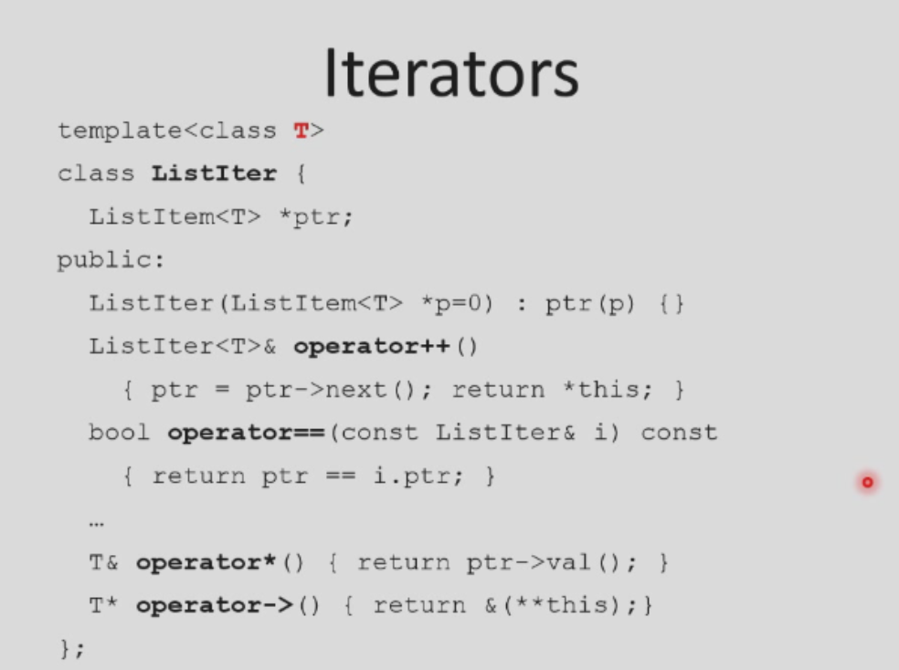

## Function template

模板:  类型必须严格对应,不能转换  如`swap(int,double)` 会报错

普通函数和模板函数同名:  如果跟普通函数匹配,**优先调用普通函数**. 

```c++
template<float>f();//指定调用float类型的模板函数
```


## Class Template

Can lead to (even more) code bloat

```c++
template <class T, int bounds = 100>
class FixedVector {
  T elements[bounds]; // fixed-size array!
}

```




```
template<typename T> class ARRAY{};
template <typename T> T&ARRAY<T>::at(int index) //记得写<T>
```